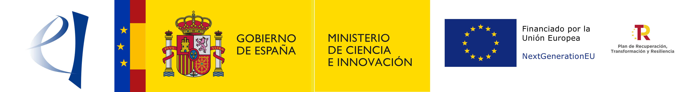
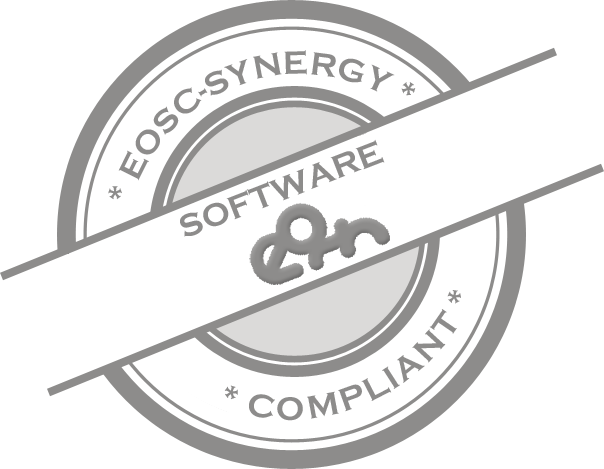

# OSCAR - Open Source Serverless Computing for Data-Processing Applications

[](https://goreportcard.com/report/github.com/grycap/oscar)
[](https://app.codacy.com/gh/grycap/oscar/dashboard?utm_source=gh&utm_medium=referral&utm_content=&utm_campaign=Badge_coverage)
[](https://github.com/grycap/oscar/actions/workflows/tests.yaml)
[](https://github.com/grycap/oscar/actions?query=workflow%3Abuild)
[](https://github.com/grycap/oscar/pkgs/container/oscar)
[](https://pkg.go.dev/github.com/grycap/oscar)
[](https://github.com/grycap/oscar/blob/master/LICENSE)


## Introduction

OSCAR is an open-source platform to support the event-driven serverless
computing model for data-processing applications. It can be automatically
deployed on multi-Clouds, and even on low-powered devices, to create highly-parallel event-driven
data-processing serverless applications along the computing continuum. These applications execute on customized runtime
environments provided by Docker containers that run on elastic Kubernetes clusters.

Information on how to deploy an OSCAR cluster using the Infrastucture Manager can be found at: https://grycap.github.io/oscar/deploy-im-dashboard/

For more documentation visit https://grycap.github.io/oscar/

> **_NOTE:_** If you detect inaccurate or unclear information on the documentation please report back to us either opening an issue or contacting us at products@grycap.upv.es

## Overview

- [**About OSCAR**](#why-oscar)
- [**Components**](#components)
- [**Licensing**](#licensing)
- [**Acknowledgements**](#acknowledgements)

### Why OSCAR

FaaS platforms are typically oriented to the execution of short-lived functions,
coded in a certain programming language, in response to events. Scientific
application can greatly benefit from this event-driven computing paradigm in
order to trigger on demand the execution of a resource-intensive application
that requires processing a certain file that was just uploaded to a storage
service. This requires additional support for the execution of generic
applications in existing open-source FaaS frameworks.

To this aim, OSCAR supports the
[High Throughput Computing Programming Model](https://scar.readthedocs.io/en/latest/prog_model.html)
initially introduced by the [SCAR framework](https://github.com/grycap/scar),
to create highly-parallel event-driven data-processing serverless applications
that execute on customized runtime environments provided by Docker containers
run on AWS Lambda.

With OSCAR, users upload files to a data storage back-end and this automatically
triggers the execution of parallel invocations to a service responsible for
processing each file. Output files are delivered into a data storage back-end
for the convenience of the user. The user only specifies the Docker image and
the script to be executed, inside a container created out of that image, 
to process a file that will be automatically made available to the
container. The deployment of the computing infrastructure and its scalability
is abstracted away from the user. Synchronous invocations are also supported to create 
scalable HTTP-based endpoints for triggering containerised applications.

### Components

</left>

OSCAR runs on an elastic Kubernetes cluster that is deployed using:

- [IM](http://www.grycap.upv.es/im), an open-source virtual infrastructure
    provisioning tool for multi-Clouds.

The following components are deployed inside the Kubernetes cluster to support the enactment of the OSCAR platform:


- [CLUES](http://github.com/grycap/clues), an elasticity manager that
    horizontally scales in and out the number of nodes of the Kubernetes cluster
    according to the workload.
- [MinIO](http://minio.io), a high-performance distributed object storage
    server that provides an API compatible with S3.
- [Knative](https://knative.dev), a serverless framework to serve
    container-based applications for synchronous invocations (default Serverless
    Backend).
- [OSCAR Manager](https://docs.oscar.grycap.net/api/), the main API, responsible for the management of the services and the integration of the different components. 
- [OSCAR UI](https://github.com/grycap/oscar-ui), an easy-to-use web-based graphical user interface aimed at end users.


As external storage providers, the following services can be used:

- External [MinIO](https://min.io) servers, which may be in clusters other than
    the platform.
- [Amazon S3](https://aws.amazon.com/s3/), an object storage service
    that offers industry-leading scalability, data availability, security, and
    performance in the AWS public Cloud.
- [Onedata](https://onedata.org/), the global data access solution for science,
    used in the [EGI Federated Cloud](https://datahub.egi.eu/).
- [dCache](http://dcache.org//), a system for storing and retrieving huge amounts of data, distributed among a large number of heterogeneous server nodes, under a single virtual filesystem tree with a variety of standard access methods.


An OSCAR cluster can be easily deployed via the [IM Dashboard](http://im.egi.eu)
on any major public and on-premises Cloud provider, including the EGI Federated Cloud.

## Licensing

OSCAR is licensed under the Apache License, Version 2.0. See
[LICENSE](https://github.com/grycap/scar/blob/master/LICENSE) for the full
license text.

## Acknowledgements

This development is partially funded by the [EGI Strategic and Innovation Fund](https://www.egi.eu/about/egi-council/egi-strategic-and-innovation-fund/).

Partially funded by the project [AI-SPRINT](https://ai-sprint-project.eu) "AI in Secure Privacy-Preserving Computing Continuum" that has received funding from the European Union’s Horizon 2020 Research and Innovation Programme under Grant 101016577.

Also, Grant PDC2021-120844-I00 funded by Ministerio de Ciencia e Innovación/Agencia Estatal de Investigación/ 10.13039/501100011033 and by “European Union NextGenerationEU/PRTR” and Grant PID2020-113126RB-I00 funded by Ministerio de Ciencia e Innovación/Agencia Estatal de Investigación/ 10.13039/501100011033.



<a href="https://eu.badgr.com/public/assertions/0vLlQBANQzyHMOrmcsck3w?identity__url=https:%2F%2Fgithub.com%2FEOSC-synergy%2Foscar.assess.sqaaas%2Fcommit%2F10254d15a9230f45c84dae22f3711653162faf78">
    
</a>

This software has received a silver badge according to the [Software Quality Baseline criteria](https://www.eosc-synergy.eu/for-developers/) defined by the [EOSC-Synergy](https://www.eosc-synergy.eu) project. Please acknowledge the use of OSCAR by citing the following scientific
publications ([preprints available](https://www.grycap.upv.es/gmolto/publications)):

```
Sebastián Risco, Germán Moltó, Diana M. Naranjo and Ignacio Blanquer. (2021). Serverless Workflows for Containerised Applications in the Cloud Continuum. Journal of Grid Computing, 19(3), 30. https://doi.org/10.1007/s10723-021-09570-2
```
```
Alfonso Pérez, Sebastián Risco, Diana M. Naranjo, Miguel Caballer, and Germán Moltó,
“Serverless Computing for Event-Driven Data Processing Applications,”
in 2019 IEEE International Conference on Cloud Computing (CLOUD 2019), 2019. https://ieeexplore.ieee.org/document/8814513/
```
