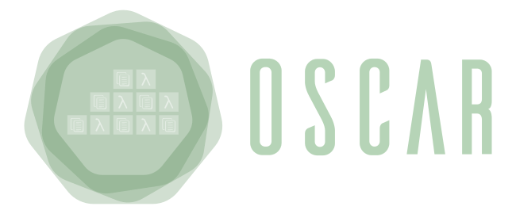
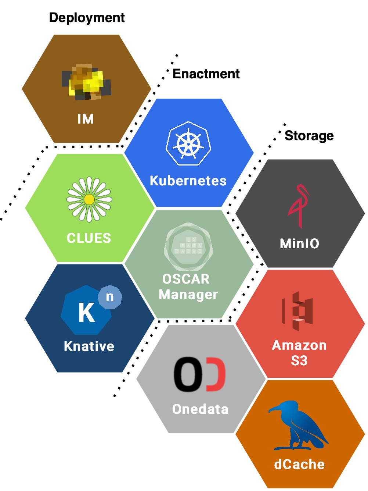

# OSCAR - Open Source Serverless Computing for Data-Processing Applications

[](https://goreportcard.com/report/github.com/grycap/oscar)
[](https://www.codacy.com/gh/grycap/oscar/dashboard?utm_source=github.com&utm_medium=referral&utm_content=grycap/oscar&utm_campaign=Badge_Coverage)
[](https://github.com/grycap/oscar/actions/workflows/tests.yaml)
[](https://github.com/grycap/oscar/actions?query=workflow%3Abuild)
[](https://github.com/grycap/oscar/pkgs/container/oscar)
[](https://pkg.go.dev/github.com/grycap/oscar)
[](https://github.com/grycap/oscar/blob/master/LICENSE)



## Introduction

OSCAR is an open-source platform to support the Functions as a Service (FaaS)
computing model for file-processing applications. It can be automatically
deployed on multi-Clouds in order to create highly-parallel event-driven
file-processing serverless applications that execute on customized runtime
environments provided by Docker containers than run on an elastic Kubernetes
cluster.

[**Deploy**](https://grycap.github.io/oscar/deploy-im-dashboard/) &nbsp; |
&nbsp; [**Documentation**](https://grycap.github.io/oscar/) &nbsp;

## Overview

- [**About OSCAR**](#why-oscar)
- [**Components**](#components)
- [**Licensing**](#licensing)
- [**Acknowledgements**](#acknowledgements)

### Why OSCAR

FaaS platforms are typically oriented to the execution of short-lived functions,
coded in a certain programming language, in response to events. Scientific
application can greatly benefit from this event-driven computing paradigm in
order to trigger on demand the execution of a resource-intensive application
that requires processing a certain file that was just uploaded to a storage
service. This requires additional support for the execution of generic
applications in existing open-source FaaS frameworks.

To this aim, OSCAR supports the
[High Throughput Computing Programming Model](https://scar.readthedocs.io/en/latest/prog_model.html)
initially introduced by the [SCAR framework](https://github.com/grycap/scar),
to create highly-parallel event-driven file-processing serverless applications
that execute on customized runtime environments provided by Docker containers
run on AWS Lambda.

With OSCAR, users upload files to a data storage back-end and this automatically
triggers the execution of parallel invocations to a service responsible for
processing each file. Output files are delivered into a data storage back-end
for the convenience of the user. The user only specifies the Docker image and
the script to be executed, inside a container created out of that image, in
order to process a file that will be automatically made available to the
container. The deployment of the computing infrastructure and its scalability
is abstracted away from the user.

### Components



OSCAR runs on an elastic Kubernetes cluster that is deployed using:

- [EC3](http://www.grycap.upv.es/ec3), an open-source tool to deploy compute
    clusters that can horizontally scale in terms of number of nodes with
    multiple plugins.
- [IM](http://www.grycap.upv.es/im), an open-source virtual infrastructure
    provisioning tool for multi-Clouds.
- [CLUES](http://github.com/grycap/clues), an elasticity manager that
    horizontally scales in and out the number of nodes of the Kubernetes cluster
    according to the workload.

The following components are deployed inside the Kubernetes cluster in order
to support the OSCAR platform:

- [MinIO](http://minio.io), a high performance distributed object storage
    server that provides an API compatible with S3.
- [OpenFaaS](https://www.openfaas.com/), a FaaS platform that allows creating
    functions executed via HTTP requests.
- [Knative](https://knative.dev), a Serverless framework to serve
    container-based applications for synchronous invocations (default Serverless
    Backend).
- OSCAR, the main application, responsible for the management of the services
    and the integration of the different components to support event-driven
    serverless computing for file processing. It includes a web-based GUI aimed at
    end users to facilitate interaction with OSCAR.

As external storage providers, the following services can be used:

- External [MinIO](https://min.io) servers, which may be in clusters other than
    the platform.
- [Amazon S3](https://aws.amazon.com/s3/), the Amazon's  object storage service
    that offers industry-leading scalability, data availability, security, and
    performance in the public Cloud.
- [Onedata](https://onedata.org/), the global data access solution for science
    used in the [EGI Federated Cloud](https://datahub.egi.eu/).

OSCAR has also been integrated with the [EC3 Portal](https://servproject.i3m.upv.es/ec3-ltos/index.php)
available in the [EGI Applications on Demand](https://www.egi.eu/services/applications-on-demand/)
service to deploy the platform on the EGI Federated Cloud resources.

Further information is available in the [documentation](https://grycap.github.io/oscar).

## Licensing

OSCAR is licensed under the Apache License, Version 2.0. See
[LICENSE](https://github.com/grycap/scar/blob/master/LICENSE) for the full
license text.

## Acknowledgements

This development is partially funded by the [EGI Strategic and Innovation Fund](https://www.egi.eu/about/egi-council/egi-strategic-and-innovation-fund/).

Please acknowledge the use of OSCAR by citing the following scientific
publication ([preprint available](https://www.grycap.upv.es/gmolto/publications/preprints/Perez2019osc.pdf)):

```
A. Pérez, S. Risco, D. M. Naranjo, M. Caballer, and G. Moltó,
“Serverless Computing for Event-Driven Data Processing Applications,”
in 2019 IEEE International Conference on Cloud Computing (CLOUD 2019), 2019.
```
