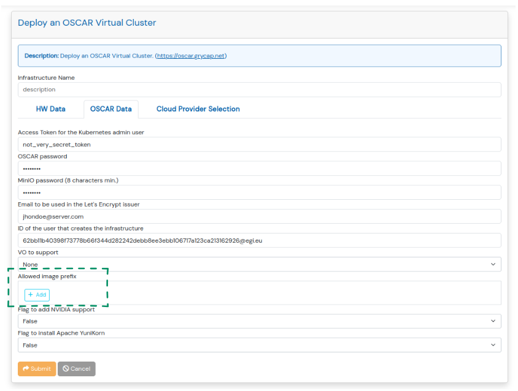

# Additional configuration

To give the administrator a more personalized cluster configuration, the OSCAR manager searches for a config map on the cluster with the additional properties to apply. Since this is still a work in progress, the only configurable property currently is the container images' origin. As seen in the following ConfigMap definition, you can set a list of "prefixes" that you consider secure repositories, so images that do not come from one of these are restricted.

``` yaml
apiVersion: v1
kind: ConfigMap
metadata:
  name: additional-oscar-config
  namespace: oscar-svc
data:
  config.yaml: |
    images:
      allowed_prefixes:
      - ghcr.io
```

Additionally, this property can be added when creating an OSCAR cluster through the IM, which will automatically create the ConfigMap.

