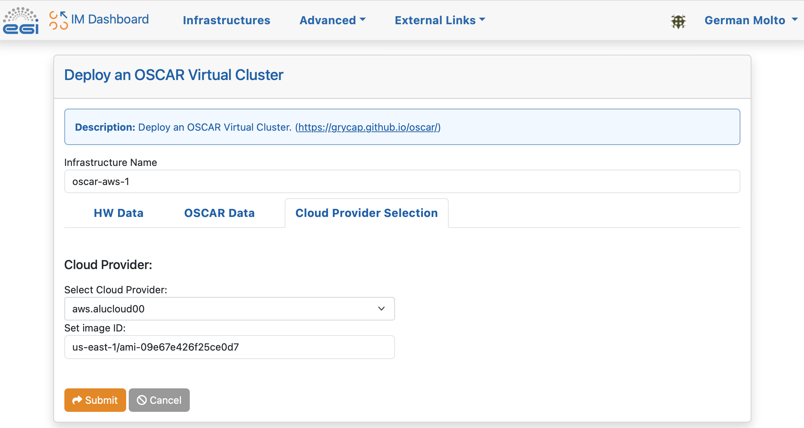
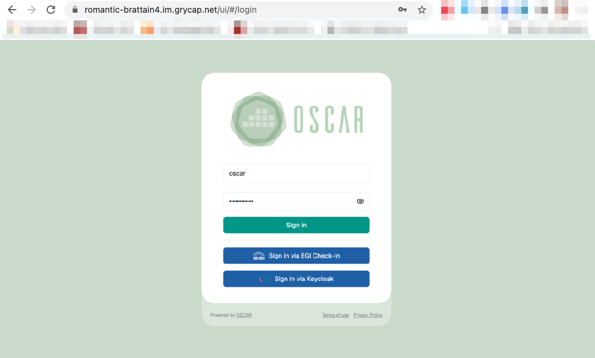

# Deployment with the IM Dashboard

An OSCAR cluster can be easily deployed on multiple Cloud back-ends without
requiring any installation by using the
[Infrastructure Manager](https://www.grycap.upv.es/im)'s
Dashboard
([IM Dashboard](https://appsgrycap.i3m.upv.es:31443/im-dashboard/login)). This
is a managed service provided by the [GRyCAP](https://www.grycap.upv.es)
research group at the [Universitat Politècnica de València](https://www.upv.es)
to deploy customized virtual infrastructures across many Cloud providers.

Using the IM Dashboard is the easiest and most convenient approach to deploy
an OSCAR cluster. It also automatically allocates a DNS entry and TLS
certificates to support HTTPS-based access to the OSCAR cluster and companion
services (e.g. MinIO).

This example shows how to deploy an OSCAR cluster on
[Amazon Web Services (AWS)](https://aws.amazon.com) with two nodes. Thanks to
the IM, the very same procedure applies to deploy the OSCAR cluster in an
on-premises Cloud (such as OpenStack) or any other Cloud provider supported
by the IM.

These are the steps:

### 1. Access the [IM Dashboard](https://appsgrycap.i3m.upv.es:31443/im-dashboard/login)

You will need to authenticate via [EGI Check-In](https://www.egi.eu/services/check-in/), which supports mutiple Identity Providers (IdP).

### 2. Configure the Cloud Credentials

Once logged in, you need to define the access credentials to the Cloud on which the OSCAR cluster will be deployed. These should be temporary credentials under the [principle of least privilege (PoLP)](https://searchsecurity.techtarget.com/definition/principle-of-least-privilege-POLP).

In our case we indicate an identifier for the set of credentials,
    [the Access Key ID and the Secret Access Key](https://docs.aws.amazon.com/general/latest/gr/aws-sec-cred-types.html)
    for an [IAM](https://aws.amazon.com/iam/) user that has privileges to
    deploy Virtual Machines in [Amazon EC2](https://aws.amazon.com/ec2).

### 3. Select the OSCAR template

### 4. Customize and deploy the OSCAR cluster

In this panel you can specify the number of Working Nodes (WNs) of the cluster together with the computational requirements for each node. We leave the default values.
- `Number of WNs in the oscar cluster`: Number of working nodes.
- `Number of CPUs for the front-end node`: Number of CPUs in the primary node.
- `Amount of Memory for the front-end node`: RAM in the primary node.
- `Flavor name of the front-end node` (only required in case of special flavors i.e. with GPUs): Type of instance that will be selected in the front node.
- `Number of CPUs for the WNs`: number of CPUs per working node.
- `Amount of Memory for the WNs`: RAM per working node.
- `Flavor name of the WNs` (only required in case of special flavors i.e. with GPUs): Type of instance that will be selected in the working nodes.
- `Size of the extra HD added to the instance`: Extra memory in the primary node.

In this panel, specify the passwords to be employed to access the Kubernetes Web UI (Dashboard), to access the OSCAR web UI and to access the MinIO dashboard. These tokens can also be used for programmatic access to the respective services.

    - Access Token for the Kubernetes admin user: It is the token to connect to the Dashboard of Kubernetes.
    - OSCAR password: password to OSCAR.
    - MinIO password 8 characters min.: password to MinIO.
    - Email to be used in the Lets Encrypt issuer: It is an Email linked with the certificates in case the user has any questions.
    - ID of the user that creates the infrastructure: unique identifier. Do not touch.
    - VO to support: It supports OIDC log in. If there is nothing, only can connect the user who deploys, in case there is a VO, it can be the user who deploys and all people in the VO.
    - Flag to add NVIDIA support: if you want to use NVIDIA.
    - Flag to install Apache YuniKorn: if you are going to use YuniKorn.
    

    Now, choose the Cloud provider. The ID specified when creating the Cloud
    credentials will be shown.
    You will also need to specify the
    [Amazon Machine Image (AMI) identifier](https://docs.aws.amazon.com/AWSEC2/latest/UserGuide/AMIs.html).
    We chose an AMI based on Ubuntu 20.04 provided by Canonical whose
    identifier for the us-east-1 region is: ami-09e67e426f25ce0d7

    NOTE: You should obtain the AMI identifier for the latest version of the
    OS. This way, security patches will be already installed. You can obtain
    this AMI identifier from the AWS Marketplace or the Amazon EC2 service.

    

    Give the infrastructure a name and press "Submit".

1. Check the status of the deployment OSCAR cluster

    You will see that the OSCAR cluster is being deployed and the
    infrastructure reaches the status "running". The process will not finish
    until it reaches the state "configured".

    

    If you are interested in understanding what is happening under the hood
    you can see the logs:

    

1. Accessing the OSCAR cluster

    Once reached the "configured" state, see the "Outputs" to obtain the
    different endpoints:

    * console_minio_endpoint: This endpoint brings access to the MinIO web
        user interface.
    * dashboard_endpoint: This endpoint redirects to the Kubernetes dashboard
        where the OSCAR cluster is deployed.
    * local_oscarui_endpoint: This endpoint is where the OSCAR backend is
        listening. It supports authentication only via basic-auth.
    * minio_endpoint: Endpoint where the MinIO API is listening. If you
        access it through a web browser, you will be redirected to
        "console_minio_endpoint".
    * oscarui_endpoint: Public endpoint of the OSCAR web user interface. It
        supports OIDC connections via EGI Check-in, as well as basic auth.

    

    The OSCAR UI can be accessed with the username ``oscar`` and the password
    you specified at deployment time.

    

    The MinIO UI can be accessed with the username ``minio`` and the password
    you specified at deployment time.

    

    The Kubernetes Dashboard can be accessed with the token you specified at
    deployment time.
    

    You can obtain statistics about the Kubernetes cluster:
    

2. Terminating the OSCAR cluster

    You can terminate the OSCAR cluster from the IM Dashboard:
    
