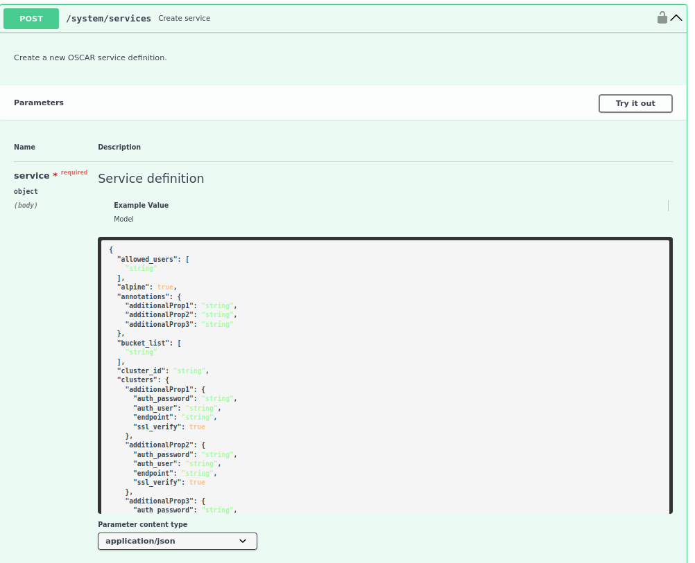
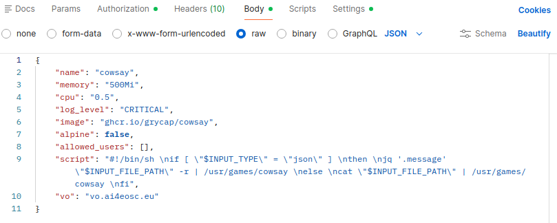

# OSCAR API

To facilitate interaction and integration with OSCAR services, a high-performance and secure [REST API](api.md) is available. This API can be used with any programming language (Python, C, Java, etc.) or API interaction tool such as Postman, cURL, etc.

To create a service, the POST method is used as shown in the following figure:



Two simple alternatives will be given on how to interact with the API to deploy a service on OSCAR.

- `PYTHON`

To deploy a service, you must have the [FDL](fdl.md) file that defines the service and the script that will be executed on it.

First, you need the credentials to access the cluster. This can be via an [OIDC Token](integration-egi.md) or basic authentication.

```
URL_BASE = 'https://oscar-cluster-remote'
ENDPOINT = '/system/services'

# IMPORTANT: Replace 'token' with your actual authentication token
token = 'YOUR_AUTH_TOKEN_HERE' 

# --- Authentication Configuration ---
# REPLACE THESE WITH YOUR ACTUAL USERNAME AND PASSWORD
USERNAME = "your_username_here"
PASSWORD = "your_password_here"

```
Another important element is to properly organize the HTTP (POST) request in terms of its headers, which must include the content type and authentication.

```
# D. Prepare Headers (Token)
headers = {
        'Content-Type': 'application/json',
        # Set the Authorization header with the Bearer Token
        'Authorization': 'Bearer ' + token 
    }

# D. Prepare Headers (Basic Auth)

# Function to encode Basic Auth credentials ---
def create_basic_auth_header(username, password):
    """Encodes username:password into Base64 format for Basic Auth header."""
    # Format: username:password
    credentials = f"{username}:{password}"
    # Encode to Base64 (requires converting string to bytes first)
    encoded_bytes = base64.b64encode(credentials.encode('utf-8'))
    # Convert bytes back to string and prepend "Basic "
    return f"Basic {encoded_bytes.decode('utf-8')}"

auth_header_value = create_basic_auth_header(USERNAME, PASSWORD)

headers = {
        'Content-Type': 'application/json',
        # Use the Base64 encoded credentials here
        'Authorization': auth_header_value 
    }
```
Then you would need to make the request to the API

```
# Send the POST request to create the service

# IMPORTANT: The OSCAR API expects the payload to be the 'service' dictionary itself, 
# not the entire nested structure found in the initial YAML file.
     
# Convert the updated service dictionary into a JSON string for the body
json_payload = json.dumps(service)

response = requests.post(
        URL_COMPLETE,
        headers=headers,
        data=json_payload
    )
```

This is an example of Python code for deploying a [cowsay service](https://github.com/grycap/oscar/tree/master/examples/cowsay) using the FDL and the corresponding script. Use only the segment with the authentication type you require. Debugging elements are also included for improved service deployment performance.  

```
import requests
import yaml
import json
import os
import base64 # Import the base64 library for encoding credentials

#  1. Configuration (Files and URLs) ---
URL_BASE = 'https://oscar-cluster-remote'
ENDPOINT = '/system/services'

# Authentication Configuration ---
# IMPORTANT: Replace 'token' with your actual authentication token
token = 'YOUR_AUTH_TOKEN_HERE' 

# REPLACE THESE WITH YOUR ACTUAL USERNAME AND PASSWORD
USERNAME = "your_username_here"
PASSWORD = "your_password_here"


URL_COMPLETE = f"{URL_BASE}{ENDPOINT}"

# File names
YAML_SERVICE_FILE = 'cowsay.yaml'  # Base YAML definition file
SHELL_SCRIPT_FILE = 'script.sh'    # Shell script file whose content will be injected

# 2. File Reading Function ---

def load_file_content(filepath):
    """Reads and returns the entire content of a file as a string."""
    if not os.path.exists(filepath):
        raise FileNotFoundError(f"File not found: {filepath}")
    with open(filepath, 'r', encoding='utf-8') as f:
        return f.read()


# 3. Function to encode Basic Auth credentials ---
def create_basic_auth_header(username, password):
    """Encodes username:password into Base64 format for Basic Auth header."""
    # Format: username:password
    credentials = f"{username}:{password}"
    # Encode to Base64 (requires converting string to bytes first)
    encoded_bytes = base64.b64encode(credentials.encode('utf-8'))
    # Convert bytes back to string and prepend "Basic "
    return f"Basic {encoded_bytes.decode('utf-8')}"

try:
    # A. Load the base service definition from the YAML file
    # This reads the YAML content.
    yaml_content = load_file_content(YAML_SERVICE_FILE)
    
    # Load YAML, navigate to the 'oscar' replica list, and get the first item.
    # This item is a dictionary with a dynamic key (the replica name).
    service_payload_dict = yaml.safe_load(yaml_content)['functions']['oscar'][0]
    
    # Get the value associated with the dynamic key (the actual service configuration dictionary)
    service = list(service_payload_dict.values())[0]

    # B. Load the content of the SH script
    script_content = load_file_content(SHELL_SCRIPT_FILE)

    # C. Inject the script into the service dictionary
    # The script content (as a string) is assigned to the 'script' field.
    service['script'] = script_content
    
    # D. Prepare Headers (token)
    headers = {
        'Content-Type': 'application/json',
        # Set the Authorization header with the Bearer Token
        'Authorization': 'Bearer ' + token 
    }

    # D. Prepare Headers (Basic Auth)
    auth_header_value = create_basic_auth_header(USERNAME, PASSWORD)
    
    headers = {
        'Content-Type': 'application/json',
        # Use the Base64 encoded credentials here
        'Authorization': auth_header_value 
    }


    # IMPORTANT: The OSCAR API expects the payload to be the 'service' dictionary itself, 
    # not the entire nested structure found in the initial YAML file.
     
    # Convert the updated service dictionary into a JSON string for the body
    json_payload = json.dumps(service)
    
    # Send the POST request to create the service
    response = requests.post(
        URL_COMPLETE,
        headers=headers,
        data=json_payload
    )

    #4. Handle the Response ---
    
    status_code = response.status_code
    
    if status_code == 201:
        print("\n✅ Service Created Successfully (201 Created)")
    else:
        print(f"\n⚠️ Error (Code {status_code})")
        print("Please check the response body below for error details.")

    print("-" * 30)
    print(f"Response Body:\n{response.text}")
    print("-" * 30)

except (FileNotFoundError, yaml.YAMLError, requests.exceptions.RequestException) as e:
    print(f"\n🛑 An error occurred during the process: {e}")


```
- `POSTMAN`

[Postman](https://www.postman.com) is one of the most popular tools developers use to test, document, and collaborate on APIs, especially REST APIs. The following is a brief example of deploying a service on an OSCAR cluster using its API.

To deploy a service, in this case the [cowsay service](https://github.com/grycap/oscar/tree/master/examples/cowsay), first a POST request is created and the API address for service deployment is entered. In this example, a remote cluster called `oscar-cluster-remote` is used.


The request must be configured for the type of authentication used. The figure shows both basic authentication (username and password) and authentication with an [OIDC Token](integration-egi.md).


The request body is also configured, where the definition of the service to be deployed is entered. This information is taken from both the FDL file and the script. Once configured, the request can be sent to the OSCAR cluster.




With this, the service is deployed and ready to run (see [Service Execution](invoking.md) section)

 