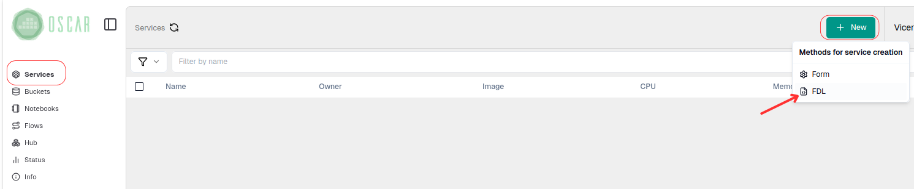
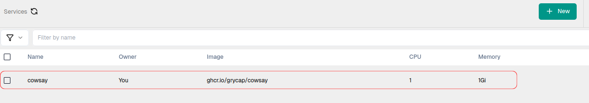
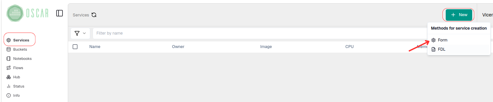
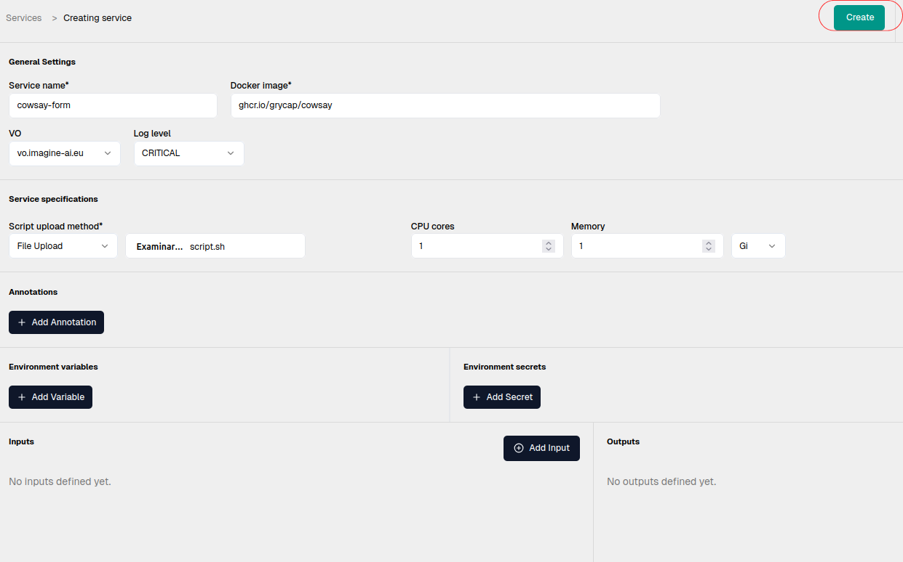
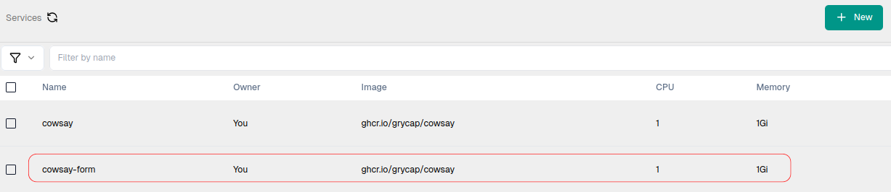

# OSCAR Dashboard

Implementing an OSCAR cluster dashboard greatly improves interaction with all elements within the cluster. This interface makes deploying a service on an OSCAR cluster much faster and more intuitive.

> ❗️
> In the `Interface` section there is a much more detailed description of how to use all the elements within the [Dashboard](usage-dashboard.md).

There are several ways to deploy a service from the OSCAR dashboard. One is by starting with an [FDL file](fdl.md) that contains the configured service and the corresponding script.  In this case, we will deploy the [cowsay service](https://github.com/grycap/oscar/tree/master/examples/cowsay).

In `services`, under `New`, go to the `FDL` option.

Next, we load both the fdl file and the script and click on `Create Service`.

In a few moments the service is created and ready to use. 

The other option is through a form where you enter all the features that the service to be deployed will have.

In `services`, under `New`, go to the `Form` option.

Next, fill out the form with the necessary information for deploying the service. This information can be found in the FDL file used previously. Once everything is complete, go to the `Create` option to deploy the service.

In a few moments the service will be created and ready to use.

With this, the service is deployed and ready to run (see [Service Execution](invoking.md) section)
