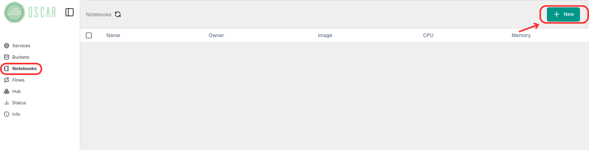
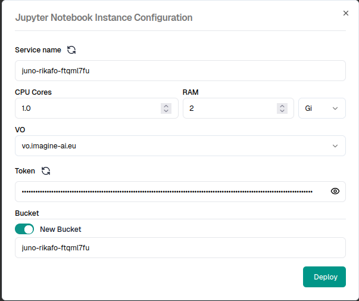
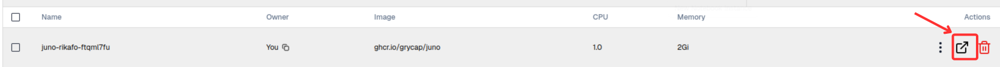
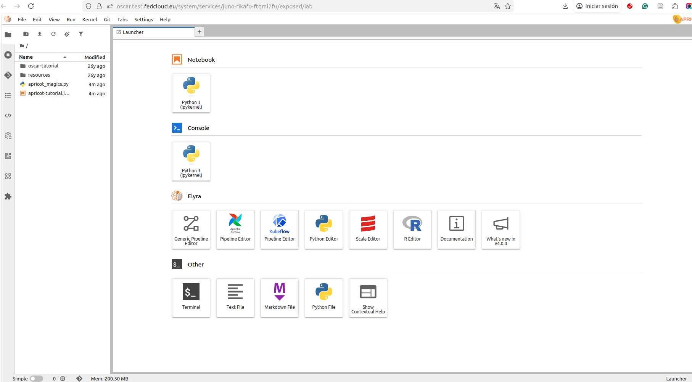

# OSCAR Python

[OSCAR-Python](https://github.com/grycap/oscar_python) is an open-source Python client for the [OSCAR API](api.md) designed to facilitate interaction with clusters and services of an OSCAR cluster. It is available on PyPI ([oscar-python client](https://pypi.org/project/oscar-python/)).

To interact with [OSCAR-Python](https://github.com/grycap/oscar_python), you can do so from any computer where Python is installed. Alternatively, you can also do it from the OSCAR cluster itself, as it allows the deployment of a [Jupyter Notebook](https://jupyter.org/) instance. The following shows how to perform this deployment.

First, in the left-hand menu, go to `Notebooks` and create a `NEW` (New Notebook Instance).



Next, assign the instance configuration values.



>!
>You can use a new bucket or one created previously.

After a few minutes, the notebook will be deployed and accessible.



From here, you have a deployed Jupyter Notebook that can be used to interact with OSCAR cluster.



Once the library is installed (`pip install oscar-python`), you can begin developing and deploying a service. First, you must initialize the client using some form of authentication.

Initialize a client with basic authentication

```
options_basic_auth = {'cluster_id':'cluster-id',
                'endpoint':'https://oscar-cluster-remote',
                'user':'username',
                'password':'password',
                'ssl':'True'}

client = Client(options = options_basic_auth)

```
If you already have a valid token, you can use the parameter [oidc_token](integration_egi.md) instead. 

```
options_oidc_auth = {'cluster_id':'cluster-id',
                'endpoint':'https://oscar-cluster-remote',
                'oidc_token':'token',
                'ssl':'True'}
                
client = Client(options = options_oidc_auth)

```
Then we use the `client.create_service` function to deploy the service. The only parameter to keep in mind is the location of the FDL file containing the service configuration. In this case, we'll use the [cowsay service](https://github.com/grycap/oscar/tree/master/examples/cowsay) as an example. After that, everything is ready to invoke the deployed service.

```
try:
    client.create_service("cowsay.yaml")
except Exception as err:
    print("Failed with: ", err)

```

With this, the service is deployed and ready to run (see [Service Execution](invoking.md) section)