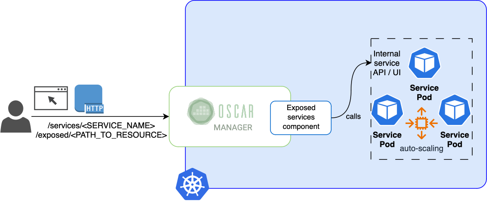

# Exposed Services


OSCAR supports the deployment and elasticity management of long-running stateless services whose internal API or web-based UI must be directly reachable outside the cluster. 

> ℹ️
> 
> This functionality can be used to support the fast inference of pre-trained AI models that require close to real-time processing with high throughput. 
> In a traditional serverless approach, the AI model weights would be loaded in memory for each service invocation.
> Exposed services are also helpful when stateless services created out of large containers require too much time to start processing a service invocation.
> By exposing an OSCAR service, the AI model weights could be loaded just once, and the service would perform the AI model inference for each subsequent request.




 An auto-scaled load-balanced approach for these stateless services is supported. When the average CPU exceeds a certain user-defined threshold, additional service pods are dynamically created (and removed when no longer necessary) within the user-defined boundaries. The user can also define the minimum and maximum replicas of the service to be present on the cluster (see the parameters `min_scale` and `max_scale` in [ExposeSettings](fdl.md/#exposesettings)).


### Prerequisites in the container image
The container image needs to have an HTTP server that binds to a specific port (see the parameter `port` in [ExposeSettings](fdl.md/#exposesettings)). If developing a service from scratch in Python, you can use [FastAPI](https://fastapi.tiangolo.com/) or [Flask](https://flask.palletsprojects.com/en/2.3.x/) to create an API. In Go, you can use [Gin](https://gin-gonic.com/). For Ruby, you can use [Sinatra](https://sinatrarb.com/). 


> ⚠️
>
> If the service exposes a web-based UI, you must ensure that the content cannot only be served from the root document ('/') since the service will be exposed in a certain subpath.
>

### How to define an exposed OSCAR service

The minimum definition to expose an OSCAR service is to indicate in the corresponding [FDL](fdl.md) the port inside the container where the service will be listening.

``` yaml
expose:
  api_port: 5000
```

Once the service is deployed, you can check if it was created correctly by making an HTTP request to the exposed endpoint: 

``` bash
https://{oscar_endpoint}/system/services/{service_name}/exposed/{path_resource} 
```

Notice that if you get a `502 Bad Gateway` error, it is most likely because the specified port on the service does not match the API port.

Additional options can be defined in the "expose" section of the FDL (some previously mentioned), such as:

- `min_scale`: The minimum number of active pods (default: 1).
- `max_scale`: The maximum number of active pods (default: 10) or the CPU threshold, which, once exceeded, will trigger the creation of additional pods (default: 80%).
- `rewrite_target`: Target the URI where the traffic is redirected (default: false).
- `NodePort`: The access method from the domain name to the public ip `<cluster_ip>:<NodePort>`.
- `default_command`: Selects between executing the container's default command and executing the script inside the container. (default: false, it executes the script)
- `set_auth`: The credentials are composed of the service name as the user and the service token as the password. Turn off this field if the container provides its own authentication method. It does not work with `NodePort` (default: false, it has no authentication).


Below is an example of the `expose` section of the FDL, showing that there will be between 5 to 15 active pods and that the service will expose an API in port 4578. The number of active pods will grow when the use of CPU increases by more than 50% and the active pods will decrease when the CPU use decreases below that threshold.

``` yaml
expose:
  min_scale: 5 
  max_scale: 15 
  api_port: 4578  
  cpu_threshold: 50
  set_auth: true
  rewrite_target: true
  default_command: true
```

In addition, you can see below a full example of a recipe to expose a service from the [AI4EOSC Marketplace](https://dashboard.cloud.ai4eosc.eu/marketplace):

``` yaml
functions:
  oscar:
  - oscar-cluster:
     name: body-pose-detection
     memory: 2Gi
     cpu: '1.0'
     image: deephdc/deep-oc-posenet-tf
     script: script.sh
     environment:
        Variables:
          INPUT_TYPE: json  
     expose:
      min_scale: 1 
      max_scale: 10 
      api_port: 5000  
      cpu_threshold: 20 
      set_auth: true
     input:
     - storage_provider: minio.default
       path: body-pose-detection/input
     output:
     - storage_provider: minio.default
       path: body-pose-detection/output
```

So, to invoke the API of this example the request will need the following information,

1. OSCAR endpoint. `localhost` or `https://{OSCAR_endpoint}`
2. Path resource. In this case, it is `v2/models/posenetclas/predict/`. Please do not forget the final `/`
3. Use `-k` or `--insecure` if the SSL is false.
4. Input image with the name `people.jpeg`
5. Output. It will create a `.zip` file that has the outputs

and will end up looking like this:

``` bash
curl {-k} -X POST https://{oscar_endpoint}/system/services/body-pose-detection-async/exposed/{path resource} -H  "accept: */*" -H  "Content-Type: multipart/form-data" -F "data=@{input image};type=image/png" --output {output file}
```

Finally, the complete command that works in [Local Testing](https://docs.oscar.grycap.net/local-testing/) with an image called `people.jpeg` as input and `output_posenet.zip` as output.

``` bash
curl -X POST https://localhost/system/services/body-pose-detection-async/exposed/v3/models/posenetclas/predict/ -H  "accept: */*" -H  "Content-Type: multipart/form-data" -F "data=@people.jpeg;type=image/png" --output output_posenet.zip
```

Another FDL example shows how to expose a simple NGINX server as an OSCAR service:

``` yaml
functions:
  oscar:
  - oscar-cluster:
     name: nginx
     memory: 2Gi
     cpu: '1.0'
     image: nginx
     script: script.sh
     expose:
      min_scale: 2 
      max_scale: 10 
      api_port: 80  
      cpu_threshold: 50 
```

In case you use the NGINX example above in your [local OSCAR cluster](https://docs.oscar.grycap.net/local-testing/), you will see the nginx welcome page in: `http://localhost/system/services/nginx/exposed/`.
Two active pods of the deployment will be shown with the command `kubectl get pods -n oscar-svc`

``` text
oscar-svc            nginx-dlp-6b9ddddbd7-cm6c9                         1/1     Running     0             2m1s
oscar-svc            nginx-dlp-6b9ddddbd7-f4ml6                         1/1     Running     0             2m1s
```