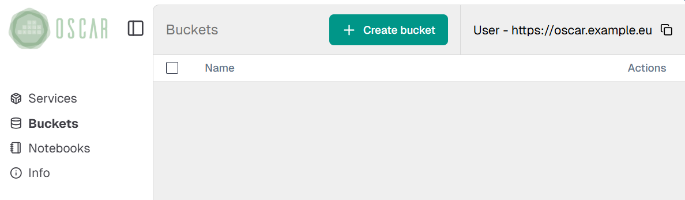
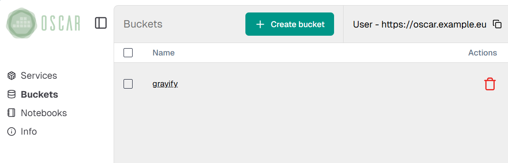

# Frequently Asked Questions (FAQ)

## Troubleshooting

- **Sometimes, when trying to deploy the cluster locally, it tells me that the :80 port is already in use.**

You may have a server running on the :80 port, such as Apache, while the deployment is trying to use it for the OSCAR Dashboard. Restarting it would solve this problem.

- **I get the following error message: "Unable to communicate with the cluster. Please make sure that the endpoint is well-typed and accessible."**

When using oscar-cli, you can get this error if you try to run a service that is not present on the cluster set as default.
You can check if you are using the correct default cluster with the following command,

`oscar-cli cluster default`

and set a new default cluster with the following command:

`oscar-cli cluster default -s CLUSTER_ID`

- **How do I use a secret image?**

In case it is required the use of secret images, you should create a [secret with the docker login configuration](https://kubernetes.io/docs/tasks/configure-pod-container/pull-image-private-registry/#registry-secret-existing-credentials) with a structure like this:

```
apiVersion: v1
kind: Secret
metadata:
  name: dockersecret
  namespace: oscar-svc
data:
  .dockerconfigjson: {base64 .docker/config.json}
type: kubernetes.io/dockerconfigjson
```

Apply the file through kubectl into the Kubernetes OSCAR cluster to create the secret. To use it in OSCAR services, you must add the secret name (`dockersecret` in this example) in the definition of the service, using the API or a FDL, under the `image_pull_secrets` parameter, or through the "Docker secret" field in OSCAR-Dashboard.

- **The OSCAR cluster does not have TLS certificates (HTTPS). Why?**

It could happen when an OSCAR cluster is deployed from an IM recipe that does not have certificates or the Let's Encrypt limit has been reached. Only [50 certificates per week can be issued](https://letsencrypt.org/docs/rate-limits/). Those certificates have a [90 days expiration lifetime](https://letsencrypt.org/2015/11/09/why-90-days.html). The certificates issued can be seen at https://crt.sh/?q=im.grycap.net.

- **I do not have certificates. I cannot see the buckets. What do I have to do?**

If the OSCAR cluster has no certificate OSCAR Dashboard will not show the buckets.



You can fix this by entering in the MinIO endpoint `minio.<OSCAR-endpoint>`. The browser will block the page because it is unsafe. Once you accept the risk, you will enter the MinIO page. It is not necessary to log in.


Return to OSCAR Dashboard and, then,  you can see the buckets.
The buckets will be shown only in the browser where you do this process.
The results may vary depending on the browser. For example, they will show up in Firefox but not in Chrome.


