<section class="oscar-hero oscar-lab-hero">
  
Hands-on lab

  <h1 class="oscar-hero__title">Lab 01. Deployment and Execution in OSCAR</h1>
  

    This lab uses the ImageMagick example from OSCAR Hub to show a complete onboarding workflow: deploy the service,
    confirm that the generated resources are ready, execute a quick synchronous test, and then validate the asynchronous
    event-driven path by uploading files to the input bucket.
  

  

    <a class="oscar-pill" href="../usage-dashboard/">Dashboard guide</a>
    <a class="oscar-pill" href="../invoking-sync/">Sync invocations</a>
    <a class="oscar-pill" href="../invoking-async/">Async invocations</a>
    <a class="oscar-pill" href="https://hub.oscar.grycap.net">OSCAR Hub</a>
  

  

    <a class="oscar-back-link" href="../hands-on/">
      &#8592;
      Back to all labs
    </a>
  

</section>

  <section class="oscar-lab-panel">
    
Before you start

    <h2>Prerequisites</h2>
    <ul>
      <li>A running OSCAR deployment with access to the Dashboard.</li>
      <li>Credentials to log in and enough quota to deploy services.</li>
      <li>One sample image for the synchronous test and optionally a few more images for the asynchronous test.</li>
      <li>Recommended references: <a href="../deploy-im-dashboard/">Deploy OSCAR</a>, <a href="../usage-dashboard/">OSCAR Dashboard</a>, and <a href="../oscar-cli/">OSCAR CLI</a>.</li>
    </ul>
  </section>
  <section class="oscar-lab-panel">
    
Expected outcome

    <h2>What you should get</h2>
    <ul>
      <li>The ImageMagick service is deployed from OSCAR Hub.</li>
      <li>A synchronous request returns a valid grayscale image.</li>
      <li>An asynchronous upload creates jobs and stores grayscale outputs in the output bucket.</li>
      <li>You finish the lab understanding when to prefer sync or async execution.</li>
    </ul>
  </section>

## 0. Login to the OSCAR cluster

Open the Dashboard login page and sign in with an account that has permission to deploy services.

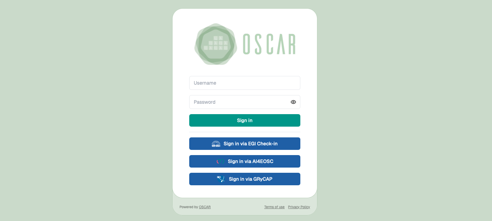

## 1. Find the ImageMagick service in OSCAR Hub

Log in to the Dashboard, open the OSCAR Hub catalog, and locate the ImageMagick service.

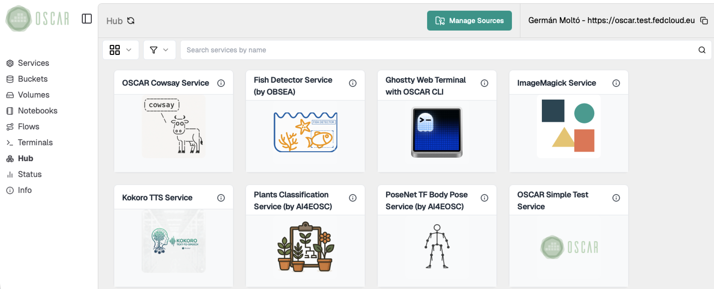

*Browse the OSCAR Hub catalog and locate the ImageMagick service.*

## 2. Review the service details and deployment options

Open the service card to inspect its description and confirm that it is the image-processing example you want to use for the lab.

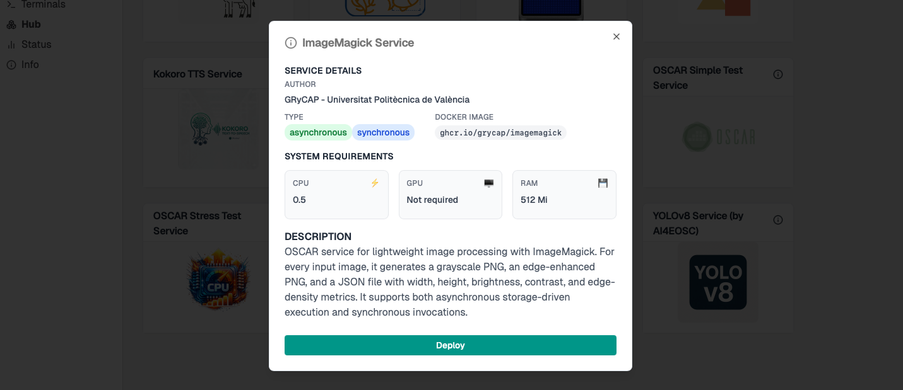

*Check the service description before deploying it.*

Review the deployment options and choose a service name that is easy to identify, together with a bucket name.
Using the same name for both the service and the bucket can simplify the lab, but it is optional.
Keep the default resource configuration for a first run unless you already know that you need different sizing.

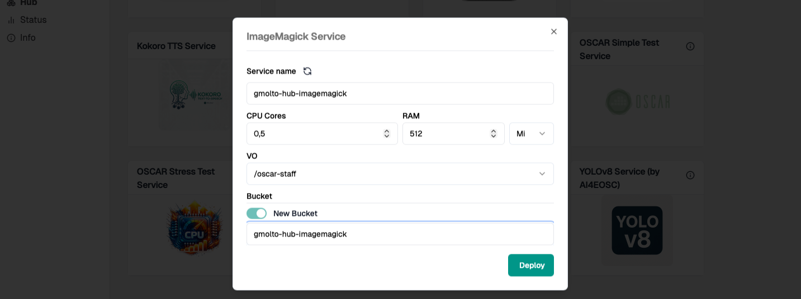

*Use the resource configuration for the first hands-on execution.*

## 3. Verify that the service is ready

Deploy the service and wait until it appears in the main services view of the Dashboard.

- Confirm that the deployment completed successfully.
- Check that the service token, logs action, and storage-related information are available.
- Verify that the required input and output locations have been created.

*Wait until the deployed service is visible in the main Dashboard view.*

## 4. See the OSCAR service details

Open the deployed service and review its token, storage configuration, and available actions before invoking it.

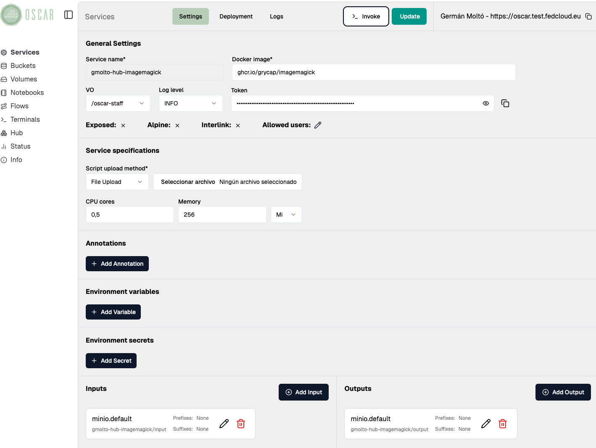

## 5. Run a synchronous invocation

Open the service invocation view from the Dashboard and upload [a sample image](https://raw.githubusercontent.com/grycap/oscar-hub/main/crates/imagemagick/input.png).

- Use this step as a quick validation that the service image and runtime are working correctly.
- Inspect the response and confirm that the output corresponds to the grayscale version of the original file.

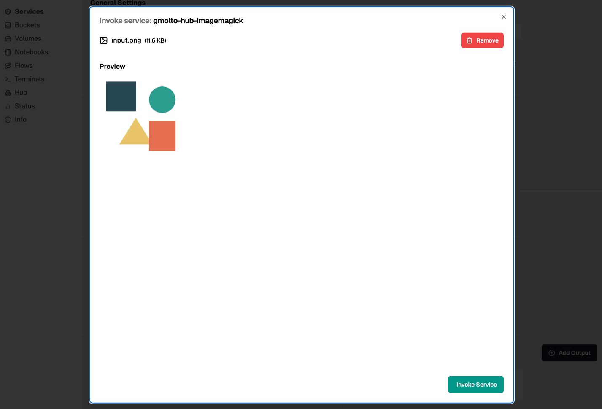

*Upload the input payload from the Dashboard invocation view.*

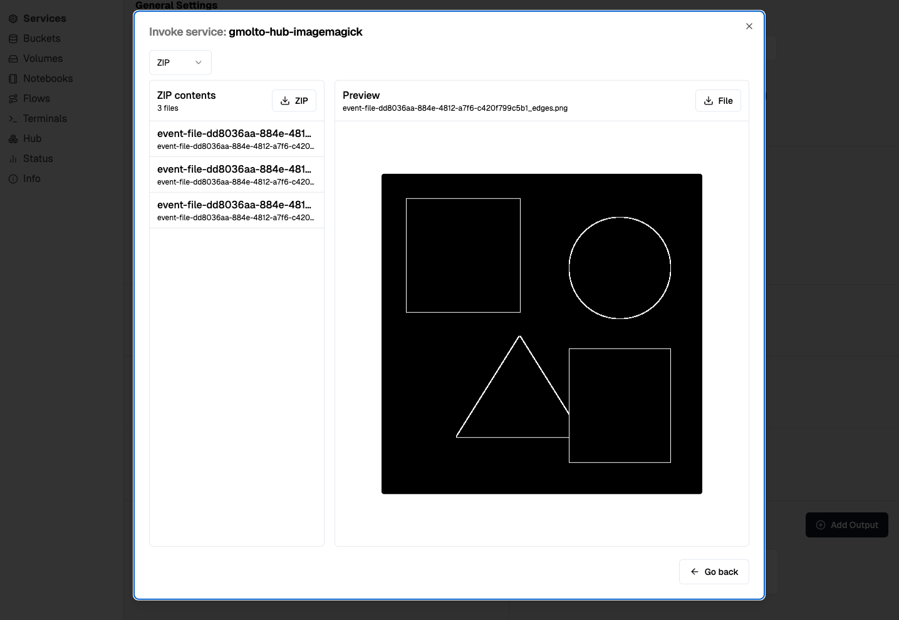

*Inspect the response returned by the synchronous invocation.*

## 6. Open the service bucket

Find the service bucket in the Dashboard:

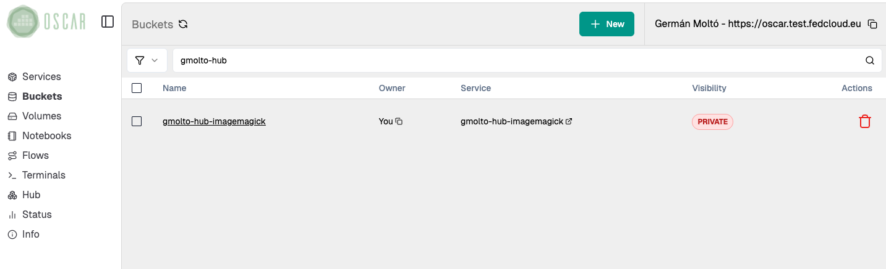

## 7. Run an asynchronous execution

Upload one or several images into the bucket.

- Each upload should trigger the service automatically.
- Use multiple files if you want to observe the event-driven behaviour more clearly.

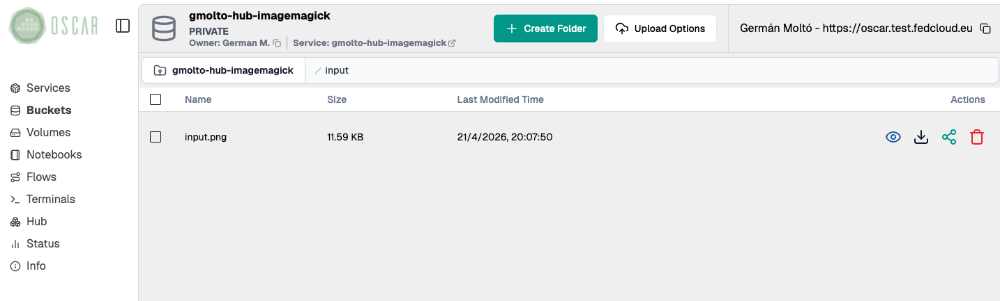

*Upload one or more images to trigger asynchronous execution.*

## 8. Check the job(s)

Follow the jobs from the logs panel and wait until they reach the `Succeeded` state.

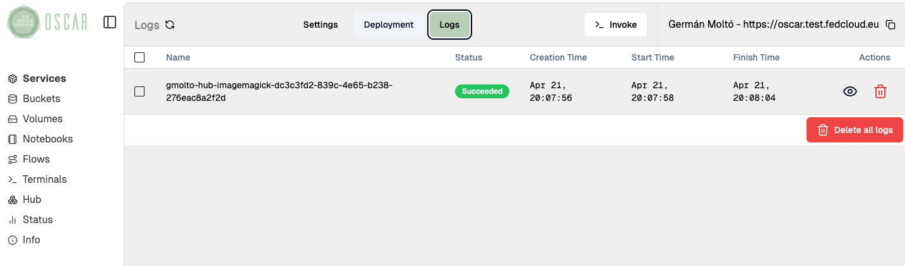

*Inspect the lifecycle and status of the asynchronous jobs.*

## 9. List and verify the output(s)

Finally, open the output bucket and verify that the processed files were converted to grayscale.

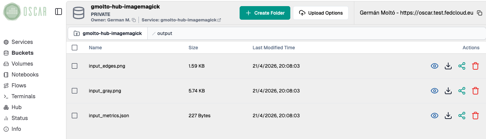

*Validate the resulting files in the output bucket.*

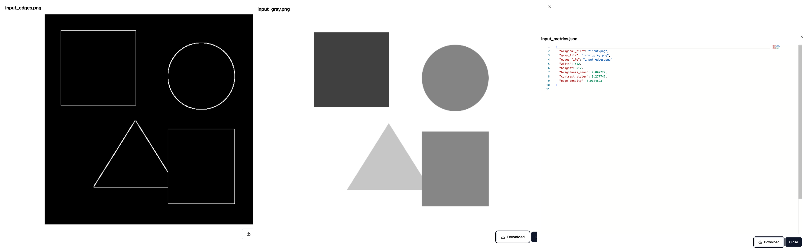

## 10. Delete the service

When you finish the lab, if you do not plan to proceed with additional hands-on labs, delete the service to clean up the deployed service if it is no longer needed.
The associated bucket will be automatically deleted.

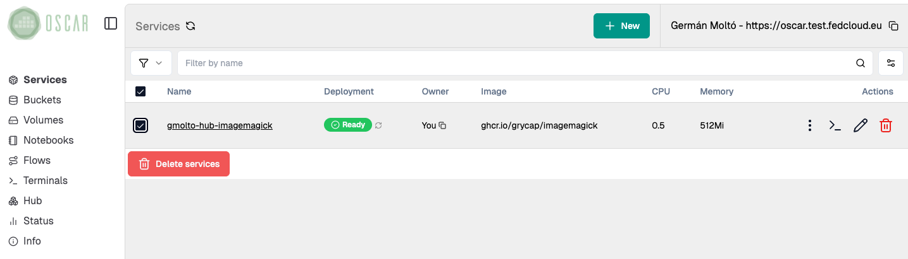

<section class="oscar-lab-panel oscar-lab-outcome">
  
Summary

  <h2>Key takeaways</h2>
  <ul>
    <li>Synchronous execution gives immediate feedback and is useful as a smoke test.</li>
    <li>Asynchronous execution is better aligned with OSCAR's event-driven model for file-processing workloads.</li>
    <li>Both execution modes use the same service but differ in how the request is triggered and how the result is inspected.</li>
  </ul>
</section>

<section class="oscar-lab-panel oscar-lab-outcome">
  
Final checklist

  <h2>What you should verify before finishing</h2>
  <ul>
    <li>The ImageMagick service was deployed successfully from OSCAR Hub.</li>
    <li>The synchronous invocation returned a valid result.</li>
    <li>The asynchronous upload triggered jobs and produced output files.</li>
    <li>You can explain the practical difference between sync and async execution in OSCAR.</li>
  </ul>
</section>

<!--
<section class="oscar-media-card oscar-lab-feature">
  

    
Next lab

    <h2>Continue with Lab 02: Interactive Analysis</h2>
    

      The next lab skeleton is ready so you can add the interactive analysis workflow on top of the same training
      structure used here.
    

  

  

    <a class="oscar-slide-button" href="../hands-on-interactive-analysis/">Open Lab 02</a>
  

</section>
-->