<section class="oscar-hero oscar-lab-hero">
  
Hands-on lab

  <h1 class="oscar-hero__title">Lab 02. Interactive Analysis via Jupyter Notebooks</h1>
  

    In this lab you will deploy a Jupyter Notebook in OSCAR, mount the bucket created for the ImageMagick service,
    and use an interactive notebook to inspect the processed images and their generated metrics.
  

  

    <a class="oscar-pill" href="../usage-dashboard/">Dashboard guide</a>
    <a class="oscar-pill" href="../integration-jupyter/">Jupyter Notebooks in OSCAR</a>
  

  

    <a class="oscar-back-link" href="../hands-on/">
      &#8592;
      Back to all labs
    </a>
  

</section>

  <section class="oscar-lab-panel">
    
Before you start

    <h2>Prerequisites</h2>
    <ul>
      <li>A running OSCAR deployment with access to the Dashboard.</li>
      <li>Credentials to log in and enough quota to deploy services.</li>
      <li>You should have completed <a href="../hands-on-deploy-execute/">Lab 01: Deploy and Execute</a> and not removed the service.</li>
    </ul>
  </section>
  <section class="oscar-lab-panel">
    
Expected outcome

    <h2>What you should get</h2>
    <ul>
      <li>A Jupyter Notebook is deployed with the bucket mounted as part of its storage.</li>
      <li>The uploaded images are processed by the ImageMagick service and the derived outputs are visible from Jupyter.</li>
      <li>A notebook-based analysis produces plots and observations from the generated files and metrics.</li>
    </ul>
  </section>

## 0. Locate your service in the OSCAR Dashboard

Start from the service you deployed in <a href="../hands-on-deploy-execute/">Lab 01: Deploy and Execute</a>.
Open the Dashboard and confirm that the ImageMagick service is still available.

- Make a note of the service name and the associated bucket name.
- If the service is missing, redeploy it before continuing with this lab.
- You will reuse the same bucket so that Jupyter can access both the `input` and `output` folders.

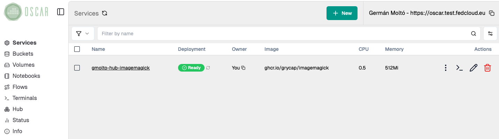

## 1. Collect a representative set of images to be processed

Download a small but varied set of images so that the notebook has meaningful data to compare.
The [sample-images folder in OSCAR Hub](https://github.com/grycap/oscar-hub/tree/main/crates/imagemagick/sample-images) already contains a suitable dataset.

- Use several files instead of just one image.
- Prefer images with visibly different patterns such as gradients, text, noise, and geometric shapes.
- This variation makes the grayscale, edge maps, and metrics easier to interpret later.

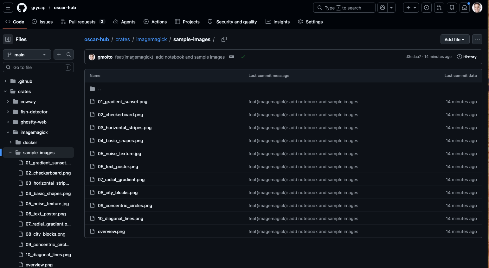

## 2. Upload them to the service's input bucket

Open the bucket linked to the ImageMagick service and upload the sample files into its `input` folder.

- Each uploaded file should trigger one asynchronous execution of the service.
- A batch upload is fine and is usually faster for the lab.
- Keep the original filenames, because the generated outputs will reuse them as prefixes.

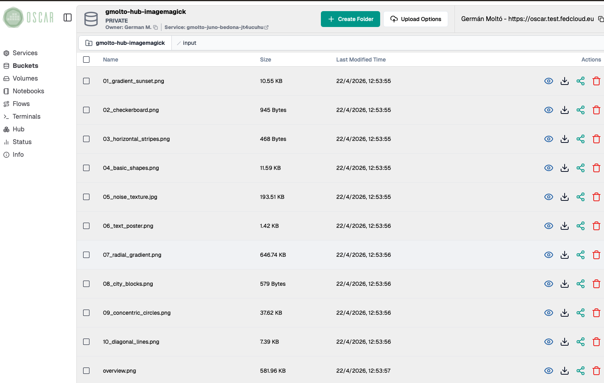

## 3. Check the execution logs

Move to the service logs and wait until the new jobs finish.

- For the files you just uploaded, the expected state is `Succeeded`.
- The logs view may still show older jobs from previous tests; focus on the entries with the most recent timestamps.
- If a job does not complete successfully, inspect it before moving on, because the notebook depends on the output files.

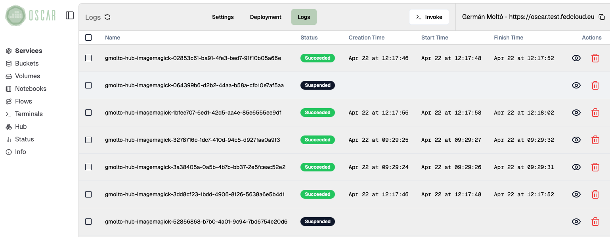

## 4. Check the output files

Open the bucket `output` folder and verify that the service generated multiple derived files per input image.

- The `*_gray.png` files are grayscale versions of the originals.
- The `*_edges.png` files highlight contours and transitions in the image.
- The `*_metrics.json` files store numerical descriptors that the notebook will read for plotting and comparison.

This is the point where OSCAR's event-driven execution ends and the interactive analysis phase begins.

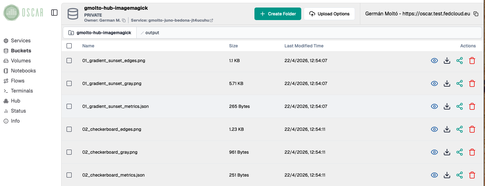

## 5. Start a Jupyter Environment with the Mounted Bucket

Open the `Notebooks` section in the Dashboard and create a new Jupyter instance.
Configure it to mount the same bucket used by the ImageMagick service.

- Choose a clear notebook name so you can identify it easily later.
- Keep the default or minimal resource profile for a first run unless you know you need more CPU or memory.
- Select the existing bucket instead of creating a new one. This is what exposes the `input` and `output` folders inside Jupyter.

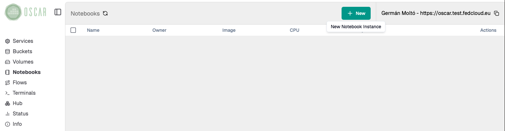

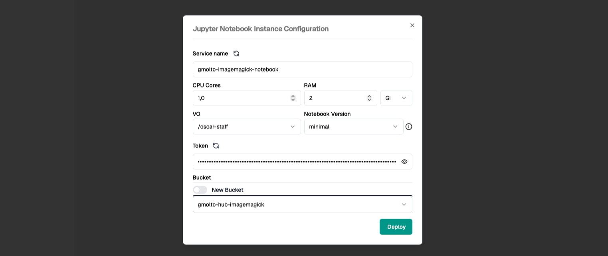

## 6. Access the Jupyter Environment

Wait until the notebook instance is ready, then open it from the Dashboard.

- A newly deployed notebook may take a short time to become reachable.
- Once it opens, confirm that the mounted workspace already contains the `input` and `output` directories from the bucket.
- That shared view is the key integration point: OSCAR writes the results to object storage, and Jupyter reads the same data for analysis.

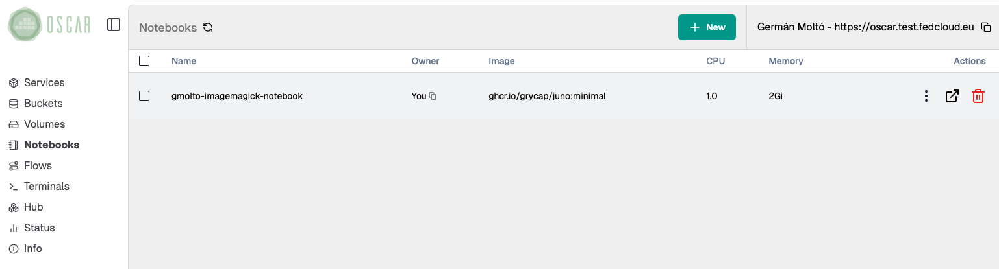

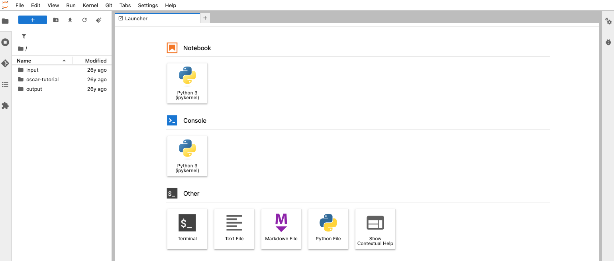

## 7. Import a Jupyter Notebook for Image Processing

From the Jupyter menu, use `File -> Open from URL` and import the notebook from:

<https://raw.githubusercontent.com/grycap/oscar-hub/refs/heads/main/crates/imagemagick/oscar-image-processing-notebook.ipynb>

After importing it:

- Save it in the mounted workspace so you can rerun it later.
- Read the introduction cells before executing anything.
- Confirm that the notebook is intended for the same ImageMagick workflow and bucket structure used in this lab.

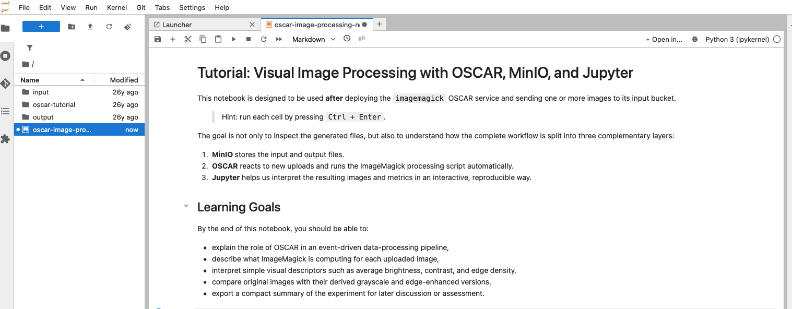

## 8. Follow the activities in the Notebook

Run the notebook step by step.
The notebook is designed to help you move from raw generated files to an interpretable analysis.

- It loads the derived images and the JSON metrics from the mounted bucket.
- It compares original, grayscale, and edge-enhanced outputs.
- It builds plots such as scatter charts and bar charts so you can compare brightness, contrast, and edge density across the uploaded files.
- Use the figures to identify which images are visually simple, highly textured, or dominated by strong transitions.

This step is where the interactive workflow adds value over a pure async execution: you are no longer just checking that files were generated, but interpreting what those results mean.

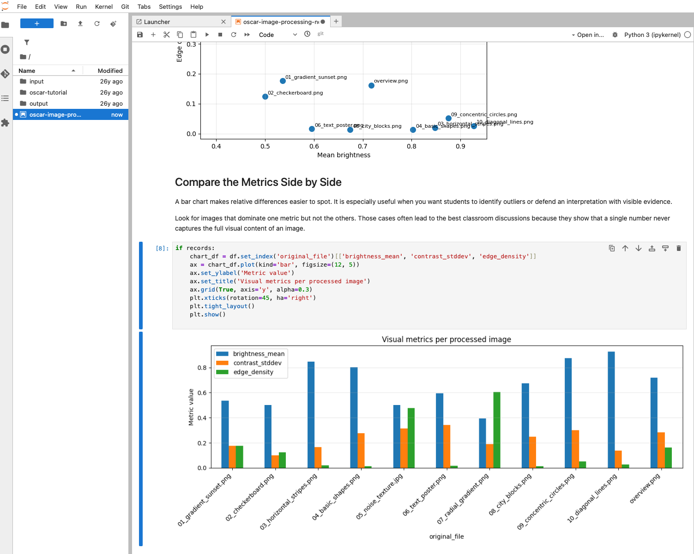

## 9. Clean up the resources

When the lab is finished, remove the resources you no longer need.

- Delete the Jupyter notebook instance from the `Notebooks` view.
- If you imported a notebook file only for this exercise, you can also remove it from the mounted workspace.
- If you are completely done with the ImageMagick example, delete the OSCAR service as well. This also lets you clean up the associated bucket and stored files.

If you plan to continue experimenting, keep the service and bucket and only remove the notebook instance.

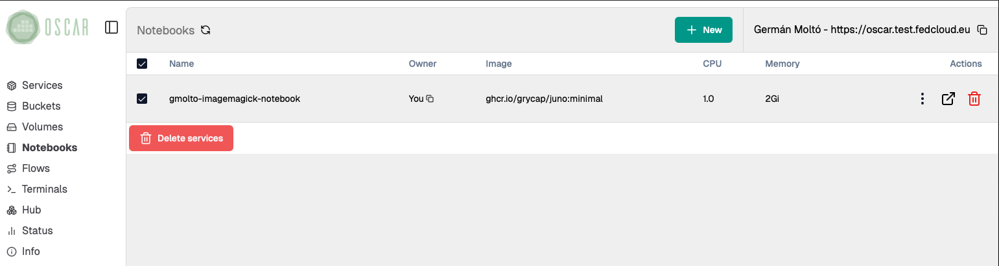

<section class="oscar-lab-panel oscar-lab-outcome">
  
Summary

  <h2>Key takeaways</h2>
  <ul>
    <li>OSCAR and Jupyter complement each other: OSCAR performs the event-driven processing and Jupyter supports interpretation of the generated data.</li>
    <li>Mounting the same bucket inside Jupyter creates a simple bridge between automated execution and interactive analysis.</li>
    <li>The ImageMagick example produces both visual outputs and machine-readable metrics, which makes it suitable for teaching exploratory analysis workflows.</li>
    <li>Compared with a pure sync or async validation, the notebook workflow helps explain patterns, compare files side by side, and document conclusions.</li>
  </ul>
</section>

<section class="oscar-lab-panel oscar-lab-outcome">
  
Final checklist

  <h2>What you should verify before finishing</h2>
  <ul>
    <li>The ImageMagick service processed the uploaded files and stored `gray`, `edges`, and `metrics` outputs in the bucket.</li>
    <li>The Jupyter instance started successfully and the mounted workspace exposed the same `input` and `output` folders.</li>
    <li>The imported notebook ran without blocking errors and generated comparison plots from the processed files.</li>
    <li>You can explain at least one observation from the metrics or visualizations, such as which image has higher edge density or lower brightness.</li>
    <li>Any temporary notebook or service resources that are no longer needed were deleted.</li>
  </ul>
</section>
