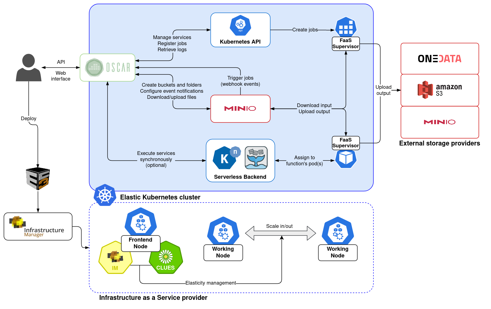

# Introduction

OSCAR is a framework to efficiently support on-premises FaaS (Functions as a Service) for general-purpose file-processing computing applications. 
It represents the porting to an on-premises scenario of the [SCAR framework](https://github.com/grycap/scar), which supports a [High Throughput Computing Programming Model](https://scar.readthedocs.io/en/latest/prog_model.html) to create highly-parallel event-driven file-processing serverless applications that execute on customized runtime environments provided by Docker containers run on AWS Lambda.

## Goal

Users upload files to a bucket and this automatically triggers the execution of parallel invocations to a function responsible for processing each file. Output files are delivered into an output bucket for the convenience of the user. Highly scalable HTTP-based endpoints can also be offered in order to expose a generic application. 
An user-provided shell script is executed inside the container run from the user-defined Docker image in order to achieve the right execution environment for the application.

## Components

OSCAR runs on an elastic [Kubernetes](http://kubernetes.io) cluster that is deployed using:

- [EC3](http://www.grycap.upv.es/ec3), an open-source tool to deploy compute clusters that can horizontally scale in terms of number of nodes with multiple plugins.
- [IM](http://www.grycap.upv.es/im), an open-source virtual infrastructure provisioning tool for multi-Clouds.
- [CLUES](http://github.com/grycap/clues), an elasticity manager that horizontally scales in and out the number of nodes of the Kubernetes cluster according to the workload.

The following components are deployed inside the Kubernetes cluster in order to support the OSCAR platform:

- [MinIO](http://minio.io), a high performance distributed object storage server that provides an API compatible with S3. 
- [OpenFaaS](https://www.openfaas.com/), a FaaS platform that allows creating functions executed via HTTP requests.
- OSCAR, the main application, responsible for the management of the services and the integration of the different components to support event-driven serverless computing for file processing. It includes a web-based GUI aimed at end users to facilitate interaction with OSCAR.

As external storage providers, the following services can be used:

- External [MinIO](https://min.io) servers, which may be in clusters other than the platform.
- [Amazon S3](https://aws.amazon.com/s3/), the Amazon's  object storage service that offers industry-leading scalability, data availability, security, and performance in the public Cloud.
- [Onedata](https://onedata.org/), the global data access solution for science used in the [EGI Federated Cloud](https://datahub.egi.eu/).