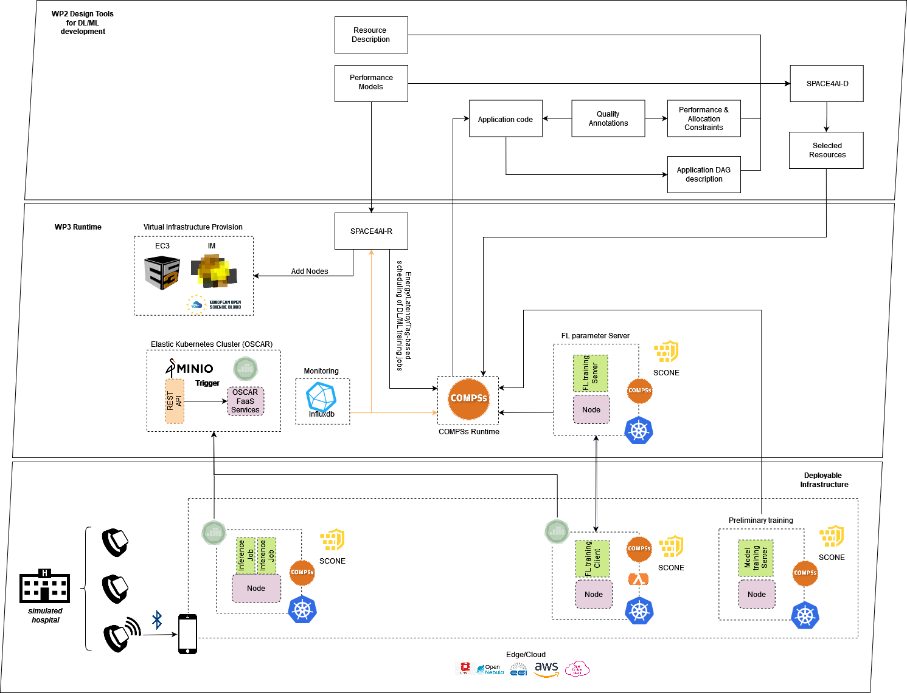

# Integration with COMPSs

[COMPSs](https://compss-doc.readthedocs.io/en/stable/) is a task-based programming model which aims to ease the development of applications for distributed infrastructures, such as large High-Performance clusters (HPC), clouds and container managed clusters. COMPSs provides a programming interface for the development of the applications and a runtime system that exploits the inherent parallelism of applications at execution time.

COMPSs support was introduced in OSCAR for the [AI-SPRINT](https://ai-sprint-project.eu) project to tackle the [Personalized Healthcare use case](https://ai-sprint-project.eu/use-cases/personalised-healthcare) in which OSCAR is employed to perform the inference phase of pre-trained models out of sensitive data captured from wearable devices. COMPSs, in particular, its Python binding named [PyCOMPSs](https://compss-doc.readthedocs.io/en/stable/Sections/09_PyCOMPSs_Notebooks/syntax/1_Basic.html), was integrated to exploit parallelism across the multiple virtual CPUs of each pod resulting from each [OSCAR service asynchronous invocation](invoking-async.md). This use case was coordinated by the [Barcelona Supercomputing Center (BSC)](https://www.bsc.es)

There are several examples that showcase the COMPSs integration with OSCAR in the [examples/compss](https://github.com/grycap/oscar/tree/master/examples/compss) folder in GitHub.