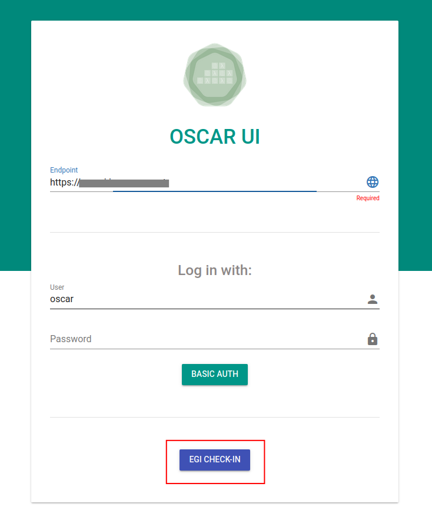
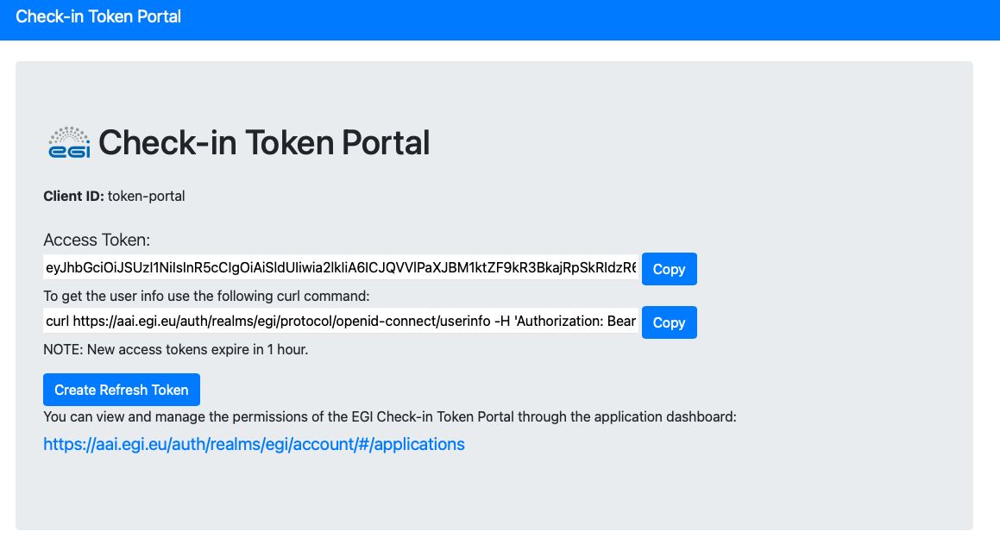

# Integration with EGI

[EGI](https://www.egi.eu/) is a federation of many cloud providers and
hundreds of data centres, spread across Europe and worldwide that delivers
advanced computing services to support scientists, multinational projects and
research infrastructures.

## Deployment on the EGI Federated Cloud

The [EGI Federated Cloud](https://www.egi.eu/federation/egi-federated-cloud/)
is an IaaS-type cloud, made of academic private clouds and virtualised
resources and built around open standards. Its development is driven by
requirements of the scientific communities.

The OSCAR platform can be deployed on the EGI Federated Cloud resources
through the [IM Dashboard](https://im.egi.ei).

You can follow [EGI's IM Dashboard documentation](https://docs.egi.eu/users/compute/orchestration/im/dashboard/) or the [OSCAR's IM Dasboard](deploy-im-dashboard.md) documentation.


## Integration with EGI Datahub (Onedata)

[EGI DataHub](https://datahub.egi.eu/), based on
[Onedata](https://onedata.org/#/home), provides a global data access solution
for science. Integrated with the EGI AAI, it allows users to have Onedata
spaces supported by providers across Europe for replicated storage and
on-demand caching.

EGI DataHub can be used as an output storage provider for OSCAR, allowing
users to store the resulting files of their OSCAR services on a Onedata
space. This can be done thanks to the
[FaaS Supervisor](https://github.com/grycap/faas-supervisor). Used in OSCAR
and [SCAR](https://github.com/grycap/scar), responsible for managing the data
Input/Output and the user code execution.

To deploy a function with Onedata as output storage provider you only have to
specify an identifier, the URL of the Oneprovider host, your access token and
the name of your Onedata space in the "Storage" tab of the service creation
wizard:


And the path where you want to store the files in the "OUTPUTS" tab:


This means that scientists can store their output files on their Onedata space
in the EGI DataHub for long-time persistence and easy sharing of experimental
results between researchers.


## Integration with EGI Check-In (OIDC)

[OSCAR API](api.md) supports OIDC (OpenID Connect) access tokens to authorize users
since release `v2.5.0`. By default, OSCAR clusters deployed via the
[IM Dashboard](deploy-im-dashboard.md) are configured to allow authorization
via basic auth and OIDC tokens using the
[EGI Check-in](https://www.egi.eu/service/check-in/) issuer. From the IM
Dashboard deployment window, users can add one
[EGI Virtual Organization](https://operations-portal.egi.eu/vo/a/list) to
grant access for all users from that VO.


### Accessing from OSCAR UI

The static web interface of OSCAR has been integrated with EGI Check-in and
published in [ui.oscar.grycap.net](https://ui.oscar.grycap.net) to facilitate
the authorization of users. To login through EGI Check-In using OIDC tokens,
users only have to put the endpoint of its OSCAR cluster and click on the
"EGI CHECK-IN" button.



### Integration with OSCAR-CLI via OIDC Agent

Since version `v1.4.0` [OSCAR CLI](oscar-cli.md) supports API authorization
via OIDC tokens thanks to the integration with
[oidc-agent](https://indigo-dc.gitbook.io/oidc-agent/).

Users must install `oidc-agent` following its
[instructions](https://indigo-dc.gitbook.io/oidc-agent/installation) and
create a new account configuration for the
`https://aai.egi.eu/auth/realms/egi/` issuer. 

After that, clusters can be
added with the command [`oscar-cli cluster add`](oscar-cli.md#add) specifying
the oidc-agent account name with the `--oidc-account-name` flag.

### Obtaining an Access Token

Once logged in via EGI Check-In you can obtain an Access Token with one of this approaches:

* From the command-line, using `oidc-agent` with the following command:

    ```sh
    oidc-token <account-short-name>
    ```
    where `account-short-name` is the name of your account configuration.
    
* From the EGI Check-In Token Portal: [https://aai.egi.eu/token](https://aai.egi.eu/token)


