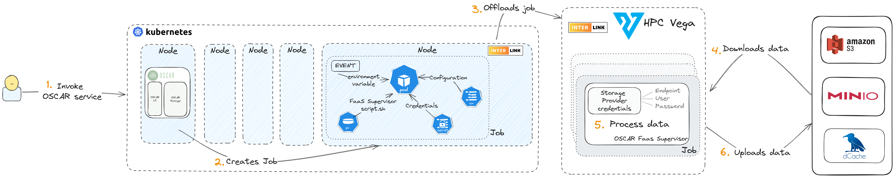

# Integration with interLink

The project [interLink](https://intertwin-eu.github.io/interLink/) is an open-source development that aims to provide an abstraction for executing a Kubernetes pod on any remote resource capable of managing a Container execution lifecycle.

OSCAR uses the Kubernetes Virtual Node to translate a job request from the Kubernetes pod into a remote call. We have been using interLink to interact with an HPC cluster. For more infomation check this [video demo](https://youtu.be/NoVCfSxwtX0?si=emLcwTiUR897jFOg).

## Installation and use of interLink Node in OSCAR cluster

The cluster Kubernetes must have at least one virtual kubelet node. Those nodes will have tagged as `type=virtual-kubelet`. Follow the documentation in the [interLink homepage](https://intertwin-eu.github.io/interLink/) to deploy an interLink virtual node to the Kubernetes cluster. OSCAR detects these nodes automatically.

Once the Virtual node and OSCAR are installed correctly, you can use this node to offload your job to the configured remote host. To offload the jobs created by a service to an interLink node the name of the virtual node has to be set in the `interlink_node_name` variable of the [service FDL](https://docs.oscar.grycap.net/fdl/#service).

Otherwise, if the variable is not set, i.e., `""`, the job will be executed in a normal Kubernetes node.

## Annotations, restrictions, and other things to keep in mind

- The [OSCAR services annotations](https://docs.oscar.grycap.net/fdl/#service) would be applied to every job for that service. The annotations are used to apply some configuration to the remote host.

- The memory and CPU defined in the OSCAR services are not applied to the jobs that are offloaded via interLink. Those parameters are set employing the annotations, as specified by the provider.

- When the offloading is set to a SLURM job, it's possible to request some resources employing [slurm flags](https://curc.readthedocs.io/en/latest/running-jobs/job-resources.html#slurm-resource-flags). For example: 
  - To request CPU and memory, `slurm-job.vk.io/flags`( `--job-name`, `--time=02:30:00`, `--cpus-per-task`, `--nodes`, `--mem`) 
  - To mount a system folder in an HPC cluster `job.vk.io/singularity-mounts` and value pattern `"--bind <outside-container>:<inside-container>"`. 
  - To  execute a command before each run `job.vk.io/pre-exec`.

- Any environment variable with a special character could create an error in the translation between the virtual node and the remote job. As a good practice, pass the environment variable encode in Base64 and decode it inside the execution of the script.

- Please note when the remote host is a SLURM cluster a docker container will be translated into a singularity one. There are some points to consider:

    - You must reference the image container indicating `docker://` at the beginning, e.g., `docker://ghcr.io/intertwin-eu/itwinai:0.0.1-3dgan-0.2`. 
    - Once the image is pulled in the remote host, the image can be referenced by path `<path-of-container>/<image>.sif`.
    - Note that your script will not run as a privileged user in the container. Therefore, you cannot write in the regular file system. Use the `/tmp` folder if needed instead.
    - There is no working directory in singularity. Therefore, absolute paths are recommended.

The interLink integration was developed in the context of the [interTwin](https://www.intertwin.eu) project, with support from [Istituto Nazionale di Fisica Nucleare - INFN](https://home.infn.it/it/), who developed interLink, and [CERN](https://home.cern), who provided the development of [itwinai](https://github.com/interTwin-eu/itwinai), used as a platform for advanced AI/ML workflows in digital twin applications and a use case. Special thanks to the [IZUM Center](https://izum.si) in Slovenia for providing access to the [HPC Vega](https://en-vegadocs.vega.izum.si) supercomputing facility to perform the testing.