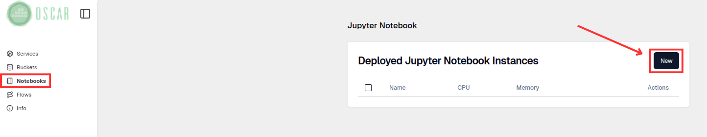
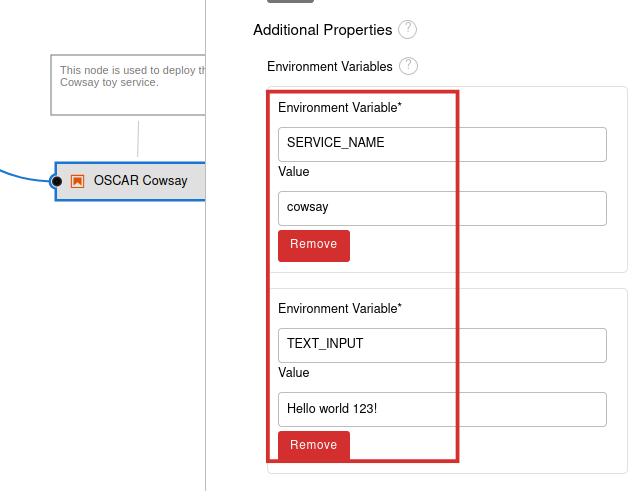

# Integration with Jupyter Notebooks

This project enables the deployment of Jupyter Notebooks inside an [`OSCAR`](https://oscar.grycap.net/) cluster, allowing users to interact with OSCAR, through its [`Python client`](https://github.com/grycap/oscar_python).

It also includes support for [`Elyra`](https://github.com/elyra-ai/elyra), for composing AI inference pipelines, and [`APRICOTLab`](https://github.com/grycap/apricotlab), to facilitate computational reproducibility by deploying virtualized infrastructures via the [`Infrastructure Manager (IM)`](https://www.grycap.upv.es/im/index.php).

## Simple tutorial

This tutorial shows a simple example of how to run the COWSAY synchronous service. You will learn:

- How to deploy a Jupyter Notebook instance
- How to create a notebook to run the COWSAY synchronous service
- How to create a Elyra project to run COWSAY synchronous service

### Deploy Jupyter Notebook

**Deploy COWSAY service**

To develop the examples you must have a service deployed (`COWSAY`).Go to the [`OSCAR dashboard`](https://dashboard.oscar.grycap.net/) and select *Create service -> FDL*. Use the following configuration:

**FDL:**

```yaml
    functions:
        oscar:
        - cluster-id:
            name: cowsay-sync-test
            cpu: '1.0'
            memory: 1Gi
            image: ghcr.io/grycap/cowsay
            script: script.sh
            log_level: CRITICAL
```
    
**Script:**

```bash
    #!/bin/sh

    if [ "$INPUT_TYPE" = "json" ]
    then
        jq '.message' "$INPUT_FILE_PATH" -r | /usr/games/cowsay
    else
        cat "$INPUT_FILE_PATH" | /usr/games/cowsay
    fi
```   

**Deploy Jupyter instance**

In the [`OSCAR dashboard`](https://dashboard.oscar.grycap.net/), go to *Notebooks* (Sidebar panel)  and then click *New*. 

</br>
</br>
Enter the Jupyter Notebook instance configuration values.
</br>
</br>
</br>
After deploying Jupyter Notebook we need to navigate to its user interface.

</br>
</br>
`
ℹ️ If you get an nginx error, you need to wait a little bit for the service to run.
`

</br>
</br>
This is the Jupyter Notebook working interface.

</br>
</br>

**Create a notebook in Jupyter**

Create a new notebook.


To interact with OSCAR from a Jupyter Notebook, we will use the [`OSCAR Python client`](https://github.com/grycap/oscar_python) library.
The code of the example of execution of the COWSAY synchronous service.

```python

from oscar_python.client import Client

token="yourToken"
oscar_options = {'cluster_id': 'cluster-id',
                'endpoint': 'https://cluster-endpoint.com',
                'oidc_token': token,
                'ssl': 'True'}
client = Client(options=oscar_options)

try:
    response = client.run_service("serviceName",
                input='{"message":"Hi there. I am a cow"}')
    print(response.text)
except Exception as err:
    print("Failed with: ", err)
    
```
In the code, you must configure the following parameters within `oscar_options`:

- **cluster_id**: Name of the OSCAR cluster.
- **endpoint**: URL of the OSCAR cluster.
- **oidc_token**: Obtain your token from [`EGI Token`](https://aai.egi.eu/token/) or personal token.
- **ssl**: Always True.

For the **serviceName** parameter, this will be the name of the service you want to run.

**Test the COWSAY example with Notebook**

After writing the code:

Click *Run* for each cell.

    

You should see the result.
```
    __________________________________
< {"message":"Hi there. I am a cow"} >
    ----------------------------------
        \\   ^__^"
        \\  (oo)\\_______
            (__)\\       )\\/\
                ||----w |
                ||     ||
    
```


ℹ️
If you want to see the example shown and others, you can download it from the
[`OSCAR-Jypiter`](https://github.com/grycap/oscar-juno/tree/main/examples/tutorial) repository or from the oscar-tutorial folder in your Jupyter workspace.`


### Create Elyra project

[`Elyra`](https://github.com/elyra-ai/elyra) is a JupyterLab extension that enhances the creation and management of workflows in data science and machine learning projects. It allows users to design processing and analysis pipelines through a visual interface, integrating notebooks, scripts, and components in a modular way.

Now we will access to create a Elyra project. To create a project click on the Elyra icon (*Generic Pipeline Editor*).


In the side panel, locate the notebooks (*.ipynb*) or scripts (*.py*) you want to include as nodes in your pipeline. If you wish, you can change the name of your pipeline (*.pipeline*).


Drag and drop each file onto the canvas. Each file becomes a pipeline node; in this case, a notebook node is created.


Right-Click to access the node properties where the notebook name (*file name*), runtime image, and other properties are located.


When you have several nodes, connect them by dragging a line from the output of one node to the input of the next, defining the order of execution. After you have the nodes connected in the execution order you want, save the pipeline and run.


**Test the COWSAY example with Elyra**
    
Download the COWSAY example from the [`AI4Compose`](https://github.com/ai4os/ai4-compose/tree/main/elyra/examples) repository. There you will find other examples that can be used in more complex applications.

Upload the downloaded files and open *cowsay.pipeline*. You'll then have the orchestrated workflow example.


ℹ️ If you double-click on each of the nodes you will be able to see each of the codes that will be executed.


Right-Click (*Open Properties*) to view the properties of each node. The `Get EGI Token` node (*setup_client.py*) contains the elements of the OSCAR cluster where the COWSAY service is installed. This node is common to any type of OSCAR service execution because it stores all the credentials for accessing the cluster; you just need to change the environment variable values.


Environment variables:

- **OSCAR_ENPOINT**: OSCAR cluster address ( *https://default-endpoint.com* )

- **OSCAR_CLUSTER_ID**: Cluster ID ( *OSCAR* )

- **CONFIG_ARCHIVE**: File where all cluster credentials will be saved ( *client.pkl* )

- **TYPE_INVOCATION**: Service invocation type ( *sync* or *async* )

- **TOKEN**: User token (can be obtained from [`EGI TOKEN`]( https://aai.egi.eu/token) )


The `OSCAR Cowsay` node (*invoke_service_cowsay.ipynb*) contains the following environment variables.


    
    
Environment variables:

- **SERVICE_NAME**: Name of the Cowsay service in OSCAR cluster ( *cowsay* )

- **TEXT_INPUT**: Input text that the service will process ( *Hello world 123!* )

Once all the nodes are configured, the user will run the workflow. Keep in mind that all files other than the *.pipeline* file should not be open. In this example, the results will be seen when opening the code of `OSCAR Cowsay` node.


      


