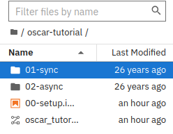
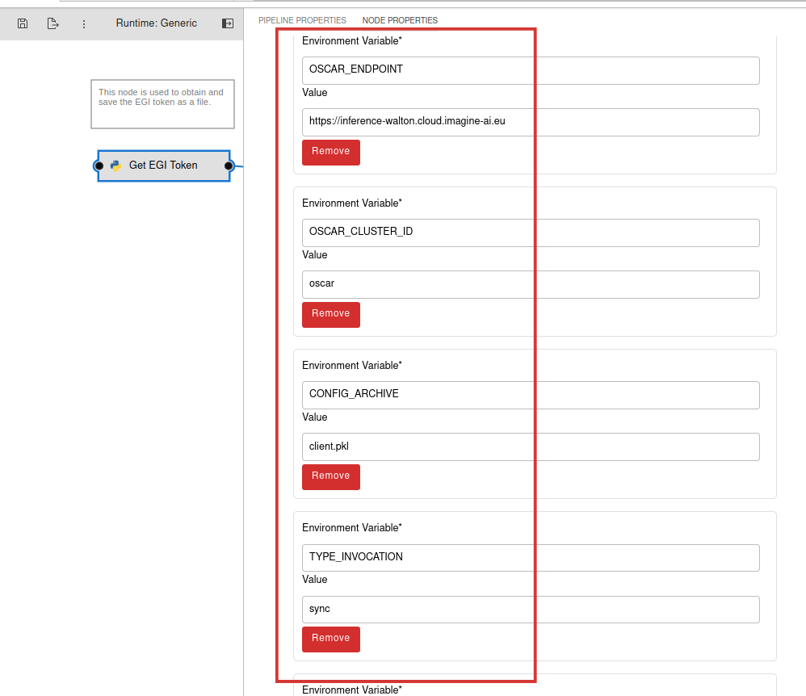
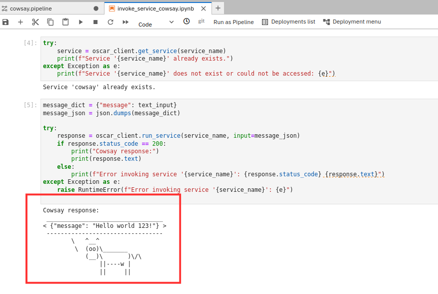

# Integration with Jupyter Notebooks

This project enables the deployment of Jupyter Notebooks inside an [`OSCAR`](https://oscar.grycap.net/) cluster, allowing users to interact with OSCAR, through its [`Python client`](https://github.com/grycap/oscar_python).

It also includes support for [`Elyra`](https://github.com/elyra-ai/elyra), for composing AI inference pipelines, and [`APRICOTLab`](https://github.com/grycap/apricotlab), to facilitate computational reproducibility by deploying virtualized infrastructures via the [`Infrastructure Manager (IM)`](https://www.grycap.upv.es/im/index.php).

## Simple tutorial

This tutorial shows a simple example of how to run the COWSAY synchronous service. You will learn:

- How to deploy a Jupyter Notebook instance
- How to create a notebook to run the COWSAY synchronous service
- How to create an Elyra project to run COWSAY synchronous service

### Deploy a Jupyter Notebook

**Deploy the COWSAY service**

To develop the examples, you must first deploy a service in OSCAR (`COWSAY`). For that, go to the [`OSCAR dashboard`](https://dashboard.oscar.grycap.net/) and select *New -> FDL*. Use the following configuration:

**FDL:**

```yaml
    functions:
        oscar:
        - cluster-id:
            name: cowsay-sync-test
            cpu: '1.0'
            memory: 1Gi
            image: ghcr.io/grycap/cowsay
            script: script.sh
            log_level: CRITICAL
```
    
**Script:**

```bash
    #!/bin/sh

    if [ "$INPUT_TYPE" = "json" ]
    then
        jq '.message' "$INPUT_FILE_PATH" -r | /usr/games/cowsay
    else
        cat "$INPUT_FILE_PATH" | /usr/games/cowsay
    fi
```   

**Deploy a Jupyter instance**

Now, let's create the Jupyter instance. In the [`OSCAR dashboard`](https://dashboard.oscar.grycap.net/), go to *Notebooks* (Sidebar panel)  and then click *New*. 

</br>
</br>
Enter the Jupyter Notebook instance configuration values. You can specify the name of an already existing bucket or create a new one (for example *juno-test*).
</br>
</br>
</br>
After deploying our Jupyter Notebooks instance, we need to navigate to its user interface. Notice that it takes some seconds to have the Jupyter service up and running, and this is represented by a spinning circle.

</br>
</br>
`
ℹ️ In case you don't see the Jupyter instance available to be accessed, you can refresh the OSCAR Dashboard by pressing the refresh button on the upper side of the panel. 
`
</br>
Once you have access to the instance, this is the Jupyter Notebook working interface you'll find.

</br>
</br>

**Create a notebook in Jupyter**

Let's start by creating a new notebook.


To interact with OSCAR from a Jupyter Notebook, we will use the [`OSCAR Python client`](https://github.com/grycap/oscar_python) library.
Next, you can see the code to invoke the execution of the COWSAY synchronous service we have created previously. Copy and paste the code in your notebook.

```python

from oscar_python.client import Client

token="yourToken"
oscar_options = {'cluster_id': 'cluster-id',
                'endpoint': 'https://cluster-endpoint.com',
                'oidc_token': "token",
                'ssl': 'True'}
client = Client(options=oscar_options)

try:
    response = client.run_service("serviceName",
                input='{"message":"Hi there. I am a cow"}')
    print(response.text)
except Exception as err:
    print("Failed with: ", err)
    
```
In the code, you must configure the following parameters within `oscar_options`:

- **cluster_id**: Name of the OSCAR cluster, representing an identifier for that cluster (for example 'sandbox').
- **endpoint**: URL of the OSCAR cluster where the OSCAR service you want to run is created. You can get it from the [`OSCAR dashboard`](https://dashboard.oscar.grycap.net/) (`Info` panel).
- **oidc_token**: Obtain your token from [`EGI Token`](https://aai.egi.eu/token/) or your personal token. Also available in the [`OSCAR dashboard`](https://dashboard.oscar.grycap.net/), section "Info".

For the **serviceName** parameter, this is the name of the service you want to run. In our tutorial, this is "cowsay-sync-test".

**Test the COWSAY example from the notebook**

After writing the code, click *Run* for each cell.


</br>
</br>

You should see the result of the OSCAR COWSAY service.
```
    __________________________________
< {"message":"Hi there. I am a cow"} >
    ----------------------------------
        \\   ^__^"
        \\  (oo)\\_______
            (__)\\       )\\/\
                ||----w |
                ||     ||
    
```


ℹ️
You can follow this example step by step in the oscar-tutorial folder in your Jupyter workspace, or downloading it from the
[`OSCAR-Jupyter`](https://github.com/grycap/oscar-juno/tree/main/examples/tutorial) repository.





### Working with Elyra

[`Elyra`](https://github.com/elyra-ai/elyra) is a JupyterLab extension that enhances the creation and management of workflows in data science and machine learning projects. It allows users to design processing and analysis pipelines through a visual interface, integrating notebooks, scripts, and components in a modular way. In our case, Elyra will facilitate the composition of different OSCAR services.

**Test the COWSAY example with Elyra**
    
Let's reproduce the COWSAY example in Elyra. For that, you have in the `oscar-tutorial` folder all the files needed. Locate them in the `03-elyra` folder on the left-side panel.


Double-click on the *cowsay.pipeline* file to open it. You'll then have the orchestrated workflow example.


ℹ️ If you double-click on each of the nodes, you will be able to see the source code that will be executed.

Let's configure the nodes to work properly with our COWSAY service we have created previously. For that, right-click and select *Open Properties* on the nodes to view the properties of each node. 

The `Get EGI Token` node (*setup_client.py*) contains the elements of the OSCAR cluster where the COWSAY service is created. This node is needed to interact with any OSCAR service because it stores all the credentials for accessing the cluster. You just need to change the environment variable values to properly configure it.



Now configure properly the environment variables:

- **OSCAR_ENDPOINT**: OSCAR cluster URL ( *https://default-endpoint.com* ). You can get it from the [`OSCAR dashboard`](https://dashboard.oscar.grycap.net/).
- **YOUR_TOKEN**: User token (can be obtained from the `Info`panel in the OSCAR Dashboard.

The `OSCAR Cowsay` node (*invoke_service_cowsay.ipynb*) contains the following environment variables.


    
    
So let's configure them properly for our tutorial: 

- **SERVICE_NAME**: Name of the Cowsay service in OSCAR cluster ( in our tutorial, *cowsay-sync-test* )
- **TEXT_INPUT**: Input text that the service will process ( for example, *Hello world 123!* )

Once all the nodes are configured, you can run the workflow. Keep in mind that all the files different from the *.pipeline* file should be closed. In Elyra, the results of the pipeline are shown in the notebook. So you will see the output when opening the code of `OSCAR Cowsay` node (double-click on the node to open it).




**Further details with Elyra**

In general, to work with Elyra, you have to create a new Elyra project. For that, click on the *Generic Pipeline Editor* Elyra icon in the "Launcher" page of Jupyter.


In the left-side panel, you have to locate the notebooks (*.ipynb*) or scripts (*.py*) you want to include as nodes in your pipeline. The general workflow consists on dragging and dropping each file you want to use in your pipeline onto the canvas. With this action, each file becomes a pipeline node. 


Then, you configure the nodes. For that, right-click on the node to access the node properties (as we have done in the previous example), where the notebook name (*Filename*), runtime image, and other properties are located. When you have several nodes, connect them by dragging a line from the output of one node to the input of the next, defining the order of execution. After you have connected the nodes in the desired execution order, save the pipeline and run it with the :arrow_forward: *Run Pipeline* button.


You can download the Cowsay example and other examples from the [`AI4Compose`](https://github.com/ai4os/ai4-compose/tree/main/elyra/examples) repository. You can use the Git tool available in the Jupyter Notebooks to clone the examples in the repository.

      


