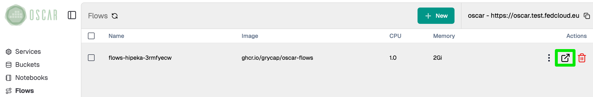
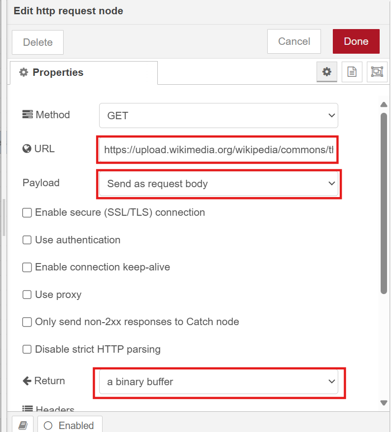

# Integration with Node-RED

[`Node-RED`](https://nodered.org/) is a flow-based development tool for visual programming, widely used to connect hardware devices, APIs, and online services. Its browser-based editor makes creating and deploying automation workflows simple.

In the context of OSCAR integration, Node-RED can be deployed and configured to interact with OSCAR services using authentication tokens obtained after logging in or using tokens specific for the service.

## Simple tutorial

This tutorial demonstrates a simple workflow that calls the YOLOv8 synchronous service. You will learn:
- How to deploy a Node-RED instance
- How to connect Node-RED to the YOLOv8 synchronous service
- How to authenticate using a token
- How to process image data through the workflow

### Steps

1. **Deploy YOLOv8**

    Go to the [`OSCAR dashboard`](https://dashboard.oscar.grycap.net/) and select `Create service -> FDL`. Use the following configuration:

    ***FDL:**
    ```yaml
    functions:
    oscar:
    - oscar-cluster:
        name: yolov8-node-red
        memory: 4Gi
        cpu: '2.0'
        image: ai4oshub/ai4os-yolov8-torch:latest
        script: script.sh
        log_level: CRITICAL
    ```
    **Script:**
    ```bash
    #!/bin/bash
    RENAMED_FILE="${INPUT_FILE_PATH}.png"
    mv "$INPUT_FILE_PATH" "$RENAMED_FILE"
    OUTPUT_FILE="$TMP_OUTPUT_DIR/output.png"
    deepaas-cli --deepaas_method_output="$OUTPUT_FILE" predict --files "$RENAMED_FILE" --accept image/png 2>&1
    echo "Prediction was saved in: $OUTPUT_FILE"
    ```

2. **Deploy Node-RED**

    In the [`OSCAR dashboard`](https://dashboard.oscar.grycap.net/), go to `Flows` (Sidebar panel)  and then click `New`. 

    

    Enter the **admin** password and select or create a Bucket.
 
    

    After deploying Node-RED we need to navigate to its user interface.

    
    ```
    ℹ️
    If you get an nginx error, you need to wait a little bit for the service to run.
    ```
    

    Log in with your credentials (the user is always **admin**).

    

    

3. **Create a workflow in Node-RED**

    Now we will create a workflow that will fetch an image from internet, make a request to Yolo8 service and visualize the result.

    We will need a the following list of components that can be found in the Node-RED sidebar menu:

    - **Common** → `inject` node
    - **Network** → `HTTP request` node
    - **Output** → `image` node
    - **OSCAR** → `OSCAR YOLO8` node
    
    


    Connect the components as shown:

    

    To configure the *HTTP request node* (double-click it):

    - **URL**: URL of an image
    - **Payload**: _Send as request body_
    - **Return**: _A binary buffer_

    

    To configure the `OSCAR YOLO8` node (double-click it):

    - **Server**: URL of the cluster
    - **Service** Name: _yolov8-node-red_
    - **Token**: Obtain the token from [`OSCAR dashboard`](https://dashboard.oscar.grycap.net/) → *Info* (Sidebar panel) → *Access token*

    

    ```
    ℹ️ 
    If you want to download this example and others, visit the [`AI4Compose`](https://github.com/ai4os/ai4-compose/tree/main)
      repository.
    ```
    
5. **Test the workflow**

    After configuring your workflow, test it in the Node-RED Editor:

    1. Click *Deploy* (top right corner)
    2. Click the *inject* node

    

    You should see the result.

    
