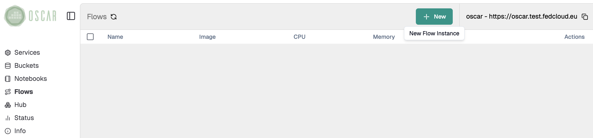

# Integration with Node-RED

[`Node-RED`](https://nodered.org/) is a flow-based development tool for visual programming, widely used to connect hardware devices, APIs, and online services. Its browser-based editor makes creating and deploying automation workflows simple.

In the context of OSCAR integration, Node-RED can be deployed and configured to interact with OSCAR services using authentication tokens obtained after logging in or using tokens specific for the service.

## Simple tutorial

This tutorial demonstrates a simple workflow that calls the [YOLOv8](https://github.com/grycap/oscar/tree/master/examples/yolov8) synchronous service. You will learn:

- How to deploy a Node-RED instance
- How to connect Node-RED to the YOLOv8 synchronous service
- How to authenticate using a token
- How to process image data through the workflow

### Steps

**Deploy YOLOv8**

Go to [`OSCAR Dashboard`](https://dashboard.oscar.grycap.net/) and, in the `Services` panel, select `Create service -> FDL`. Use the following configuration:

##### FDL:
```yaml
functions:
  oscar:
  - oscar-cluster:
      name: yolov8-node-red
      memory: 4Gi
      cpu: '2.0'
      image: ai4oshub/ai4os-yolov8-torch:latest
      script: script.sh
      log_level: CRITICAL
```
    
##### Script:

```bash
#!/bin/bash
RENAMED_FILE="${INPUT_FILE_PATH}.png"
mv "$INPUT_FILE_PATH" "$RENAMED_FILE"
OUTPUT_FILE="$TMP_OUTPUT_DIR/output.png"
deepaas-cli --deepaas_method_output="$OUTPUT_FILE" predict --files "$RENAMED_FILE" --accept image/png 2>&1
echo "Prediction was saved in: $OUTPUT_FILE"
```

**Deploy Node-RED instance**

1. In the [`OSCAR dashboard`](https://dashboard.oscar.grycap.net/), go to the `Flows` panel and then click `New`. 
     

1. Enter the **admin** password, that you will be asked to access later on this instance of Node-RED, and select or create a Bucket.
   
    

1. After deploying Node-RED we access its user interface.
    

Once the service is up and running, you can log in with your credentials (the user is always **admin**).


    

**Create a workflow in Node-RED**

Let's create a workflow that fetches an image from the Internet, makes a request to the YOLO service and visualizes the result.

We need the following list of components from the Node-RED sidebar menu:

- **Common** → `inject` node
- **Network** → `HTTP request` node
- **Output** → `image` node
- **OSCAR** → `OSCAR YOLO8` node


Drag and drop the boxes to the canvas and then connect the components as shown:


Now we need to configure the components. To configure the *HTTP request node* double-click on it:

- **URL**: URL of an image you want to analyze with YOLO (for example, you can use this [`image`](https://upload.wikimedia.org/wikipedia/commons/thumb/1/15/Cat_August_2010-4.jpg/640px-Cat_August_2010-4.jpg))
- **Payload**: _Send as request body_
- **Return**: _A binary buffer_


Configure the `OSCAR YOLO8` node:

- **Server**: URL of the OSCAR cluster. You can get it from [`OSCAR dashboard`](https://dashboard.oscar.grycap.net/) → *Info* (Sidebar panel) → *Endpoint*
- **Service** Name: _yolov8-node-red_
- **Token**: Obtain the token from [`OSCAR dashboard`](https://dashboard.oscar.grycap.net/) → *Info* (Sidebar panel) → *Access token*


    
**Test the workflow**

After configuring your workflow, you can test it in the Node-RED Editor:

Click *Deploy* (top right corner) and then click on the *inject* node:


You should see the result as indicated below. 


ℹ️ 
NOTE: If you want to download this example and others, visit the [`AI4Compose`](https://github.com/ai4os/ai4-compose/tree/main) repository.
