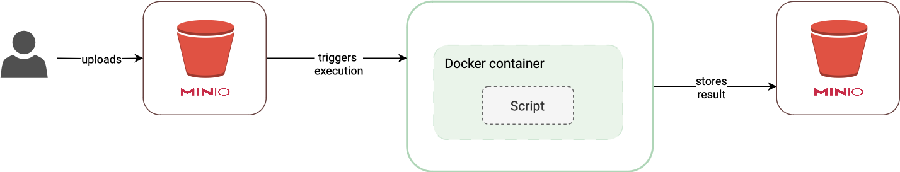

# Asynchronous invocations

For event-driven file processing, OSCAR automatically manages the creation
and [notification system](https://docs.min.io/minio/baremetal/monitoring/bucket-notifications/bucket-notifications.html#minio-bucket-notifications)
of MinIO buckets in order to allow the event-driven invocation of services
using asynchronous requests, generating a Kubernetes job for every file to be
processed.

In addition, the service can be executed asynchronously sending an
HTTP POST request to paths `/run/<SERVICE_NAME>` and `/job/<SERVICE_NAME>`
respectively. 

