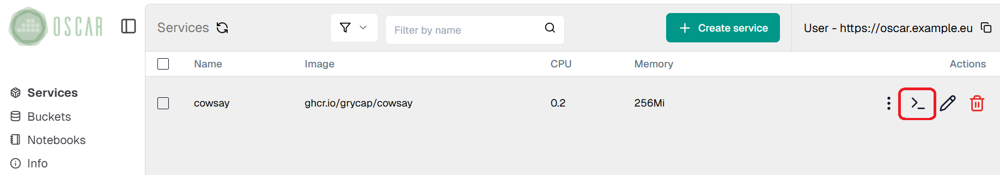
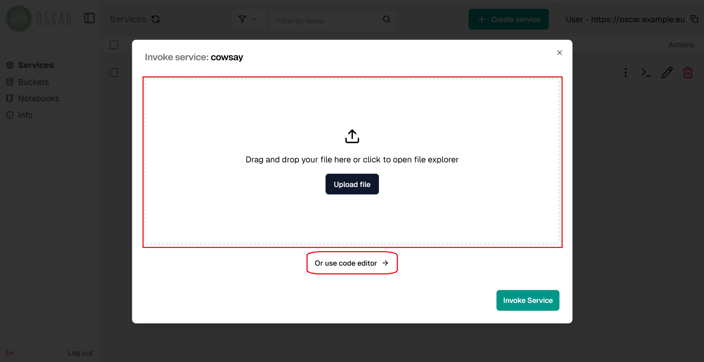
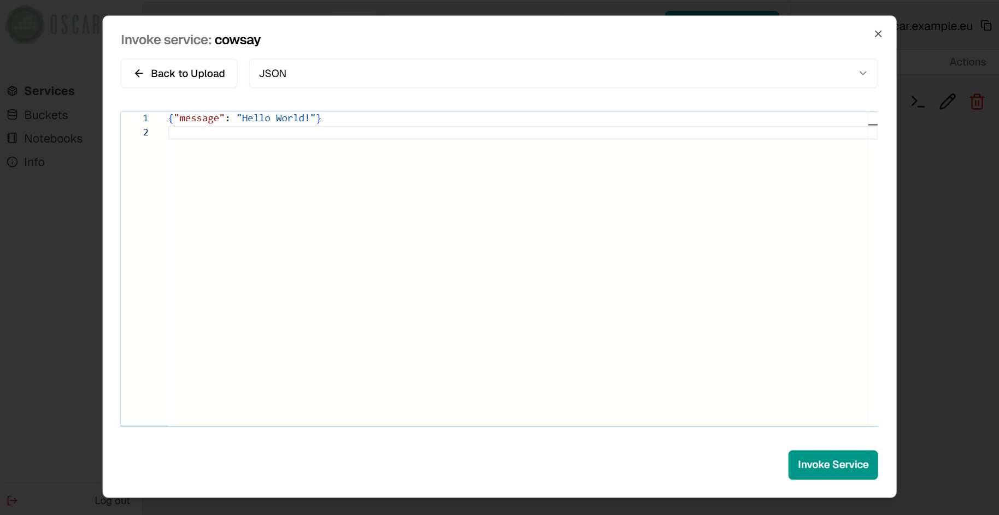
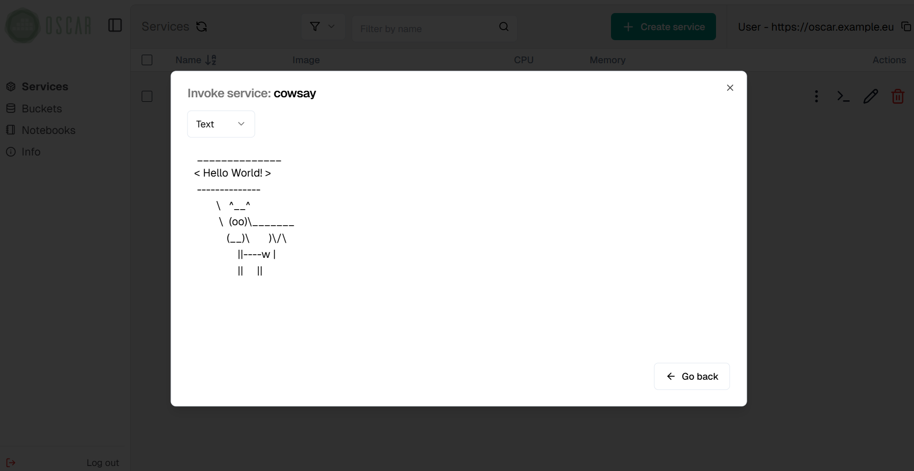
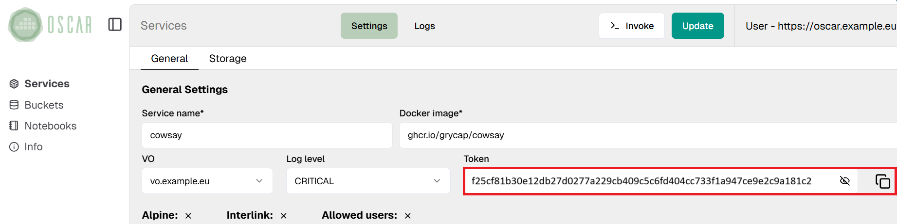

# Synchronous invocations

Synchronous invocations allow obtaining the execution output as the response
to the HTTP call to the `/run/<SERVICE_NAME>` path of the [OSCAR API](api.md). For this, OSCAR delegates
the execution to a serverless back-end (e.g. [Knative](https://knative.dev)) which uses an auto-scaled set of pods to process the requests.


Synchronous invocations can be made through [OSCAR CLI](oscar-cli.md), using the command
`oscar-cli service run`:

```sh
oscar-cli service run [SERVICE_NAME] {--input | --text-input} {-o | -output }
```

You can check these examples:

- [plant-classification-sync](https://oscar.grycap.net/blog/post-oscar-faas-sync-ml-inference/)
- [text-to-speech](https://oscar.grycap.net/blog/post-oscar-text-to-speech/).

The input can be sent as a file via the `--input` flag, and the result of the
execution will be displayed directly in the terminal:

```sh
oscar-cli service run plant-classification-sync --input images/image3.jpg
```

Alternatively, it can be sent as plain text using the `--text-input` flag and
the result stored in a file using the `--output` flag:

```sh
oscar-cli service run text-to-speech --text-input "Hello everyone"  --output output.mp3
```


### Synchronous Invocations via OSCAR CLI

[OSCAR CLI](oscar-cli.md) simplifies the execution of services synchronously via the
[`oscar-cli service run`](oscar-cli.md#run) command. This command requires the
input to be passed as text through the `--text-input` flag or directly a file
to be sent by passing its path through the `--input` flag. Both input types
are automatically encoded in [Base64](https://en.wikipedia.org/wiki/Base64).

It also allows setting the `--output` flag to indicate a path for storing
(and decoding if needed) the output body in a file, otherwise the output will
be shown in stdout.

An illustration of triggering a service synchronously through OSCAR-CLI can be
found in the [cowsay example](https://github.com/grycap/oscar/tree/master/examples/cowsay#oscar-cli).

```sh
oscar-cli service run cowsay --text-input '{"message":"Hello World"}'
```

### Synchronous Invocations via OSCAR API 

OSCAR services can also be invoked via traditional HTTP clients
such as [cURL](https://curl.se/) using the path `/run/<SERVICE_NAME>` defined in the [OSCAR API](api.md) . However,
you must take care to properly format the input to one of the two supported
formats (JSON or Base64 encode) and include the
[service access token](#service-access-tokens) in the request.

An illustration of triggering a service synchronously through cURL can be
found in the
[cowsay example](https://github.com/grycap/oscar/tree/master/examples/cowsay#curl).

To send an input file through cURL, you must encode it in base64 or json. To avoid
issues with the output in synchronous invocations remember to put the
`log_level` as `CRITICAL`. Output, which is encoded in base64 or in json, should be
decoded as well. Save output in the expected format of the use-case.

``` sh
base64 input.png | curl -X POST -H "Authorization: Bearer <TOKEN>" \
 -d @- https://<CLUSTER_ENDPOINT>/run/<OSCAR_SERVICE> | base64 -d > result.png
```

## Synchronous Invocations via OSCAR Dashboard

Another way to perform synchronous invocations is by using the [OSCAR Dashboard](https://dashboard.oscar.grycap.net), which allows you to send files in base64 format or use a built-in code editor to create payloads in a more user-friendly way. You also can access it by navigating directly to the cluster endpoint in your browser.

After logging in, find the service you want to invoke and click its **invocation** button (`>_`).



Next, you can either upload a file containing the payload or use the built-in code editor to construct it manually.



For demonstration purposes, we'll use the built-in code editor to send a JSON payload.



Finally, you can view the result of the invocation directly in the dashboard.




## Service access tokens

As detailed in the [API specification](api.md), invocation paths require either the
service access token or the Access Token of the user when the cluster is integrated with EGI Check-in, in the request header for authentication (any of them is valid). Service access
tokens are auto-generated in service creation and update, and MinIO eventing
system is automatically configured to use them for event-driven file
processing. Tokens can be obtained through the API, using the
[`oscar-cli service get`](oscar-cli.md#get) command or directly from the web
interface.




### Limitations

Although the use of the Knative Serverless Backend for synchronous invocations provides elasticity similar to the one provided by their counterparts in public clouds, such as AWS Lambda, synchronous invocations are not still the best option for run long-running resource-demanding applications, like deep learning inference or video processing. 

The synchronous invocation of long-running resource-demanding applications may lead to timeouts on Knative pods. Therefore, we consider asynchronous invocations (which generate Kubernetes jobs) as the optimal approach to handle event-driven file processing.

