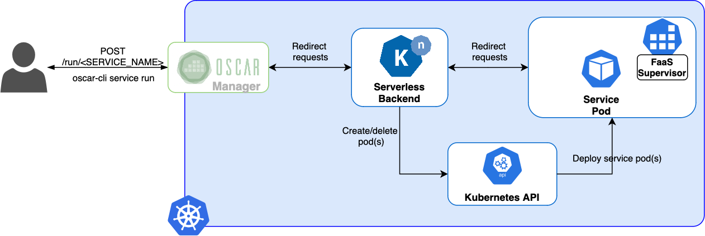

# Invoking services

OSCAR services can be invoked synchronously and asynchronously sending an
HTTP POST request to paths `/run/<SERVICE_NAME>` and `/job/<SERVICE_NAME>`
respectively. For file processing, OSCAR automatically manages the creation
and [notification system](https://docs.min.io/minio/baremetal/monitoring/bucket-notifications/bucket-notifications.html#minio-bucket-notifications)
of MinIO buckets in order to allow the event-driven invocation of services
using asynchronous requests, generating a Kubernetes job for every file to be
processed.

## Service access tokens

As detailed in the [API specification](api.md), invocation paths require the
service access token in the request header for authentication. Service access
tokens are auto-generated in service creation and update, and MinIO eventing
system is automatically configured to use them for event-driven file
processing. Tokens can be obtained through the API, using the
[`oscar-cli service get`](oscar-cli.md#get) command or directly from the web
interface.


## Synchronous invocations

Synchronous invocations allow obtaining the execution output as the response
to the HTTP call to the `/run/<SERVICE_NAME>` path. For this, OSCAR delegates
the execution to a Serverless Backend ([Knative](https://knative.dev) or
[OpenFaaS](https://www.openfaas.com/)). Unlike asynchronous invocations, that
are translated into Kubernetes jobs, synchronous invocations use a "function"
pod to handle requests. This is possible thanks to the
[OpenFaaS Watchdog](https://github.com/openfaas/classic-watchdog), which is
injected into each service and is in charge of forking the process to be
executed for each request received.



Synchronous invocations can be made through OSCAR-CLI, using the comand
`oscar-cli service run`:

```sh
oscar-cli service run [SERVICE_NAME] {--input | --text-input} {-o | -output }
```

You can check these use-cases:

- [plant-classification-sync](https://oscar.grycap.net/blog/post-oscar-faas-sync-ml-inference/)
- [text-to-speech](https://oscar.grycap.net/blog/post-oscar-text-to-speech/).

The input can be sent as a file via the `--input` flag, and the result of the
execution will be displayed directly in the terminal:

```sh
oscar-cli service run plant-classification-sync --input images/image3.jpg
```

Alternatively, it can be sent as plain text using the `--text-input` flag and
the result stored in a file using the `--output` flag:

```sh
oscar-cli service run text-to-speech --text-input "Hello everyone"  --output output.mp3
```

### Input/Output

[FaaS Supervisor](https://github.com/grycap/faas-supervisor), the component in
charge of managing the input and output of services, allows JSON or base64
encoded body in service requests. The body of these requests will be
automatically decoded into the invocation's input file available from the
script through the `$INPUT_FILE_PATH` environment variable.

The output of synchronous invocations will depend on the application itself:

1. If the script generates a file inside the output dir available through the
    `$TMP_OUTPUT_DIR` environment variable, the result will be the file encoded in
    base64.
1. If the script generates more than one file inside `$TMP_OUTPUT_DIR`, the
    result will be a zip archive containing all files encoded in base64.
1. If there are no files in `$TMP_OUTPUT_DIR`, FaaS Supervisor will return its
    logs, including the stdout of the user script run.
    **To avoid FaaS Supervisor's logs, you must set the service's `log_level`
    to `CRITICAL`.**

This way users can adapt OSCAR's services to their own needs.

### OSCAR-CLI

OSCAR-CLI simplifies the execution of services synchronously via the
[`oscar-cli service run`](oscar-cli.md#run) command. This command requires the
input to be passed as text through the `--text-input` flag or directly a file
to be sent by passing its path through the `--input` flag. Both input types
are automatically encoded in base64.

It also allow setting the `--output` flag to indicate a path for storing
(and decoding if needed) the output body in a file, otherwise the output will
be shown in stdout.

An illustration of triggering a service synchronously through OSCAR-CLI can be
found in the [cowsay example](https://github.com/grycap/oscar/tree/master/examples/cowsay#oscar-cli).

```sh
oscar-cli service run cowsay --text-input '{"message":"Hello World"}'
```

### cURL

Naturally, OSCAR services can also be invoked via traditional HTTP clients
such as [cURL](https://curl.se/) via the path `/run/<SERVICE_NAME>`. However,
you must take care to properly format the input to one of the two supported
formats (JSON or base64 encoded) and include the
[service access token](#service-access-tokens) in the request.

An illustration of triggering a service synchronously through cURL can be
found in the
[cowsay example](https://github.com/grycap/oscar/tree/master/examples/cowsay#curl).

To send an input file through cURL, you must encode it in base64 or json. To avoid
issues with the output in synchronous invocations remember to put the
`log_level` as `CRITICAL`. Output, which is encoded in base64 or in json, should be
decoded as well. Save output in the expected format of the use-case.

``` sh
base64 input.png | curl -X POST -H "Authorization: Bearer <TOKEN>" \
 -d @- https://<CLUSTER_ENDPOINT>/run/<OSCAR_SERVICE> | base64 -d > result.png
```

### Limitations

Although the use of the Knative Serverless Backend for synchronous invocations provides elasticity similar to the one provided by their counterparts in public clouds, such as AWS Lambda, synchronous invocations are not still the best option to run long-running resource-demanding applications, like deep learning inference or video processing. 

The synchronous invocation of long-running resource-demanding applications may lead to timeouts on Knative pods. Therefore, we consider Kubernetes job generation as the optimal approach to handle event-driven file processing through asynchronous invocations in OSCAR, being the execution of synchronous services a convenient way to support general lightweight container-based applications.

## Exposed services

OSCAR also supports the deployment and elasticity management of long-running services that need to be directly reachable from outside the cluster (i.e. exposed services). This is useful when stateless services created out of large containers require too much time to be started to process a service invocation. This is the case when supporting the fast inference of pre-trained AI models that require close to real-time processing with high throughput. In a traditional serverless approach, the AI model weights would be loaded in memory for each service invocation (thus creating a new container). 

Instead, by exposing an OSCAR service, the AI model weights could be loaded just once and the service would perform the AI model inference for each subsequent request. An auto-scaled load-balanced approach for these stateless services is supported. When the average CPU exceeds a certain user-defined threshold, additional service instances (i.e. pods) will be dynamically created (and removed when no longer necessary), within the user-defined boundaries (see the parameters `min_scale` and `max_scale` in [ExposeSettings](https://docs.oscar.grycap.net/fdl/#exposesettings)).


### Prerequisites in the container image
The container image needs to have an HTTP server that binds to a certain port (see the parameter `port` in [ExposeSettings](https://docs.oscar.grycap.net/fdl/#exposesettings)`). If developing a service from scratch, in Python you can use [FastAPI](https://fastapi.tiangolo.com/) or [Flask](https://flask.palletsprojects.com/en/2.3.x/) to create an API. In Go you can use [Gin](https://gin-gonic.com/) or [Sinatra](https://sinatrarb.com/) in Ruby. 

Notice that if the service exposes a web-based UI you must ensure that the content cannot only be served from the root document ('/'), since the service will be exposed in a certain subpath.

### How to define an exposed OSCAR service

The minimum definition to expose an OSCAR service is to indicate in the corresponding [FDL](https://docs.oscar.grycap.net/fdl/) file the port inside the container where the service will be listening.

``` yaml
expose:
  port: 5000
```

Once the service is deployed, if you invoke the service and it returns a `502 Bad Gateway` error, the port is wrong.


Additional options can be defined in the "expose" section, such as the minimum number of active pods (default: 1).
The maximum number of active pods (default: 10) or the CPU threshold which, once exceeded, will triger the creation of additional pods (default: 80%).

Below is a specification with more details where there will be between 5 to 15 active pods and the service exposes an API in port 4578. The number of active pods will grow when the use of CPU increases by more than 50%.
The active pods will decrease when the use of CPU decreases.

``` yaml
expose:
  min_scale: 5 
  max_scale: 15 
  port: 4578  
  cpu_threshold: 50
```

Below there is an example of a recipe to expose a service from the [AI4EOSC/DEEP Open Catalog](https://marketplace.deep-hybrid-datacloud.eu/)

``` yaml
functions:
  oscar:
  - oscar-cluster:
     name: body-pose-detection-async
     memory: 2Gi
     cpu: '1.0'
     image: deephdc/deep-oc-posenet-tf
     script: script.sh
     environment:
        Variables:
          INPUT_TYPE: json  
     expose:
      min_scale: 1 
      max_scale: 10 
      port: 5000  
      cpu_threshold: 20 
     input:
     - storage_provider: minio.default
       path: body-pose-detection-async/input
     output:
     - storage_provider: minio.default
       path: body-pose-detection-async/output
```


The service will be listening in a URL that follows the next pattern:

``` text
https://{oscar_endpoint}/system/services/{name of service}/exposed/
```

Now, let's show an example of executing the [Body pose detection](https://marketplace.deep-hybrid-datacloud.eu/modules/deep-oc-posenet-tf.html) ML model of [AI4EOSC/DEEP Open Catalog](https://marketplace.deep-hybrid-datacloud.eu/). We need to have in mind several factors:

1. OSCAR endpoint. `localhost` or `https://{OSCAR_endpoint}`
2. Path resource. In this case, it is `v2/models/posenetclas/predict/`. Please do not forget the final `/`
3. Use `-k` or `--insecure` if the SSL is false.
4. Input image with the name `people.jpeg`
5. Output. It will create a `.zip` file that has the output

The following code section represents a schema of the command:

``` bash
curl {-k} -X POST https://{oscar_endpoint}/system/services/body-pose-detection-async/exposed/{path resource} -H  "accept: */*" -H  "Content-Type: multipart/form-data" -F "data=@{input image};type=image/png" --output {output file}
```

Finally, the complete command that works in [Local Testing](https://docs.oscar.grycap.net/local-testing/) with an image called `people.jpeg` as input and `output_posenet.zip` as output.

``` bash
curl -X POST https://localhost/system/services/body-pose-detection-async/exposed/v3/models/posenetclas/predict/ -H  "accept: */*" -H  "Content-Type: multipart/form-data" -F "data=@people.jpeg;type=image/png" --output output_posenet.zip
```

Another FDL example shows how to expose a simple NGINX server as an OSCAR service:

``` yaml
functions:
  oscar:
  - oscar-cluster:
     name: nginx
     memory: 2Gi
     cpu: '1.0'
     image: nginx
     script: script.sh
     expose:
      min_scale: 2 
      max_scale: 10 
      port: 80  
      cpu_threshold: 50 
```

In case you use the NGINX example above in your [local OSCAR cluster](https://docs.oscar.grycap.net/local-testing/), you will see the nginx welcome page in: `http://localhost/system/services/nginx/exposed/`.
Two active pods of the deployment will be shown with the command `kubectl get pods -n oscar-svc`

``` text
oscar-svc            nginx-dlp-6b9ddddbd7-cm6c9                         1/1     Running     0             2m1s
oscar-svc            nginx-dlp-6b9ddddbd7-f4ml6                         1/1     Running     0             2m1s
```