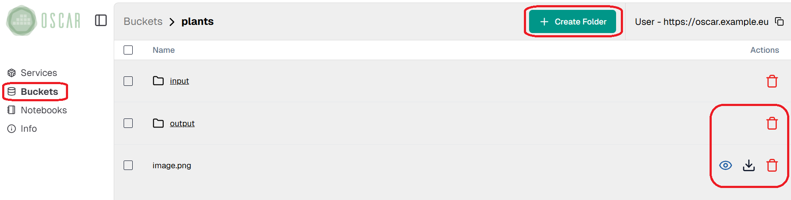
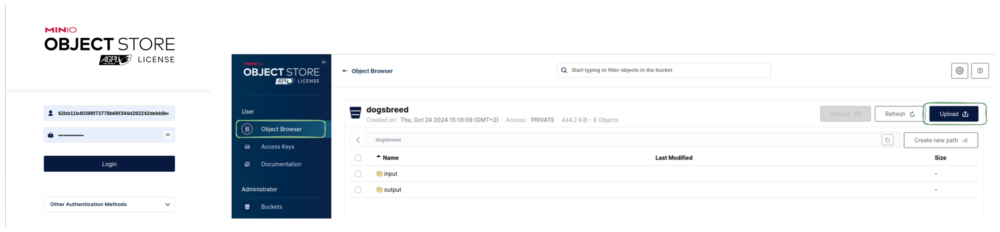

# Accessing and managing MinIO storage provider

Each OSCAR cluster includes a deployed MinIO instance, which is used to trigger service executions. When a service is configured to use MinIO as its storage provider, it monitors a specified input folder for new data. Whenever new data is added to this folder, it triggers the associated service to execute. 

These folders can be accessed via both the OSCAR UI and the MinIO console UI.

- **Using the OSCAR UI**: The following image highlights the section where MinIO buckets are accessible. Users can view a list of available buckets and perform operations such as uploading and deleting files.
  

- **Using the MinIO Console UI**: Access details for this interface are available in the "Info" tab within the OSCAR UI. This tab provides the MinIO console endpoint and the necessary credentials to log in, where the *Access Key* serves as the username, and the *Secret Key* functions as the password.

Finally, the following image provides an overview of the MinIO login panel and the "Object Browser" tab. Once logged in, the "Object Browser" tab allows users to navigate their available buckets, view stored objects, and perform various operations such as uploading, downloading, or deleting files.

