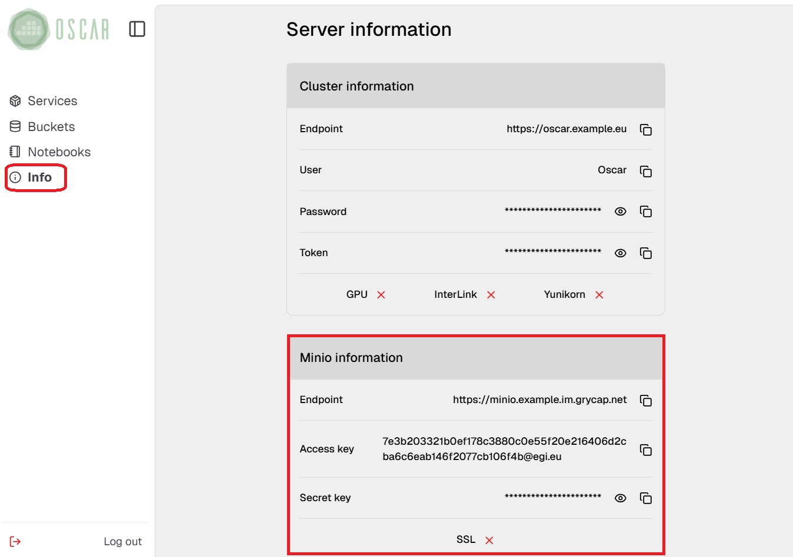

# Using the MinIO Storage Provider

Each OSCAR cluster includes a deployed MinIO instance, which is used to trigger service executions. When a service is configured to use MinIO as its storage provider, it monitors a specified input folder for new data. Whenever new data is added to this folder, it triggers the associated service to execute. 

## Using graphical interfaces

These folders can be accessed via both the OSCAR Dashboard and the MinIO console UI.

- **Using OSCAR-Dashboard**: The following image highlights the section where MinIO buckets are accessible. Users can view a list of available buckets and perform operations such as uploading and deleting files.
  


- **Using the MinIO Console UI**: Access details for this interface are available in the "Info" tab within the OSCAR Dashboard. This tab provides the MinIO console endpoint and the necessary credentials to log in, where the *Access Key* serves as the username, and the *Secret Key* functions as the password.



Finally, the following image provides an overview of the MinIO login panel and the "Object Browser" tab. Once logged in, the "Object Browser" tab allows users to navigate their available buckets, view stored objects, and perform various operations such as uploading, downloading, or deleting files.


Further information about the MinIO Console avaliable on [MinIO Console documentation](https://min.io/docs/minio/linux/administration/minio-console.html).

## Using command-line interfaces

MinIO buckets can also be managed through [oscar-cli command-line](https://github.com/grycap/oscar-cli) or the official [MinIO client](https://min.io/docs/minio/linux/reference/minio-mc.html). 

- **oscar-cli**: The OSCAR client provides a dedicated set of commands for accessing files within buckets. It is important to note that this interface does not support DELETE or UPDATE operations. Below is a brief overview of the available commands and their functionalities.
  - [get-file](https://docs.oscar.grycap.net/oscar-cli/#get-file): Get file from a service's storage provider.
  - [list-files](https://docs.oscar.grycap.net/oscar-cli/#list-files): List files from a service's storage provider path.
  - [put-file](https://docs.oscar.grycap.net/oscar-cli/#put-file): Upload a file on a service storage provider.
  
  An example of a put-file operation:

  ``` bash
  oscar-cli service put-file fish-detector.yaml minio .path/to/your/images ./fish-detector/input/
  ```
  
- **mc**: If a user wants to use the MinIO client it needs to follow some previous steps.
  - *Install the client*: Detailed instructions for installing the MinIO client (mc) are available in [the official documentation](https://min.io/docs/minio/linux/reference/minio-mc.html#install-mc).
  - *Configure the MinIO instance*: The client requires credentials to connect and interact with the MinIO instance. This configuration can be set with the following command:
  
    ``` bash
    mc alias set myminio https://minio.gracious-varahamihira6.im.grycap.net YOUR-ACCESS-KEY YOUR-SECRET-KEY
    ```

  Once the client is configured, users can perform various operations supported by the MinIO client. For a complete list of available commands and their usage, refer to the [MinIO client reference](https://min.io/docs/minio/linux/reference/minio-mc.html#command-quick-reference). The following example demonstrates a PUT operation, where a file is uploaded to a specific folder within a bucket.

  ```bash
  mc cp /path/to/your/images/*.jpg myminio/fish-detector/input/
  ```
