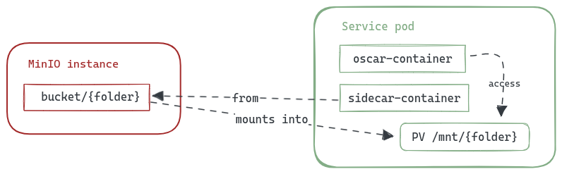

# Mounting external storage on service volumes

This feature enables the mounting of a folder from a storage provider, such as MinIO or dCache, into the service container. As illustrated in the following diagram, the folder is placed inside the /mnt directory on the container volume, thereby making it accessible to the service.



This functionality can be useful with exposed services, such as those using a Jupyter Notebook, to make the content of the storage bucket accessible directly within the Notebook. For instance, if you have a MinIO bucket called `notebook` you want to access, you would need to add the following parameters to the service definition:

``` yaml
mount:
  storage_provider: minio.default
  path: /notebook
```

The complete definition of this use case that integrates the expose of a Jupyter Notebook with the access to a mounted bucket would look like the following:

``` yaml
functions:
  oscar:
  - oscar-cluster:
     name: jupyter
     memory: 2Gi
     cpu: '1.0'
     image: jupyter/base-notebook
     script: jupyterscript2.sh
     environment:
       Variables:
         JUPYTER_TOKEN: "root"
         JHUB_BASE_URL: "/system/services/jupyter/exposed"
         JUPYTER_DIRECTORY: "/mnt"
     mount:
       storage_provider: minio.default
       path: /notebook
     expose:
      min_scale: 1
      max_scale: 1
      api_port: 8888
      cpu_threshold: 90
      rewrite_target: true
```
**Note**: You can find the files of this example on [OSCAR's repository examples](https://github.com/grycap/oscar/tree/master/examples/expose_services/jupyter)

As OSCAR has the credentials of the default MinIO instance internally, if you want to use a different one or a different storage provider, you need to set these credentials on the service [FDL](/fdl). Currently, the storage providers supported on this functionality are:

 - [MinIO provider](/fdl/#minioprovider)
 - [WebDav provider](/fdl/#webdavprovider)