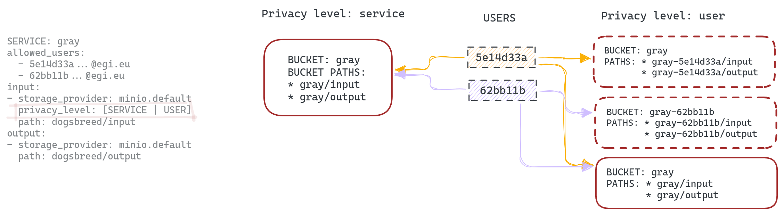

# Multitenancy support in OSCAR

In the context of OSCAR, multi-tenancy support refers to the platform's ability to enable multiple users or organizations (tenants) to deploy and run their applications or functions on the same underlying infrastructure. For this multitenancy support is required minimum version of OSCAR 3.6.0. 

In this context, services can be defined with different visibility levels: **private** (accessible only by the owner), **public** (accessible by all users), or **restricted** (accessible only by a specified list of users defined by the owner). This allows fine-grained control over who can access and use each deployed service.

> **_NOTE:_** By default, services are treated as **private** unless a visibility setting is explicitly defined.
> 
To use this functionality, there are some requisites that the cluster and the users have to fulfil:

- **The cluster needs to have enabled OIDC access.**

	This is because the implementation of this functionality relies on the EGI ePUIDs to distinguish between users, therefore removing the need to manage a database.  

- **Users who want to create restricted services need to know the ePUID of the users who will have access to the service.**
	
	If a service's visibility is set to restricted, the service owner must provide a list of allowed users by specifying their unique user ePUID to grant them access. It’s important to note that only the service creator, or owner, has permission to update the service. Allowed users can view the service and its associated buckets, and they may invoke the service, but they cannot perform any modifications or administrative actions. At creation time, the ePUID of the user creating the service doesn't need to be present on the list; however, when a service is updated, if the user who has created the service needs to access it, its ePUID must be on the list. This "allowed users" list is defined on the FDL at service creation time (more info in [FDL docs](fdl.md)).

> **_NOTE:_** A user can obtain its EGI User ePUID by login into https://aai.egi.eu/ (for the production instance of EGI Check-In) or https://aai-demo.egi.eu (for the demo instance of EGI Check-In). 


The following is an example of an FDL that creates a service whose usage is limited to two different EGI users.


``` yaml
functions:
  oscar:
  - oscar-cluster:
      name: grayify-multitenant
      memory: 1Gi
      cpu: '0.6'
      image: ghcr.io/grycap/imagemagick
      script: script.sh
      vo: "vo.example.eu"
      isolation_level: USER
      visibility: restricted
      allowed_users: 
      - "62bb11b40398f73778b66f344d282242debb8ee3ebb106717a123ca213162926@egi.eu"
      - "5e14d33ac4abc96272cc163da6a200c2e18591bfb3b0f32a4c9c867f5e938463@egi.eu"
      input:
      - storage_provider: minio.default
        path: grayify-multitenant/input
      output:
      - storage_provider: minio.default
        path: grayify-multitenant/output
```

> **_NOTE:_** To test the service in the FDL above, please use this script to execute the function: [ImageMagick example](https://github.com/grycap/oscar/blob/master/examples/imagemagick/script.sh).

## ISOLATION LEVEL

The isolation level variable has been added to the FDL service definition to facilitate the configuration of the service's privacy. There are 2 configurations available, *SERVICE* and *USER*. Below we explain them in more detail.


### SERVICE

The *SERVICE* isolation level is the default value. If you isolate the service at the service level and use MinIO as the storage provider (event source), the buckets indicated in the input/output sections of the service definition will be created. These buckets will only be visible to the users defined in the *allowed_users* list.


### USER

By isolating the service at the *USER* level, in addition to creating the buckets specified in input/output, additional private buckets will be created. Each user defined in the *allowed_users* list will have access to its private bucket, which will also trigger the execution of the service if a file is uploaded to the /input folder located inside it. The executions triggered by those private buckets will redirect the output into the same private bucket, in the /output folder. 

Let's see how it works with an example. Let's suppose that we are the user '5e14d33a', and we create a service called 'gray', with a default bucket also called 'gray' and a list of two users (ourselves and user '62bb11b'). Our automatically created **private bucket** will be 'gray-5e14d33a'. Inside that private bucket, we will find two folders: one for 'input' files and another for 'output' files. When we, as user '5e14d33a' upload a file into the 'input' folder, this provokes an event in MinIO that triggers the service. The output of this execution will be uploaded into the 'output' folder of our private bucket, meaning that the other users of the service (in the example, user '62bb11b') cannot access the inputs/outputs of our execution. THe same happens for user '62bb11b' and its private bucket. However, if we use the default 'gray' bucket, the files stored on it will be accessible by both users.



Since OSCAR uses MinIO as the main storage provider, so that users only have access to their designated bucket's service, MinIO users are created on-the-fly for each EGI ePUID. Consequently, each user accessing the cluster will have a MinIO user with its UID as AccessKey and an autogenerated SecretKey.
