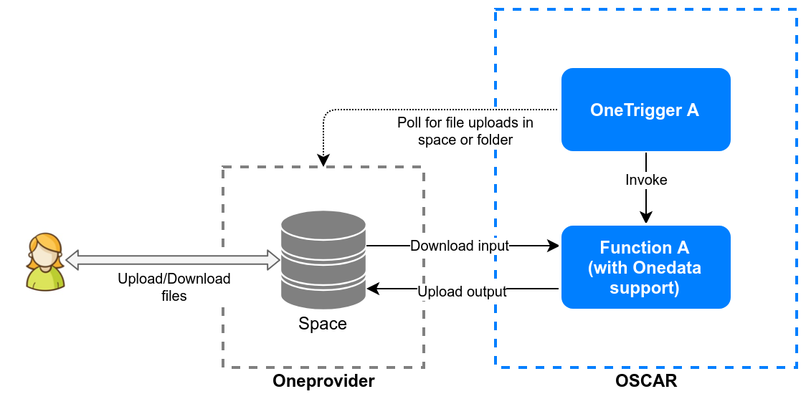

Integration with the EGI Federated Cloud
========================================

`EGI <https://www.egi.eu/>`_ is a federation of many cloud providers and hundreds of data centres, spread across Europe and worldwide that delivers advanced computing services to support scientists, multinational projects and research infrastructures.

The `EGI Federated Cloud <https://www.egi.eu/federation/egi-federated-cloud/>`_ is an IaaS-type cloud, made of academic private clouds and virtualised resources and built around open standards. Its development is driven by requirements of the scientific communities.

EGI Applications on Demand: EC3 Portal
--------------------------------------

The OSCAR platform can be deployed on the EGI Federated Cloud resources through the `EC3 Portal <https://servproject.i3m.upv.es/ec3-ltos/index.php>`_ available in the `EGI Applications on Demand <https://www.egi.eu/services/applications-on-demand/>`_ service.

The `EC3 Web Interface documentation <https://ec3.readthedocs.io/en/devel/ec3aas.html>`_ can be followed in order to deploy the platform. Remember to pick “OSCAR” as a Local Resource Management System.

.. image:: images/oscar-egi-ec3.png
   :scale: 60 %

EGI DataHub
-----------

`EGI DataHub <https://datahub.egi.eu/>`_ (`Onedata <https://onedata.org/#/home>`_) can be used as a storage provider and source of events for OSCAR, allowing users to process their files by uploading them to a space. This can be done thanks to the development of:

-  `OneTrigger <https://github.com/grycap/onetrigger>`_. A command-line tool to detect Onedata file events in order to trigger a webhook (i.e. an OSCAR Function).
-  `FaaS-Supervisor <https://github.com/grycap/faas-supervisor>`_. Used in OSCAR and `SCAR <https://github.com/grycap/scar>`_, responsible for managing the data Input/Output and the user code execution. Support for Onedata has been added to perform the integration with EGI DataHub.

To deploy a function with Onedata support (besides minio) you only have to specify the URL of the Oneprovider host, your access token and the space name where files will be stored. This will trigger the following:

-  Creation of input and output folders in the specified space.
-  Deployment of a OneTrigger pod for the function.
-  Injection of Onedata’s login variables into the function.

.. image:: images/oscar-onedata.png
   :scale: 60 %
