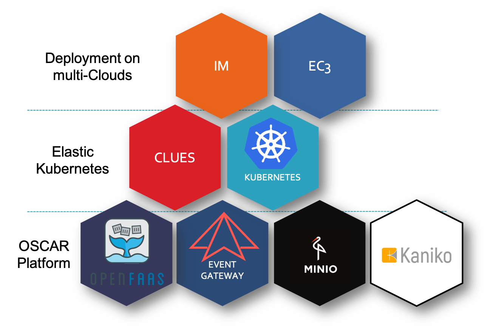

Introduction
============

OSCAR is a framework to efficiently support on-premises FaaS (Functions as a Service) for general-purpose file-processing computing applications. 
It represents the porting to an on-premises scenario of the `SCAR framework <https://github.com/grycap/scar>`_, which supports a `High Throughput Computing Programming Model <https://scar.readthedocs.io/en/latest/prog_model.html>`_ to create highly-parallel event-driven file-processing serverless applications that execute on customized runtime environments provided by Docker containers run on AWS Lambda.

Goal
----
Users upload files to a bucket and this automatically triggers the execution of parallel invocations to a function responsible for processing each file. Output files are delivered into an output bucket for the convenience of the user. Highly scalable HTTP-based endpoints can also be offered in order to expose a generic application. 
An user-provided shell script is executed inside the container run from the user-defined Docker image in order to achieve the right execution environment for the application.

Components
----------
OSCAR consists of a set of services deployed on a elastic Kubernetes cluster in order to support the 

These are the main components used:

For the deployment of the elastic Kubernetes cluster:

- `Kubernetes <http://kubernetes.io>`_, an open-source system for automating deployment, scaling, and management of containerized applications.
- `CLUES <http://github.com/grycap/clues>`_, an elasticity manager that horizontally scales in and out the number of nodes of the Kubernetes cluster according to the workload 
                                            (a plugin allows to introduce horizontal elasticity for the Kubernetes cluster).
- `IM <http://www.grycap.upv.es/im>`_, an Infrastructure as a Code tool to automatically deploy complex Cloud architectures on multi-clouds.
- `EC3 <www.grycap.upv.es/ec3>`_, a tool to deploy compute clusters that can horizontally scale in terms of number of nodes with multiple plugins

The services that currently comprise the OSCAR stack:

- `Minio <http://minio.io>`_, a high performance distributed object storage server that provides an API compatible with S3.
- `OpenFaaS <https://www.openfaas.com/>`_, a FaaS platform that allows creating functions executed via HTTP requests.
- `OSCAR UI <https://github.com/grycap/oscar-ui>`_, a web-based GUI aimed at end users to facilitate interaction with OSCAR.

Architecture
------------

The main architecture of OSCAR is described in the following figure:

