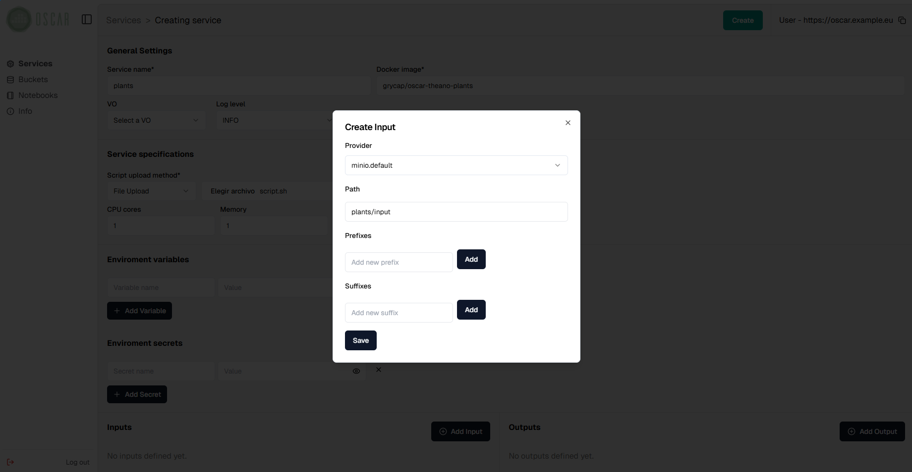
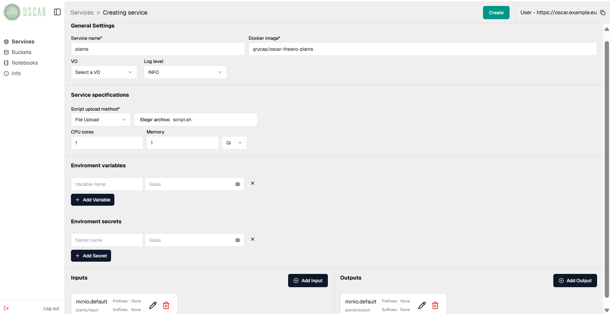
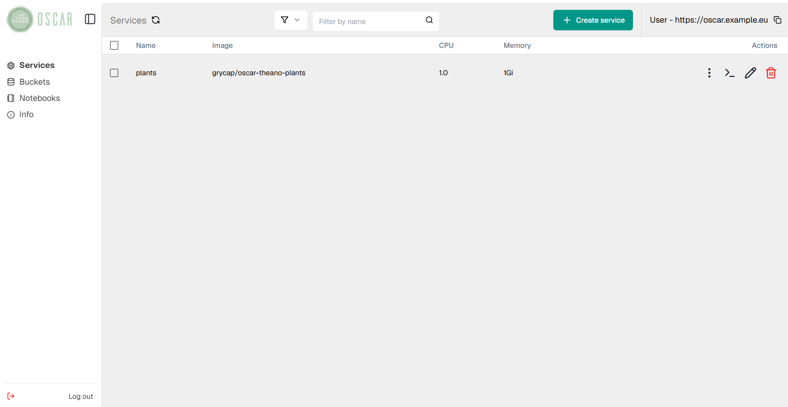
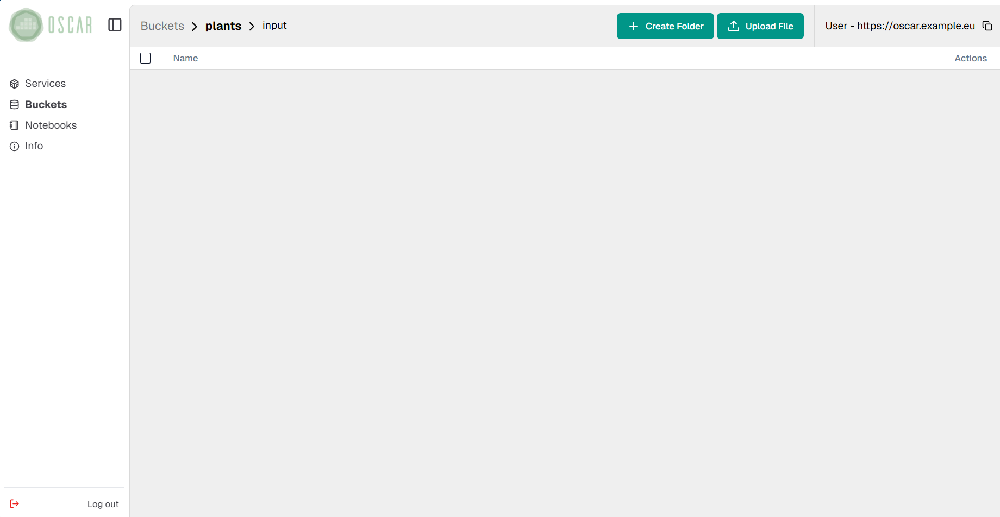

# OSCAR UI

> ❗️
>
> For simple OSCAR services you may use the UI, but its features may not be on par with the latest changes in the [FDL](fdl.md). 
> Therefore, it is recommended to use [OSCAR CLI](oscar-cli.md) to deploy an OSCAR service.  


This section details the usage of the OSCAR UI with the
[plant classification](https://github.com/grycap/oscar/tree/master/examples/plant-classification-sync) example, from the 
[OSCAR examples](https://github.com/grycap/oscar/tree/master/examples). 

## Login

OSCAR UI is exposed via a Kubernetes ingress and it is accessible via the
Kubernetes master node IP. 


After a correct login, you should see the main view:
<!-- TODO actualizar foto del login a la nueva interfaz -->


## Deploying services

In order to create a new service, you must click on the "Create service"
button and follow the wizard. For an [OSCAR Service](oscar-service.md) a script must be provided for the
processing of files. This script must use the environment variables
`INPUT_FILE_PATH` and `TMP_OUTPUT_DIR` to refer to the input file and the
folder where to save the results respectively:


```
#!/bin/bash

echo "SCRIPT: Invoked classify_image.py. File available in $INPUT_FILE_PATH"
FILE_NAME=`basename "$INPUT_FILE_PATH"`
OUTPUT_FILE="$TMP_OUTPUT_DIR/$FILE_NAME"
python2 /opt/plant-classification-theano/classify_image.py \
 "$INPUT_FILE_PATH" -o "$OUTPUT_FILE"
```

You must fill in the fields indicating the container image to use, the name of
the service and the script file. In addition, you can add environment
variables, specify the resources (RAM and CPUs) and choose the log level of
the service.

Note that specifying a tag in the container image used can be convenient to
avoid problems with quotas for certain container registries such as
[Docker Hub](https://docs.docker.com/docker-hub/download-rate-limit/#what-is-the-download-rate-limit-on-docker-hub).
This is due to the fact that Kubernetes defaults the
[`imagePullPolicy`](https://kubernetes.io/docs/concepts/containers/images/#image-pull-policy)
of pods to `Always` when no tag or the `latest` tag is set, which checks the
version of the image in the registry every time a job is launched.


Next, the credentials of the storage providers to be used must be introduced.
As the platform already has a MinIO deployment to operate, it is not necessary
to enter its credentials for using it.



Multiple MinIO, Onedata and Amazon S3 storage providers can be used. Although in order to use providers distinct from MinIO, you need to create the service through FDL file and not the form provided by the web interface.

In this section, you must first choose the paths of the storage provider to be
used as source of events, i.e. the input bucket and/or folder that will
trigger the service.

***Only the `minio.default` provider can be used as input storage provider.***

After filling in each path, remember to click on the "Save" button.


Finally, the same must be done to indicate the output paths to be used in
the desired storage providers. You can also indicate suffixes and/or prefixes
to filter the files uploaded to each path by name.



***Note that the resulting files can be stored in several storage providers distinct to MinIO, but in order to do that, you must create the service through the FDL file and not the form provided by the web interface.***


After clicking the "Create" button we will see the new service edit menu.



Also we will able to see it on the main
view after a few seconds.




## Triggering the service

### HTTP endpoints

OSCAR services can be invoked through auto-generated HTTP endpoints. Requests
to these endpoints can be made in two ways:

- **Synchronous** through the path `/run/<SERVICE_NAME>`. This redirects the
    request to the OpenFaaS gateway in order to perform the processing.
- **Asynchronous** through the path `/job/<SERVICE_NAME>`. This mode is used
    to perform file-processing when files are uploaded to the input storage
    provider, creating a Kubernetes job per service invocation.

The content of the HTTP request body will be stored as a file that will be
available via the `INPUT_FILE_PATH` environment variable to process it.

A detailed specification of the OSCAR's API and its different paths can be
found [here](api.md).

## MinIO Storage Tab

MinIO Storage Tab is made to manage buckets without using MinIO UI. It
simplifies the process. From MinIO Storage Tab, buckets can be created or
removed and folders inside them. Furthermore, files can be uploaded to the
buckets and downloaded from them. Each time a service is created or submitted
an edit, the buckets that are not created will be formed.

### Uploading files

Once a service has been created, it can be invoked by uploading files to its
input bucket/folder. This can be done through the MinIO web interface
(accessible from the Kubernetes frontend IP, on port `30300`) or from the
"Buckets" section in the side menu of the OSCAR web interface. Selecting that section will list the buckets created and, by clicking on their name,
you will be able to see their content, upload and download files.


To upload files, you can just drag and drop them into the folder.


he file will be uploaded, raising an event that will trigger the service.


Note that the web interface includes a preview button for some file formats,
such as images.


## Service status and logs

When files are being processed by a service, it is important to know their
status, as well as to observe the execution logs for testing. For this
purpose, OSCAR includes a log view, accessible by clicking on the "LOGS"
button in a service from the main view.


In this view you can see all the jobs created for a service, as well as their
status ("Pending", "Running", "Succeeded" or "Failed") and their creation,
start and finish time.


To view the logs generated by a job, simply click on the drop-down button
located on the right.


The view also features options to delete one or all logs.

## Downloading files from MinIO

Downloading files from the platform's MinIO storage provider can also be done
using the OSCAR web interface. To do it, simply select one or more files and
click on the button "Download" or click on download icon to download one file.


In the following picture you can see the preview of the resulting file after
the execution triggered in the previous step.


## Deleting services

Services can be deleted by clicking on the trash can icon from the main view.


Once you have accepted the message shown in the image above, the service will
be deleted after a few seconds.


