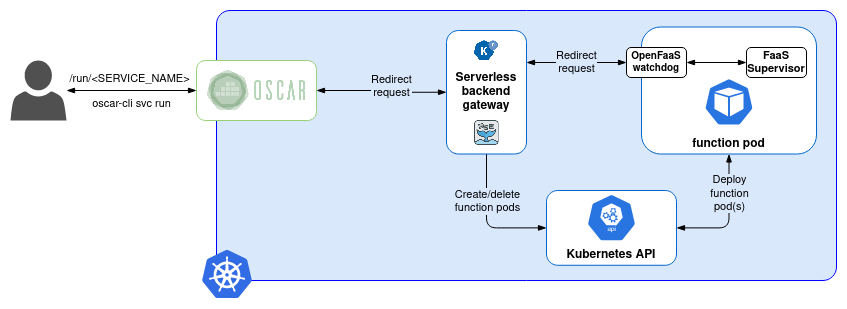
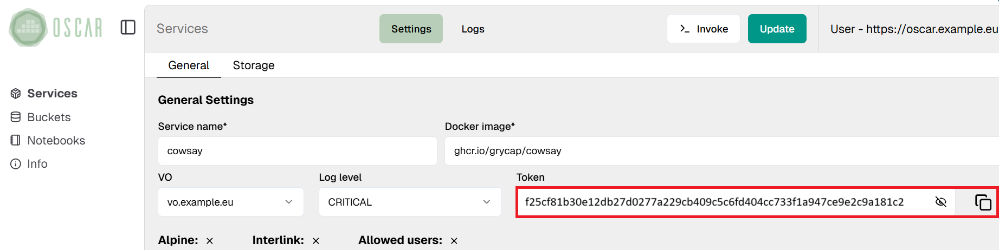

# Cowsay example for synchronous invocations

```
 __________
< Hi there >
 ----------
        \   ^__^
         \  (oo)\_______
            (__)\       )\/\
                ||----w |
                ||     ||

```

This example shows the basic functionality to invoke OSCAR services
synchronously. The idea is to rely on a Serverless backend like OpenFaaS to
manage the HTTP requests. For this, OSCAR implements an HTTP proxy that
redirects invocations to the Serverless backend gateway, which internally is
in charge of managing the "function" pods.



## Deployment

Deployment of synchronous services doesn't differ from asynchronous ones, the
only requirement is that a Serverless backend must be deployed and configured
in the cluster (currently only [OpenFaaS](https://github.com/openfaas/faas) is
supported). Then, the `/run/<SERVICE_NAME>` path will be available within the
[OSCAR's API](https://grycap.github.io/oscar/api/).

To deploy this service through
[OSCAR-CLI](https://github.com/grycap/oscar-cli) you only have to place in
this folder and run:

```sh
oscar-cli apply cowsay.yaml
```

It can also be deployed through the OSCAR's web interface using the container
image `ghcr.io/grycap/cowsay` and the user script available in this folder.
**Remember to set the service's log_level to "CRITICAL" to avoid FaaS
Supervisor logs in the response.**

## Input types

[FaaS Supervisor](https://github.com/grycap/faas-supervisor) is the component
in charge of managing the input and output of services, as well as
initializing the user script in order to process the request. For synchronous
invocations, it only supports HTTP requests in JSON format or encoded in
base64, which will be decoded into the invocation's input file available from
the script through the `$INPUT_FILE_PATH` environment varible.

To show both input formats for requesting the service, this example can be
configured throught the `INPUT_TYPE` environment variable, which if set as
`json` will expect the message to be displayed into the JSON variable
`"message"`. If the `INPUT_TYPE` environment variable is not set or it just
have any value other than `json` the service will expect the message to be
shown encoded in base64.

## Invoking the service

### OSCAR-CLI

The easy way to invoke a service synchronously is by running the
[`oscar-cli service run`](https://github.com/grycap/oscar-cli#run) command.
For example, if the `INPUT_TYPE` is configured as `json`:

```sh
oscar-cli service run cowsay --text-input '{"message": "Hi there"}'
```

and if `INPUT_TYPE` not defined or other than `json`:

```sh
oscar-cli service run cowsay --text-input "Hi there"
```

*Note that in the latter case the OSCAR-CLI automatically encodes the input
before sending it to the OSCAR cluster.*

### cURL

Naturally, OSCAR services can also be invoked via traditional HTTP clients
such as [cURL](https://curl.se/) via the path `/run/<SERVICE_NAME>`. However,
you must take care to properly format the input to one of the two supported
formats and enter the service access token (required from OSCAR >= v2.2.0).
You can get the token via oscar-cli with the command:

```sh
oscar-cli service get cowsay | grep token
```

and via the web interface:



*Note that the token changes in every service update.*

Finally, to invoke the service if the `INPUT_TYPE` is configured as `json`,
you can run:

```sh
curl -H 'Authorization: Bearer <SERVICE_TOKEN>' -d '{"message": "Hi there"}' https://<CLUSTER_ENDPOINT>/run/cowsay
```

and if `INPUT_TYPE` not defined or other than `json`:

```sh
echo "Hi there" | base64 | curl -H 'Authorization: Bearer <SERVICE_TOKEN>' \
-d @- https://<CLUSTER_ENDPOINT>/run/cowsay
```
Note that if the OSCAR cluster has been locally deployed with a self-signed certificate, you will need to use the `--insecure` flag for `curl` to disable the verification of the legitimacy of the server.