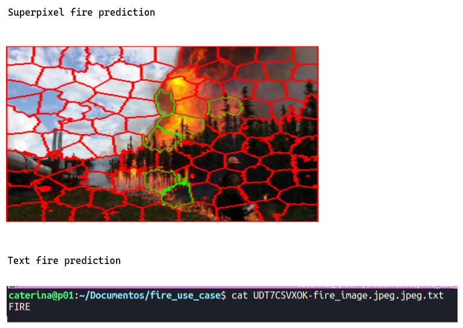

# Fire detection

This example is extracted from the Github repository
[efficient-compact-fire-detection-cnn](https://github.com/NeelBhowmik/efficient-compact-fire-detection-cnn),
which implements a real-time fire detection based on convolutional neural
networks.

The inference file has been modified so the output can be an image of the
superpixel fire prediction and a textfile with only the prediction as text
(FIRE/NO_FIRE). In addition, you can enable the SNS option, in order to send
an sns notification via aws-cli if fire is detected, by setting the enviroment
variable $SEND_SNS to true and adding the following aws-cli configuration variables.

```
    AWS_ACCESS_KEY_ID: [aws_access_key_id]
    AWS_SECRET_ACCESS_KEY: [aws_secret_access_key]
    AWS_DEFAULT_REGION: [aws_default_region]
    AWS_DEFAULT_OUTPUT: json
    TOPIC_ARN: [topic_arn]
```

The image for the service has been build an pushed to a public github registry
but you can see the Dockerfile that generates it [here](Dockerfile).

Because this example is an asynchronous one, once you have the function
deployed into an OSCAR cluster, you can upload to the specified input bucket
the image that you want to process, through oscar-ui or whichever storage
provider that you are using.

As mentioned, the output would be an image and a textfile like the ones shown
next, zipped within the corresponding input image.

Here is an example of a prediction output:


## Example with replicas

In addition, this example has another function definition file
(`fire_detection_replicas.yaml`) which uses the ReScheduler and Resource
Manager features, where the main cluster can delegate jobs to another when
it is overloaded. As you can see, the file includes two definitions of the
function, one for each cluster, and the `replicas` field in the cluster
`oscar-cluster-edge`, referencing the service in the `oscar-cluster` as a
replica to delegate jobs.

```
functions:
  oscar:
  - oscar-cluster-edge:
      name: fire-detection
      cpu: 1.0
      memory: 1Gi
      image: ghcr.io/grycap/fire-detection:latest
      script: script.sh
      replicas:
      - type: oscar
        cluster_id: oscar-cluster
        service_name: fire-detection
      input:
      - storage_provider: minio
        path: fire-detect/input
      output:
      - storage_provider: minio
        path: fire-detect/output
      environment:
        Variables:
          SEND_SNS: false
          # aws-cli configuration variables are only needed if 'SEND_SNS' is true
          AWS_ACCESS_KEY_ID: [aws_access_key_id]
          AWS_SECRET_ACCESS_KEY: [aws_secret_access_key]
          AWS_DEFAULT_REGION: [aws_default_region]
          AWS_DEFAULT_OUTPUT: json
          TOPIC_ARN: [topic_arn]
  - oscar-cluster:
      name: fire-detection
      cpu: 1.0
      memory: 1Gi
      image: ghcr.io/grycap/fire-detection:latest
      script: script.sh
      input:
      - storage_provider: minio
        path: fire-detect/input
      output:
      - storage_provider: minio
        path: fire-detect/output
      - storage_provider: minio.oscar-cluster-edge
        path: fire-detect/output
      environment:
        Variables:
          SEND_SNS: false
          # aws-cli configuration variables are only needed if 'SEND_SNS' is true
          AWS_ACCESS_KEY_ID: [aws_access_key_id]
          AWS_SECRET_ACCESS_KEY: [aws_secret_access_key]
          AWS_DEFAULT_REGION: [aws_default_region]
          AWS_DEFAULT_OUTPUT: json
          TOPIC_ARN: [topic_arn]
```

*This feature is introduced in OSCAR v2.5.0 and oscar-cli v1.3.0. Remember to
set the environment variables `RESOURCE_MANAGER_ENABLE` and
`RESCHEDULER_ENABLE` to `true` to enable it.*
