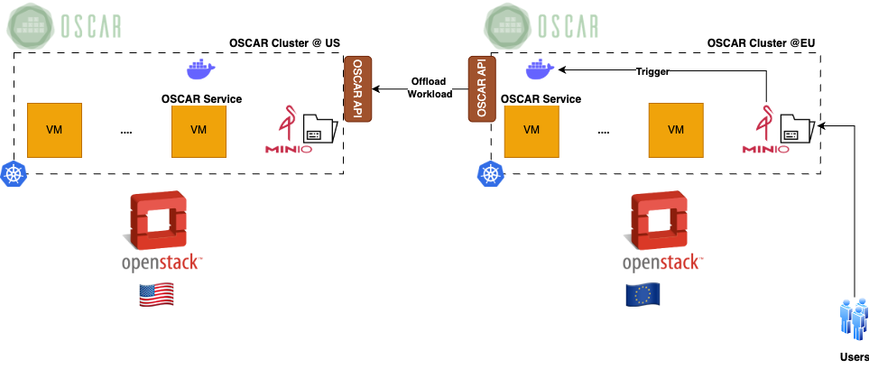
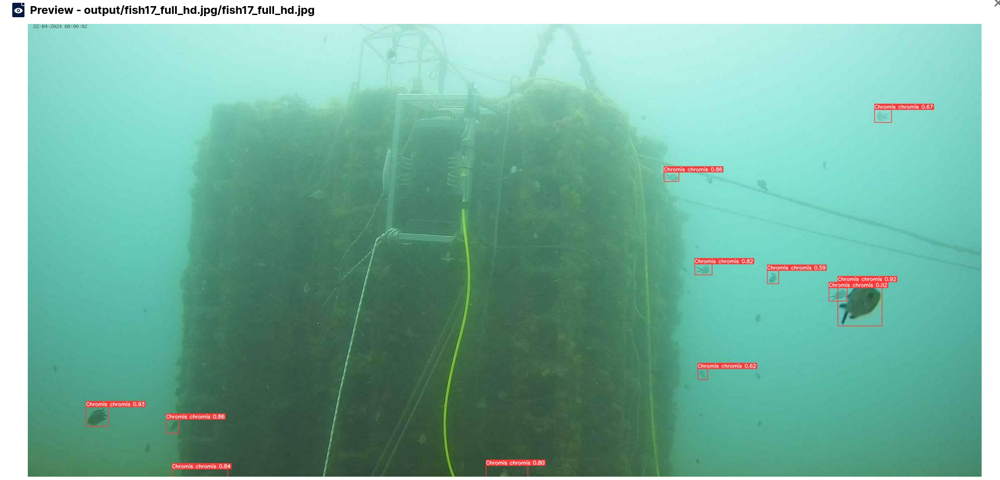
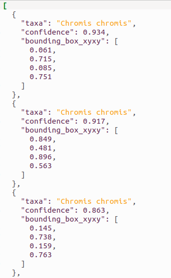

# Replicated Fish Detector with Offloading across OSCAR clusters

A replicated service architecture is created from the FDL files. The service to be deployed in both clusters is the **fish-detector** service. **OSCAR Cluster @EU** has a **fish-detector** service, which presents a replica service in **OSCAR Cluster @US**. The latter processes the offloaded workloads from the former (when there are no available computing resources left) and uploads the results to the **OSCAR Cluster @EU** output bucket.

## OBSEA Fish Detection

AI-based fish detection and classification algorithm based on YOLOv8. The model has been finetuned to detect and classify fish at the OBSEA underwater observatory.

This is a container that will run the [obsea-fish-detection](https://dashboard.cloud.imagine-ai.eu/catalog/modules/obsea-fish-detection) application leveraging the DEEP as a Service API component. The application is based on the [ai4oshub/ai4os-yolov8-torch](https://hub.docker.com/r/ai4oshub/ai4os-yolov8-torch) module.

The fish-detector service processes individual images. When an image is uploaded to the service's input bucket, the inference model detects and classifies fish, returning both a processed image with bounding boxes and a JSON file containing the detection results.

Here is an example of a prediction output:

