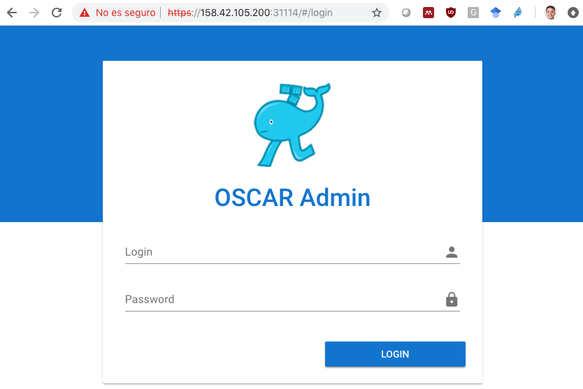
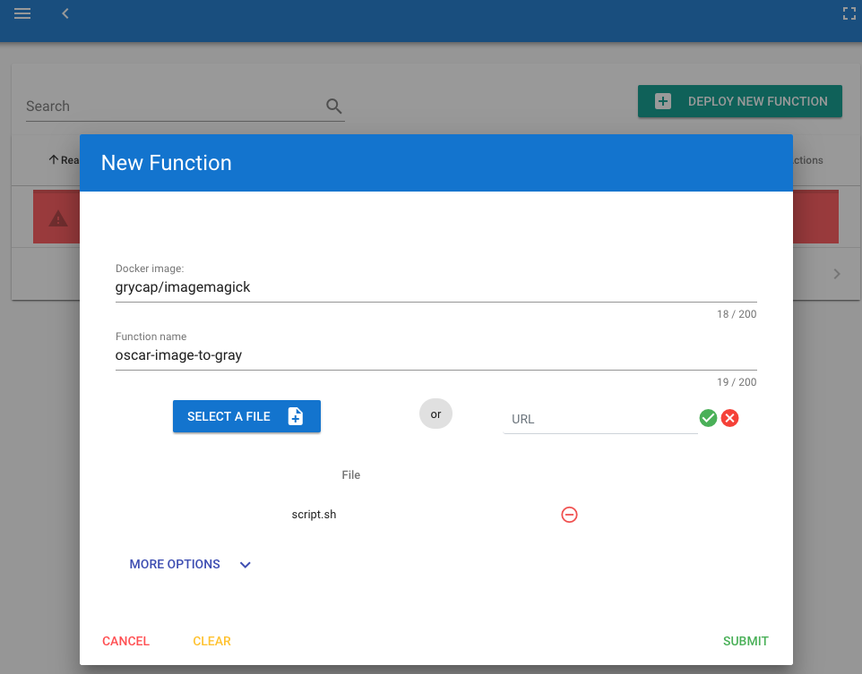
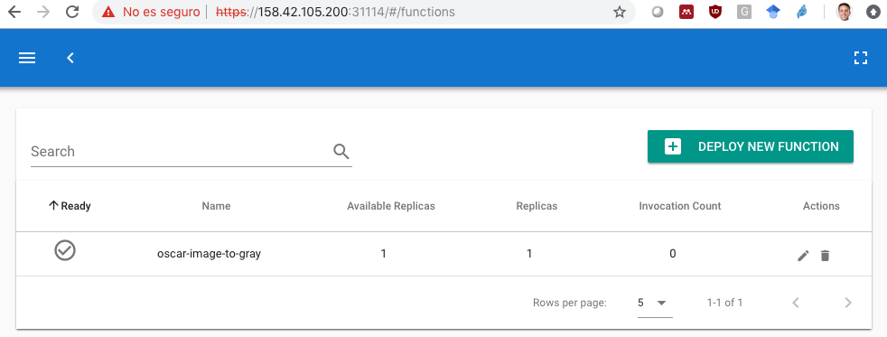
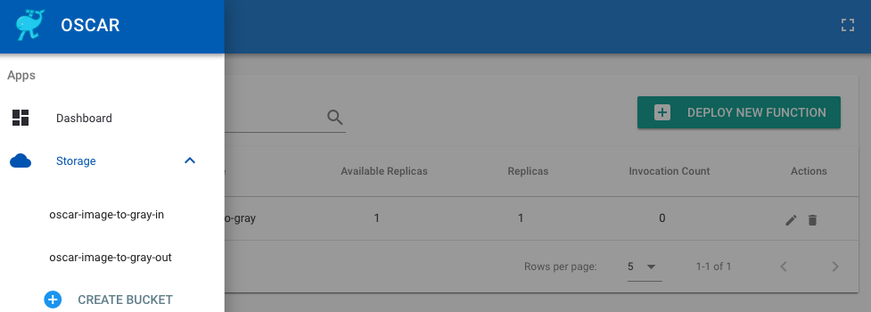
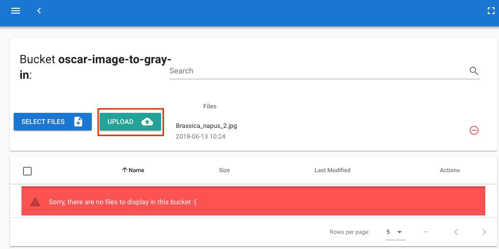
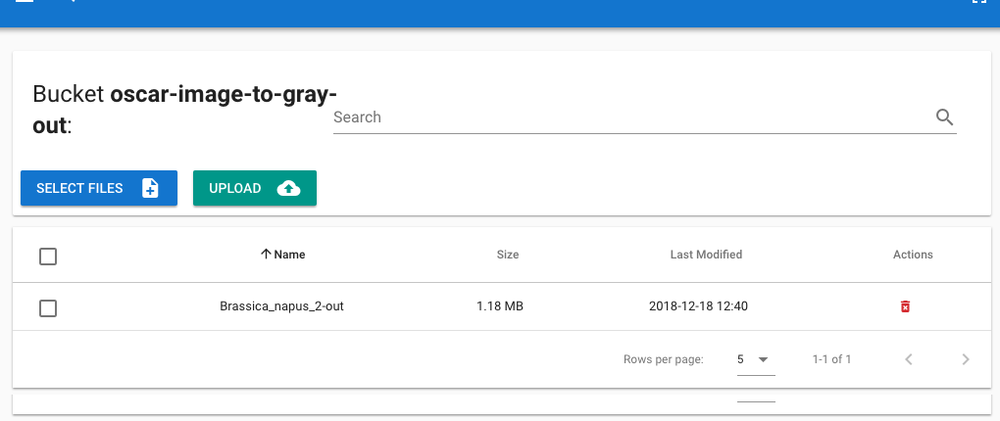
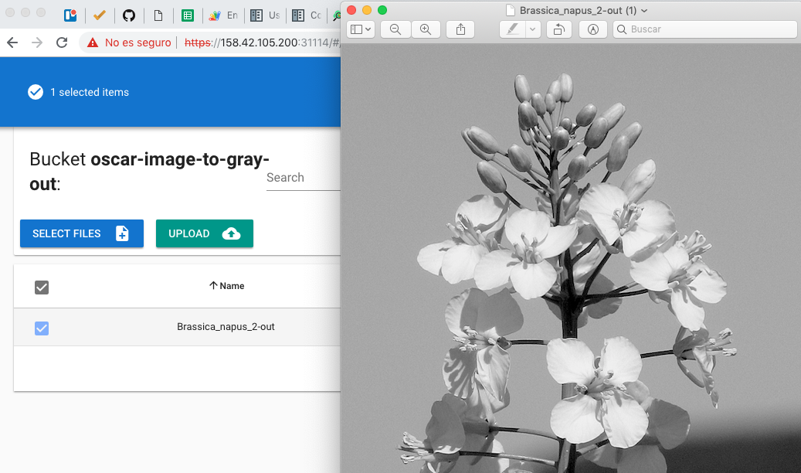
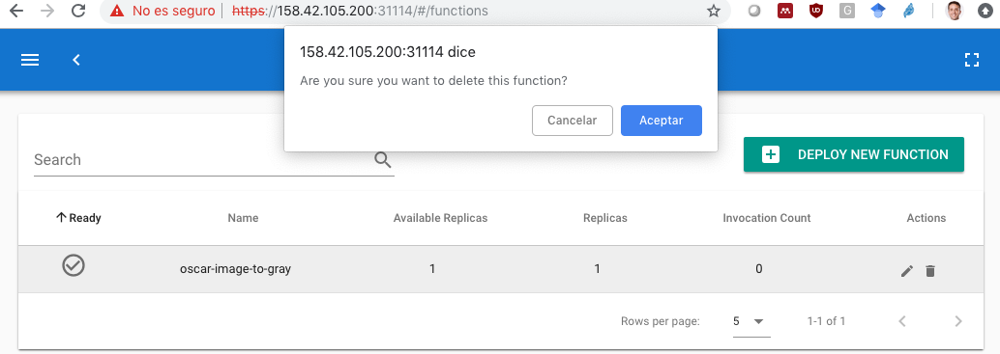
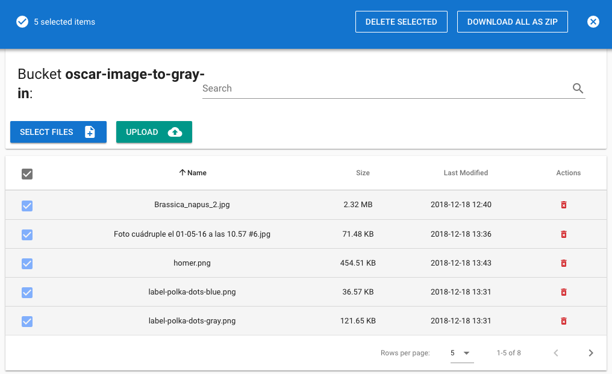
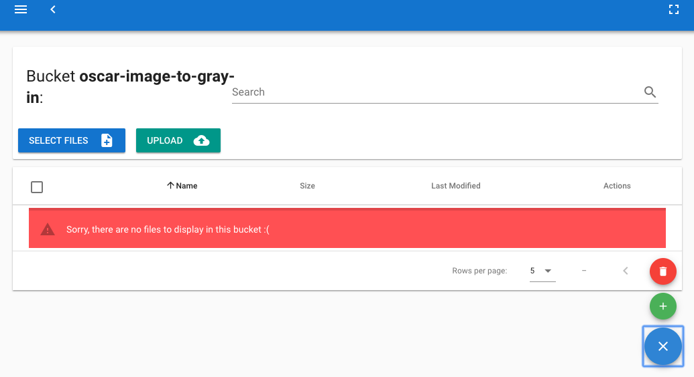

# Image Conversion to Grayscale with ImageMagick

This example supports highly-scalable event-driven image conversion to
grayscale using the popular [ImageMagick](https://www.imagemagick.org)
software. The goal is to have:

* An input bucket created in Minio on which the user uploads the files to be converted.
* A function that is triggered upon each file upload in order to trigger the
    file conversion, which is automatically handled by an elastic Kubernetes
    cluster that provisions additional nodes on-demand if required.
* An output bucket created in Minio on which the user will find the converted files.

## STEP 1: Deploy the OSCAR cluster on an IaaS Cloud

Follow the [deployment instructions](https://docs.oscar.grycap.net/deploy-im-dashboard/).

## STEP 2: Log in the OSCAR UI

Log in into the OSCAR UI using the
[Default Service Endpoints](https://o-scar.readthedocs.io/en/latest/usage.html#default-service-endpoints)
and access credentials.



## STEP 3: Create the Function

You will use the following information:

* Docker image: [grycap/imagemagick](https://hub.docker.com/r/grycap/imagemagick)
* Script: The `script.sh` file in this directory in charge of processing the image.

Create a new function and specify the aforementioned details:



Press the Submit button and you will receive a confirmation message.

## STEP 4: Verify the Created Buckets and Function

After a few seconds the function will be created:



and the input and output buckets will be automatically created as well:



## STEP 5: Upload Image File to Trigger the Function

Upload an image to the input bucket created. You have to select the image
first and then upload it. You can upload a bunch of images at the same time.



## STEP 6: Access the Output File

The processed file will be automatically uploaded to the output bucket.



and, finally, visualize the image:



## STEP 7: Remove the Function

Once you have finished you have to delete the function:



And in case you want to remove the buckets as well you can proceed as follows.

First delete all the files:



Then, delete the bucket:



## STEP 8: Terminate the OSCAR Cluster

You can terminate the Kubernetes cluster with the
[EC3](https://github.com/grycap/ec3) command:

```sh
ec3 destroy <cluster-name>
```
