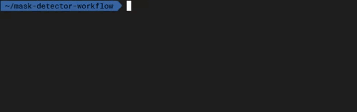

# Mask detector workflow

This example is based on the
[SCAR's Mask detector hybrid workflow](https://github.com/grycap/scar/tree/master/examples/mask-detector-workflow),
but, in this case, both services will be executed on top of an OSCAR cluster.

The easy way to deploy the services is via
[oscar-cli](https://github.com/grycap/oscar-cli), but
[you can also use the UI](https://grycap.github.io/oscar/usage/).

To trigger the workflow you only have to upload a video into the `input`
folder of the `mask-detector` MinIO bucket, result images will be stored into
the `result` folder of the same bucket when the workflow execution has been
completed.
