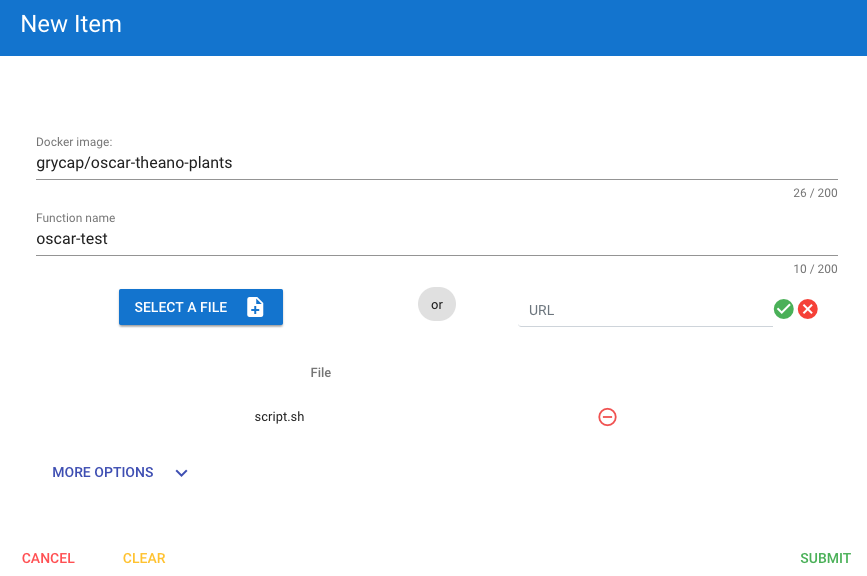
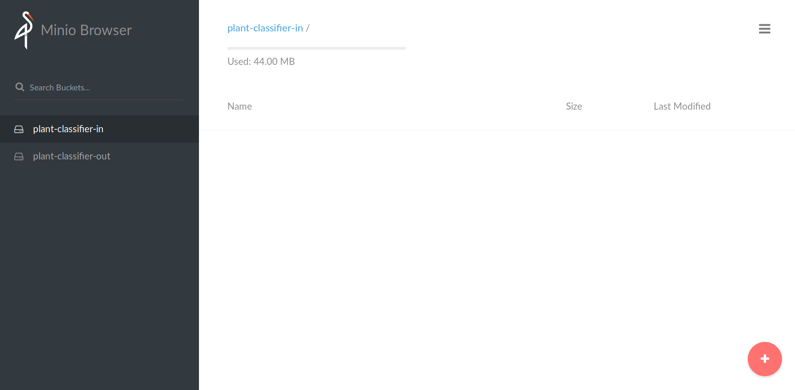
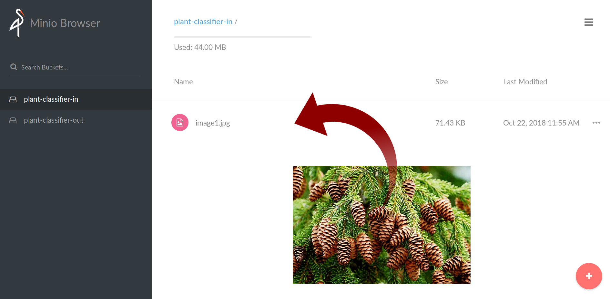
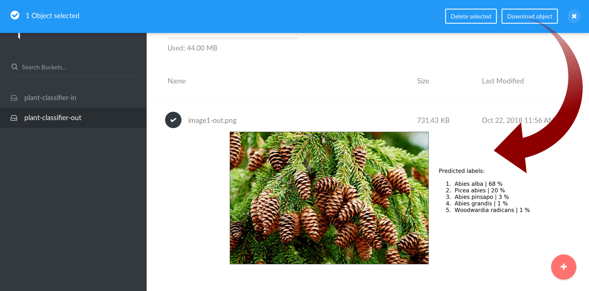

# Plant Classification with Lasagne/Theano

Example cloned from: <https://github.com/indigo-dc/plant-classification-theano>

To run this example you need:

1. A Kubernetes cluster running the OSCAR framework, as indicated in the
  [deployment instructions](https://o-scar.readthedocs.io/en/latest/deploy.html).

2. The container to deploy available in Docker Hub:

  * You can create your own with the following command:

    ```sh
    docker build -t {docker-hub-user}/{docker-hub-image} .
    docker push {docker-hub-user}/{docker-hub-image}
    ```

  * Or use the
  [grycap/oscar-theano-plants](https://hub.docker.com/r/grycap/oscar-theano-plants/)
  Docker image already available in Docker Hub (created out of this
  [Dockerfile](https://github.com/grycap/oscar/blob/master/examples/plant-classification-theano/Dockerfile)).

3. Then, to create the function you have two options:

* Option 1: Use the OSCAR web-based interface available at the IP of the
  front-end of the Kubernetes cluster (port `31114`) and specify the
  `script.sh` available in this folder:

  

* Option 2: Use curl to do a POST request:

  In this case you need to pass the script in Base64. You can use the python
  script available in the examples folder:

  ```
  python ../tobase64.py < script.sh
  ```

  ```
  curl -X POST --header 'Content-Type: application/json' --header 'Accept: text/plain' -d '{ \
  "image": "grycap/oscar-theano-plants", \
  "name": "plant-classifier", \
  "script": "IyEvYmluL2Jhc2gKCmVjaG8gIlNDUklQVDogSW52b2tlZCBjbGFzc2lmeV9pbWFnZS5weS4gRmlsZSBhdmFpbGFibGUgaW4gJFNDQVJfSU5QVVRfRklMRSIKRklMRV9OQU1FPWBiYXNlbmFtZSAkU0NBUl9JTlBVVF9GSUxFYApPVVRQVVRfRklMRT0kU0NBUl9PVVRQVVRfRk9MREVSLyRGSUxFX05BTUUKCnB5dGhvbjIgL29wdC9wbGFudC1jbGFzc2lmaWNhdGlvbi10aGVhbm8vY2xhc3NpZnlfaW1hZ2UucHkgJFNDQVJfSU5QVVRfRklMRSAtbyAkT1VUUFVUX0ZJTEU=" \
  }' 'http://${OSCAR_ENDPOINT}:32112/functions'
  ```

  Once OSCAR finishes the creation of the function (it will take some
  minutes), the corresponding buckets in Minio are also created.
  

4. To execute the function that will process the image you need to upload the
  image to process to the corresponding input bucket, in this case
  `plant-classifier-in`.
  

5. Once the function is executed, the output is automatically copied to the
  output bucket in minio, in this case `plant-classifier-out`. You can
  download the ouput from here for further processing.
  
