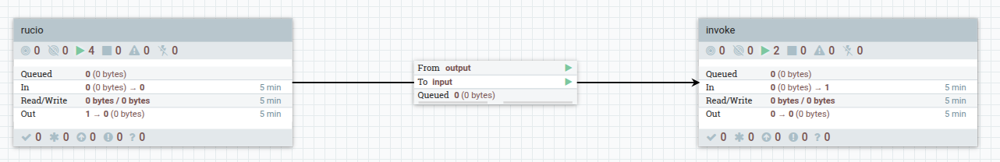

To illustrate the usage of Rucio as a data source in an OSCAR Service and Dataflow, an example has been created that uses Rucio to fetch input files for processing.

The example consists of two main components:

1. **Rucio Service**: This service is defined in the `rucio-service.yaml` file. It specifies the use of a Docker image that processes files fetched from Rucio. The service is configured with necessary parameters such as Rucio account, RSE, and authentication details.

2. **Rucio Dataflow**: The dataflow is defined in the `rucio-dataflow.yaml` file. It sets up a connection to a Rucio messaging queue to listen for new files. When a new file is detected, it triggers the invocation of the Rucio Service to process the file.

### Prerequisites
- Access to an OSCAR instance where you can deploy services.
- Access to an Apache NiFi instance to deploy the dataflow.
- A Rucio account with access to the necessary RSEs and datasets (and the Rucio messaging endpoint).
- [DCNiOS](https://github.com/interTwin-eu/dcnios) client installed.

### Deployment Steps

1. **Configure the Rucio Service**:
   - Open the `rucio-service.yaml` file.
   - Update the placeholders (e.g., `<rucio-endpoint>`, `<rucio-account>`, `<rse>`, `<oidc-token>`, `<oidc-audience>`) with your actual Rucio and authentication details.
    - Save the changes.
2. **Deploy the Rucio Service**:
    - Use the OSCAR CLI or GUI to deploy the Rucio Service defined in `rucio-service.yaml`.
3. **Configure the Rucio Dataflow**:
   - Open the `rucio-dataflow.yaml` file.
   - Update the placeholders (e.g., `<rucio-endpoint>`, `<rucio-port>`, `<user-rabbitmq>`, `<pass-rabbitmq>`, `<truststore-path>`, `<truststore-pass>`, `<oscar-endpoint>`, `<oscar-svc-token>`) with your actual Rucio messaging and OSCAR details.
   - Save the changes.
4. **Deploy the Rucio Dataflow**:
   - Use DCNiOS to deploy the Rucio Dataflow defined in `rucio-dataflow.yaml`.
5. **Monitor the Dataflow**:    
   - Once deployed, monitor the dataflow to ensure it is correctly listening for new files from Rucio and invoking the Rucio Service as expected.

   
