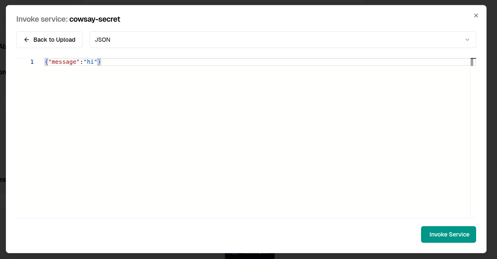
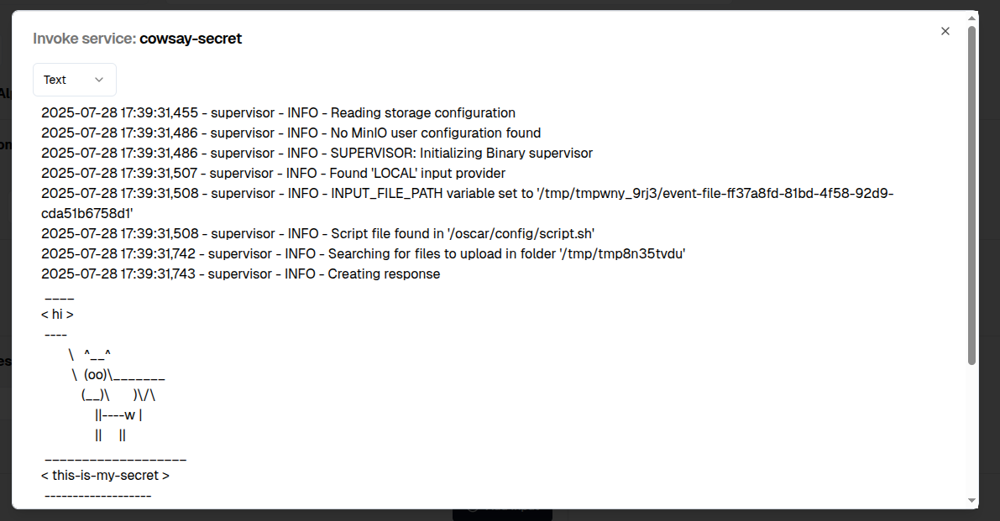

# Secret usage in an OSCAR Service

To illustrate the usage of secrets in an OSCAR Service, the cowsay example has been modified to incorporate a **Secret**.

In the FDL file **_secret_usage.yaml_** the secret is defined in the `environment.secrets` field:

```YAML
functions:
  oscar:
  - oscar-replica:
      name: cowsay-secret
      cpu: '1.0'
      memory: 1Gi
      image: ghcr.io/grycap/cowsay
      script: script.sh
      environment:
        secrets:
          COWSAY_SECRET: "this-is-my-secret"
        Variables:
          INPUT_TYPE: json
```
The name of the secret is `COWSAY_SECRET` and the value is `this-is-my-secret`.

The script executed includes a command to print the content of the secret:

```BASH
#!/bin/sh

if [ "$INPUT_TYPE" = "json" ]
then
    jq '.message' "$INPUT_FILE_PATH" -r | /usr/games/cowsay && echo "$COWSAY_SECRET" | /usr/games/cowsay
else
    cat "$INPUT_FILE_PATH" | /usr/games/cowsay && echo "$COWSAY_SECRET" | /usr/games/cowsay
fi
```

When running an invocation from the GUI:



The result of the execution is:



