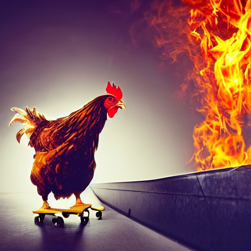

# Stable Diffusion

This example is based on a Keras / Tensorflow implementation of Stable Diffusion. The following repositories were used for the creation of the image:

* [srisco/stable-diffusion-tensorflow](https://github.com/srisco/stable-diffusion-tensorflow)
* [huggingface.co/fchollet/stable-diffusion](https://huggingface.co/fchollet/stable-diffusion)
* [huggingface.co/divamgupta/stable-diffusion-tensorflow](https://huggingface.co/divamgupta/stable-diffusion-tensorflow/)

The image if pushed to a public github registry [here](ghcr.io/grycap/stable-diffusion-tf:latest) but you can see the Dockerfile that generates it [here](Dockerfile).

## Deploy an OSCAR cluster
Follow the instructions in the documentation for your desired IaaS cloud provider.
[See Deployment](https://docs.oscar.grycap.net/)

## Create the OSCAR Service

The Service can be created using the OSCAR GUI by providing the [FDL](stable-diff.yaml) and the [script.sh](script.sh) file.

## Upload the input file to the MinIO bucket

Once the service is created, you can upload the input file to the bucket. The input file should be a file containing the prompt that you want to process.

For example, using the following prompt:

`a chicken making a 360 with a skateboard with background flames`

The following image is generated:

