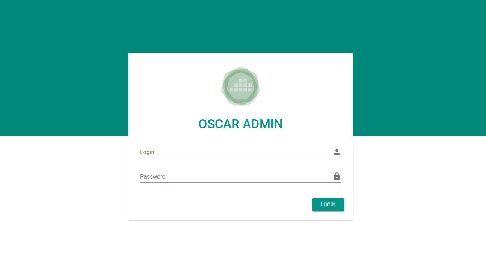
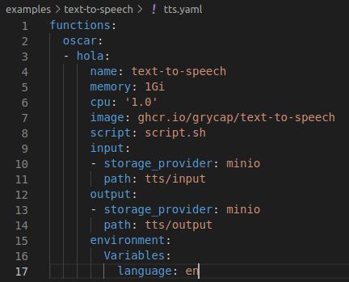
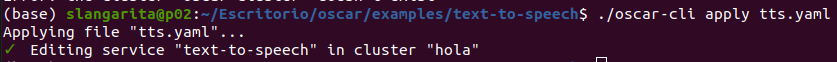
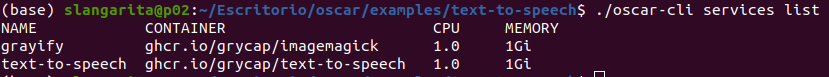
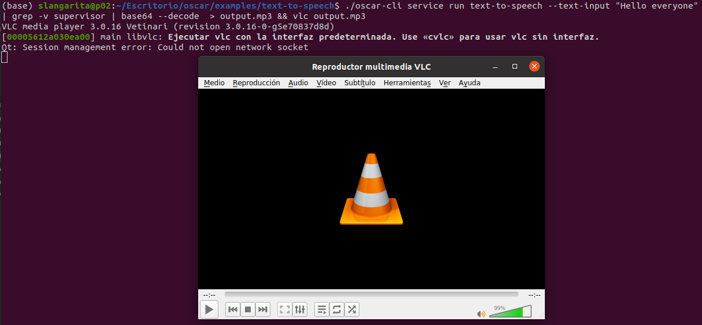

# Text to Speech

Example of text to speech in OSCAR using [Google Speech](https://pypi.org/project/google-speech/) library, where introducing an input of text string or text file return an audio file.

## STEP 1: Deploy the OSCAR cluster on an IaaS Cloud

Follow the [deployment instructions](https://o-scar.readthedocs.io/en/latest/deploy.html). Or you can execute this script to install it locally.
```sh
curl -L http://go.oscar.grycap.net | bash
```


### STEP 1.1: Log in the OSCAR UI

Log in into the OSCAR UI using the [Default Service Endpoints](https://o-scar.readthedocs.io/en/latest/usage.html#default-service-endpoints) and access credentials. To verify the succesfull installation.




## STEP 2: Create the Service

To create the function we are going to use the command line interface [OSCAR-CLI](https://docs.oscar.grycap.net/oscar-cli/).

### STEP 2.1: Get the file .yaml ready

Check in the yaml file that the cluster name exist and select in which language you want to hear the voice. If you do not know the code language, you will found it in this [page](https://www.andiamo.co.uk/resources/iso-language-codes/).




### STEP 2.2: Deploy the Service

To deploy the service use the command:
```sh
 oscar-cli apply tts.yaml
```



## STEP 3: Verify the Service

After some minutes the service will be created. The input and output buckets will be automatically created as well. Verify that the service is up with the command:

```sh
oscar-cli services list
```




## STEP 4: Invoke the Service Synchronously

To run the service synchronously use:
```sh
oscar-cli service run text-to-speech --text-input "Hello everyone"
```
You also can pass a file text substituing the flag `--text-input {string}` to `--input {filepath}`


## STEP 5: Access the Output Files

The output that will be printed in the screen is the sound file encoded in base64. If you want to save it locally use this command:
```sh
oscar-cli service run text-to-speech --text-input "Hello everyone" | grep -v supervisor | base64 --decode  > output.mp3
```
And if you have installed vlc and you want to play it use this one:
```sh
oscar-cli service run text-to-speech --text-input "Hello everyone" | grep -v supervisor | base64 --decode  > output.mp3 && vlc output.mp3
```




## STEP 6: Remove the Function


Once you have finished you could delete the service using the command:

```sh
oscar-cli services remove text-to-speech
```


## STEP 8: Terminate the OSCAR Cluster

You can terminate the Kubernetes cluster with the [EC3](https://github.com/grycap/ec3) command:

```sh
ec3 destroy <cluster-name>
```


