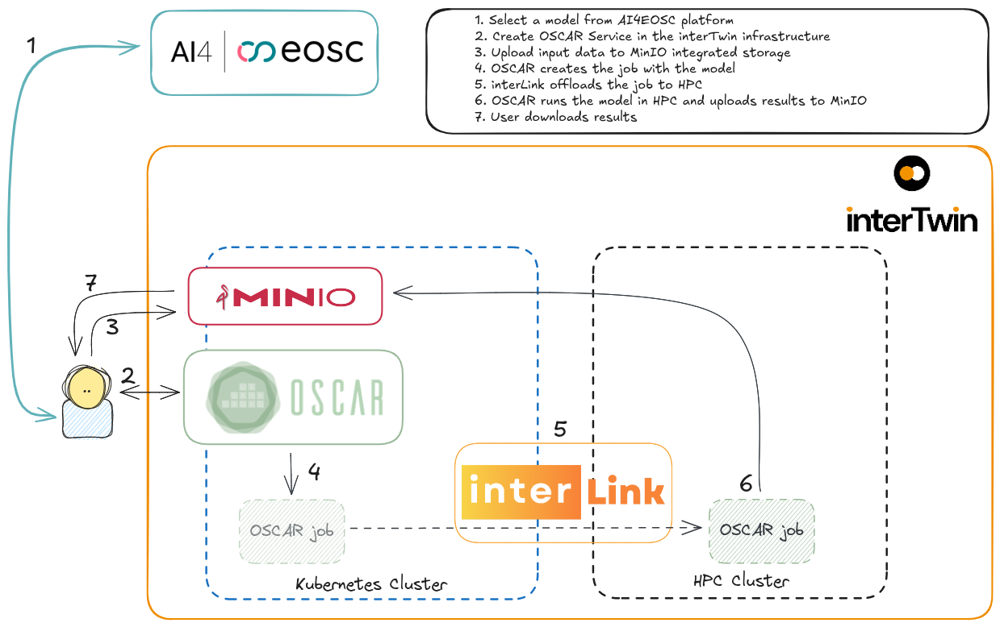

# Thermal Bridges on Building Rooftops Detection on HPC: an AI4EOSC-interTwin collaboration

The integration between OSCAR and [interLink](http://github.com/interTwin-eu/interlink) formed the core of the automated execution pipeline, allowing AI models to be deployed, triggered, and executed on HPC resources without any manual intervention, an essential step toward user-driven scientific workflows in Digital Twin scenarios.

We demonstrated the feasibility of this solution by executing one of the models of the AI4EOSC Automated Thermography use case: [“Thermal Bridges on Building Rooftops Detection”](https://dashboard.cloud.ai4eosc.eu/catalog/modules/thermal-bridges-rooftops-detector).

The image above shows how the user can create an OSCAR Service to perform some AI inference in HPC by creating an OSCAR Service and let OSCAR-interLink handle the rest. 

## Deployment of the service

Employ the **_thermal-detector-interlink.yaml_** and **_script-interlink_** files to deploy the OSCAR Service using your preferred [OSCAR interface](https://docs.oscar.grycap.net/oscar-cli/).

## Video demonstration

https://www.youtube.com/watch?v=Apq4ipQ1W_k