# Video Processing with function composition

This example supports highly-scalable event-driven video analysis using
[ffmpeg](https://ffmpeg.org/) to extract keyframes of the video and
[darknet](https://pjreddie.com/darknet) to analyze such keyframes. To achieve
this, the example defines two different functions and links them using a
shared Minio bucket. This kind of workflow allow the user to use function
composition to create more complex workflows. The goal is to have:

* An input bucket created in Minio on which the user uploads the video to be analyzed.
* A video processing function that is triggered upon each video upload which
extracts the video keyframes.
* An output bucket created in Minio on which the video funciton stores the
extracted keyframes. This bucket is also the input bucket of the the image
processing function,
* A function that is triggered upon each video upload that extracts the video keyframes.
* An output bucket created in Minio on which the user will find the converted files.

## STEP 1: Deploy the OSCAR cluster on an IaaS Cloud

Follow the [deployment instructions](https://o-scar.readthedocs.io/en/latest/deploy.html).

## STEP 2: Log in the OSCAR UI

Log in into the OSCAR UI using the
[Default Service Endpoints](https://o-scar.readthedocs.io/en/latest/usage.html#default-service-endpoints)
and access credentials.

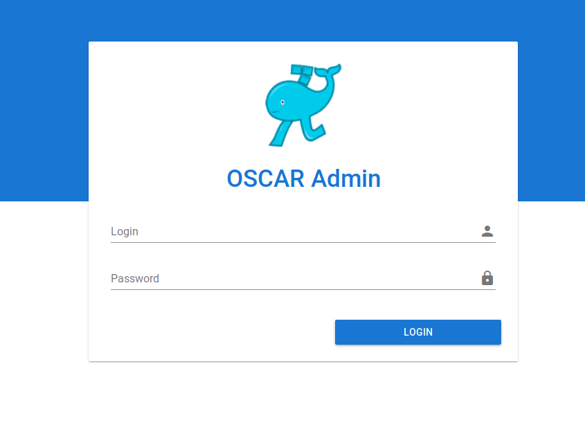

## STEP 3: Create the Functions

The creation order of the functions doesn't matter, so first we are going to
create the video processing function and the the image processing function:

### STEP 3.1: Video processing

You will use the following information:

* Docker image: [grycap/ffmpeg](https://hub.docker.com/r/grycap/ffmpeg)
* Script: The `split-video.sh` file in this directory in charge of processing
the video.

Create a new function and specify the aforementioned details:

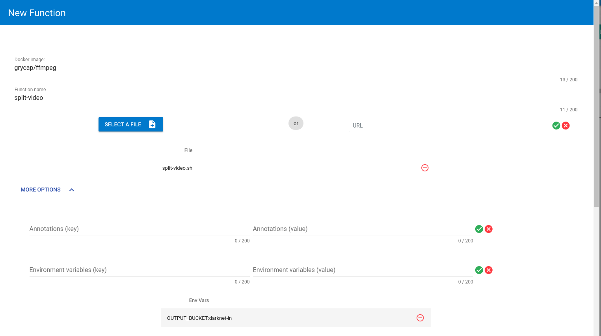

Bear in mind the creation of the environment variable '**OUTPUT_BUCKET**'
which must have as value the name of the input bucket of the darknet function
which is '**darknet-in**'.

Press the Submit button and you will receive a confirmation message.

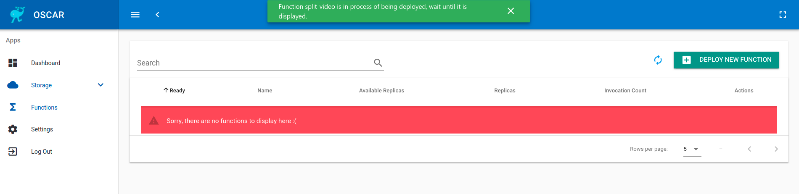

### STEP 3.2: Image processing

You will use the following information:

* Docker image: [grycap/darknet-v3](https://hub.docker.com/r/grycap/imagemagick)
* Script: The `yolov3-object-detection.sh` file in this directory in charge of
processing the image.

Create a new function and specify the aforementioned details:

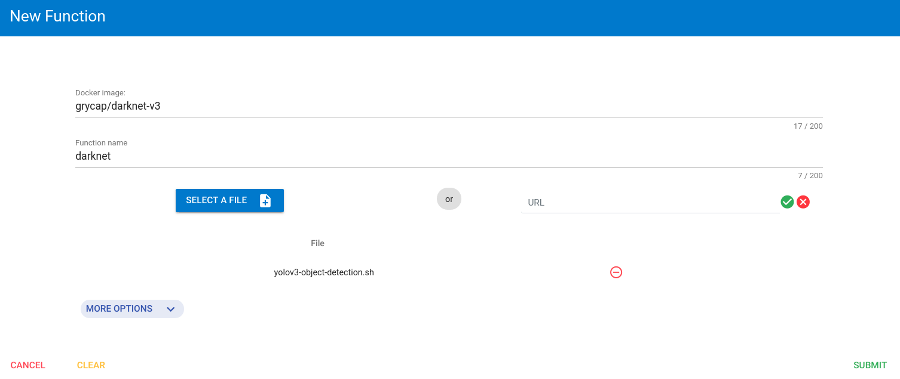

The darknet library needs a function with at least **2Gi** of memory, so make
sure you specify that in the requests (after clicking in '*MORE OPTIONS*', the
lasts fields are for specifiying resources). To make sure that CPU resources
are also available, fill the request with at least **1** CPU, like in the
following image:

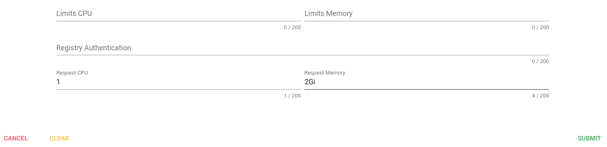

Again, press the Submit button and you will receive a confirmation message.

## STEP 4: Verify the Created Buckets and Function

After some minutes the functions will be created and can be seen in the
interface. The input and output buckets will be automatically created as well:

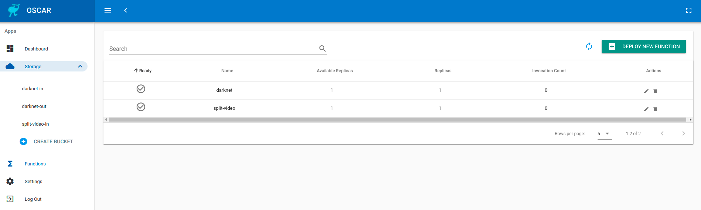

## STEP 5: Upload a Video to Trigger the Function

Upload an video to the input bucket created. You have to select the video
first and then upload it. You can upload a bunch of videos at the same time.

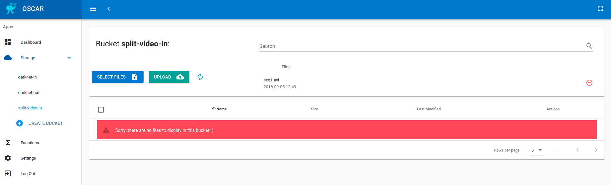

## STEP 6: Access the Output Files

The extracted keyframes will be automatically uploaded to the output bucket of
the video function (which in this case is the input bucket of the darknet
function).

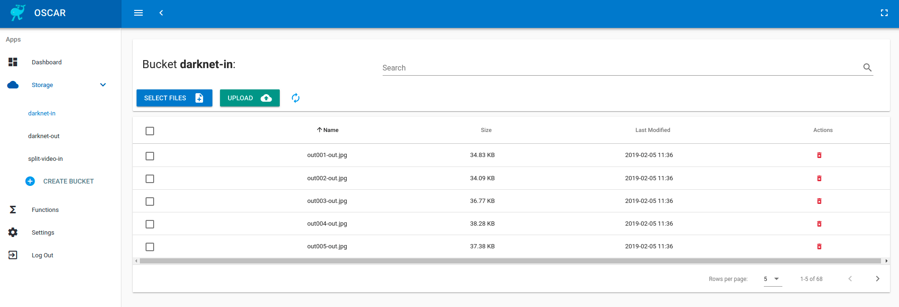

This will automatically trigger the image analysis function that saves their
results in the '**darknet-out**' bucket. When the execution is finished you
can download all the generated files as a zip file. First you have to select
all the generated files by clicking in '*Rows per page: All*':

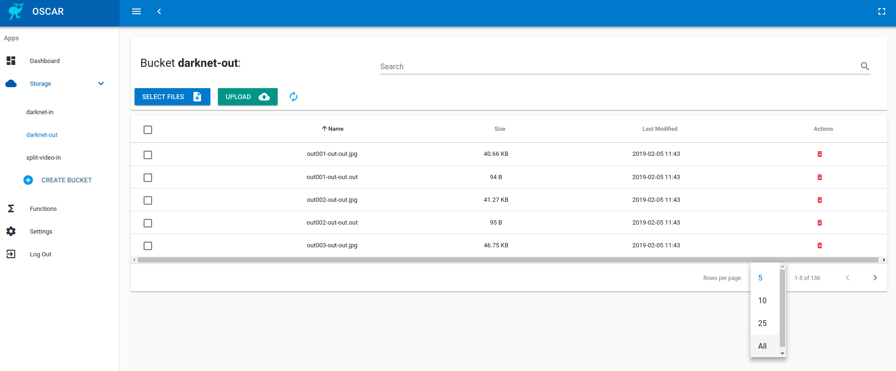

Then you can select all the files by clicking on the checkbox of the header
row and then clicking in the button *DOWNLOAD ALL AS A ZIP* like in the
following image:

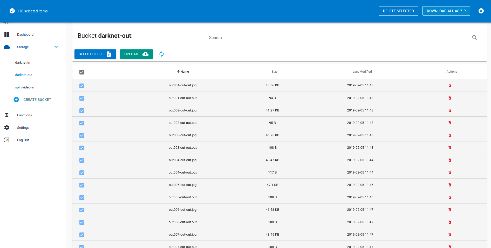

## STEP 7: Remove the Function

Once you have finished you could delete the function by clicking in the trash
can icon next to the function information. You should see a dialog like the
following:

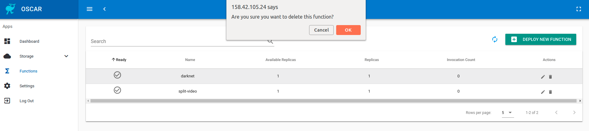

And in case you want to remove the buckets as well you can proceed as follows.

First delete all the files:

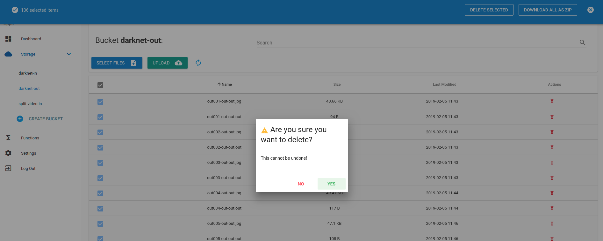

Then, delete the bucket:

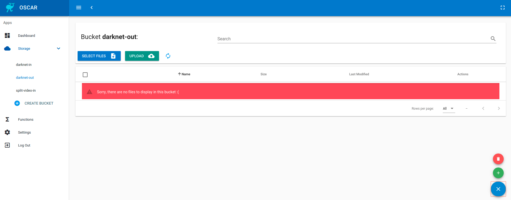

## STEP 8: Terminate the OSCAR Cluster

You can terminate the Kubernetes cluster with the
[EC3](https://github.com/grycap/ec3) command:

```sh
ec3 destroy <cluster-name>
```
