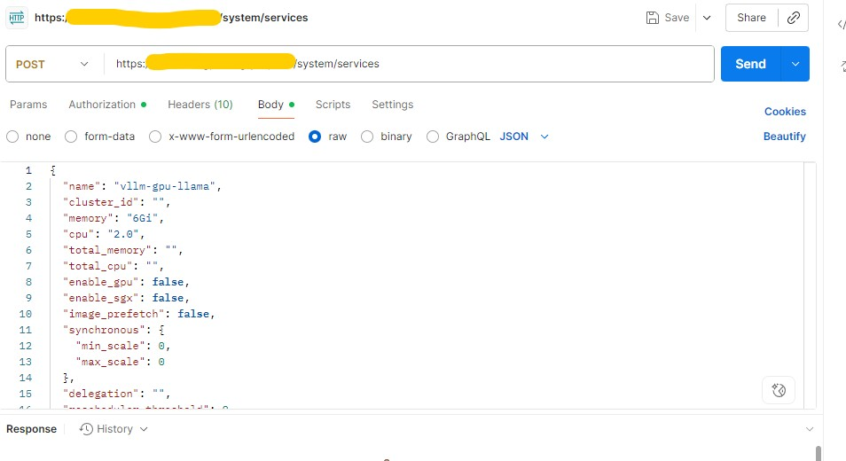
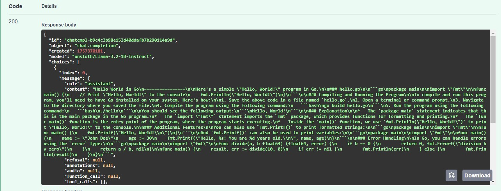
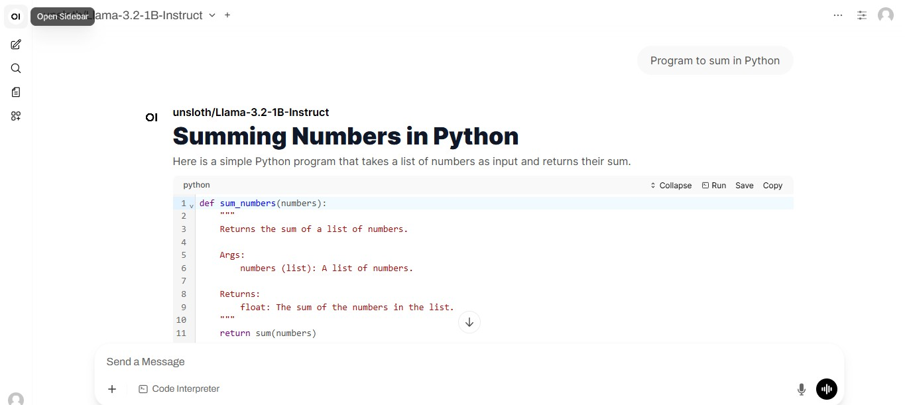

# Deploy LLM model Llama with vLLM

In this tutorial, we provide a universal guide on how to deploy OSCAR-exposed services with LLM models using [vLLM](https://docs.vllm.ai/en/latest/).

Model requirements:
- The model needs to be available on the [Hugging Face](https://huggingface.co) platform.
- The model needs to support the [OpenAI API](https://platform.openai.com/docs/overview) interface.
- The OSCAR cluster must have GPUs and sufficient resources to run the model.

For this guide, we will use the [Llama-3.2-1B-Instruct](https://huggingface.co/unsloth/Llama-3.2-1B-Instruct) model and a cluster with a GPU that has 18.00 GiB of memory available.

## 1. Create Docker image

To start, we need to have a Docker image that contains `vllm` and the model we want to use (`Llama-3.2-1B-Instruct`).

The basic Dockerfile must contain:
- The `vllm`, through the official Docker image or installed with `pip`.
- The `huggingface_hub[cli]`, to download the model from its platform.
- The model (`Llama-3.2-1B-Instruct`) that `vllm` will utilize offline.
- 

```Dockerfile
FROM vllm/vllm-openai:latest

RUN huggingface-cli download unsloth/Llama-3.2-1B-Instruct
```

## 2. Create FDL definition of the service and the script

The most important part of the service definition is its environment variables, which we will use to launch and optimize our model.

```yaml
...
environment:
    Variables:
        OPENAI_BASE_URL: "/system/services/vllm-gpu-llama/exposed"
        API_KEY: "secretkey"
        GPU_MEMORY_UTILIZATION: "0.5"
        MAX_MODEL_LEN: "1000"
...
```

As mentioned before, the environment variables will be used in the script as arguments to the command that launches the model.

Example:
```bash
...
python3 -m vllm.entrypoints.openai.api_server --root-path $OPENAI_BASE_URL --model unsloth/Llama-3.2-1B-Instruct --max_model_len $MAX_MODEL_LEN --enforce-eager --gpu-memory-utilization $GPU_MEMORY_UTILIZATION --api-key $API_KEY
...
```

You can find the complete definition of the service and its script in `vllm_llama.yaml` and `script.sh`.

If you want to learn more about optimizing vLLM, check its documentation on [Optimization and Tuning](https://docs.vllm.ai/en/latest/performance/optimization.html).

> **Note**: 
> - The argument `--gpu-memory-utilization` is **required** and must be less than `0.9` to avoid possible out-of-memory errors.  
> - The `--enforce-eager` argument is also important, as it reduces memory usage.

## 3. Interact with the deployed service's API using Postman.
To deploy the service, you can use [API](https://docs.oscar.grycap.net/latest/api) use file `vllm_llama.json`
OSCAR exposes a secure REST API available at the Kubernetes master's node IP through an Ingress Controller. This API has been described following the [OpenAPI Specification](https://www.openapis.org)
> **Note**: 
> - The bearer token used to run a service can be either the OSCAR service access token or the user's Access Token if the OSCAR cluster is integrated with EGI Check-in.



## 4. Deploy the service with OSCAR CLI

To deploy the service, you can use either [OSCAR CLI](https://github.com/grycap/oscar-cli) with the provided FDL file (`vllm_llama.yaml`) and script (`script.sh`), or the [Dashboard](https://dashboard.oscar.grycap.net/).

```bash
oscar-cli apply vllm_llama.yaml
```

## 4. Access and test the service

You can test your service in different ways:

### Direct request with `curl`

1. Open a terminal and try:

    ```bash
    curl -X POST "https://<YOUR_CLUSTER>/system/services/vllm-gpu-llama/exposed/v1/chat/completions" \
    -H "Content-Type: application/json" \
    -H "Authorization: Bearer secretkey" \
    --data '{
        "model": "unsloth/Llama-3.2-1B-Instruct",
        "messages": [
            {
                "role": "user",
                "content": "Hello World in golang"
            }
        ]
    }'
    ```
    > Replace `secretkey` with your actual API key.

2. **Expected Response Example:**

    

### Through Swagger UI using the exposed OpenAPI documentation

> **Warning**: You can't use this method if you have specified `$API_KEY`.

1. Go to `https://<YOUR_CLUSTER>/system/services/vllm-gpu-llama/exposed/docs`

2. Find the `POST /v1/chat/completions`

3. Try it:
    ```json
    {
        "messages": [
            {
                "role": "user",
                "content": "Give me a fun fact"
            }
        ]
    }
    ```
4. **Expected Response Example:**

    

### Through Open WebUI

1. Install [Docker](https://www.docker.com)
2. Run Open WebUI:
    ```bash
    docker run -d -p 3000:8080 -e WEBUI_AUTH=False -v open-webui:/app/backend/data --name open-webui ghcr.io/open-webui/open-webui:main
    ```
3. Go to [http://localhost:3000/](http://localhost:3000/)
4. Add a connection to the service:  
    `Top right corner → Admin Panel → Settings → Connections → OpenAI API`
5. Try it:
    

## Additional Resources

- [vLLM Documentation](https://docs.vllm.ai/en/latest/)
- [OSCAR Documentation](https://docs.oscar.grycap.net/)
- [Hugging Face Documentation](https://huggingface.co/docs)
- [API](https://docs.oscar.grycap.net/latest/api/)
- [OSCAR CLI](https://github.com/grycap/oscar-cli)

## FAQ

**Q: Can I use a different model?**  
A: Yes, as long as it is available on Hugging Face and supports the OpenAI API interface. Update the model name in the Dockerfile, FDL, and script. But be cautious: every model has its own requirements.

**Q: Where are downloaded models stored?**  
A: By default, in `~/.cache/huggingface/hub`. Set `HF_HUB_CACHE` or `HF_HOME` to change this. More info on [Hugging Face Cache management](https://huggingface.co/docs/datasets/cache).

---