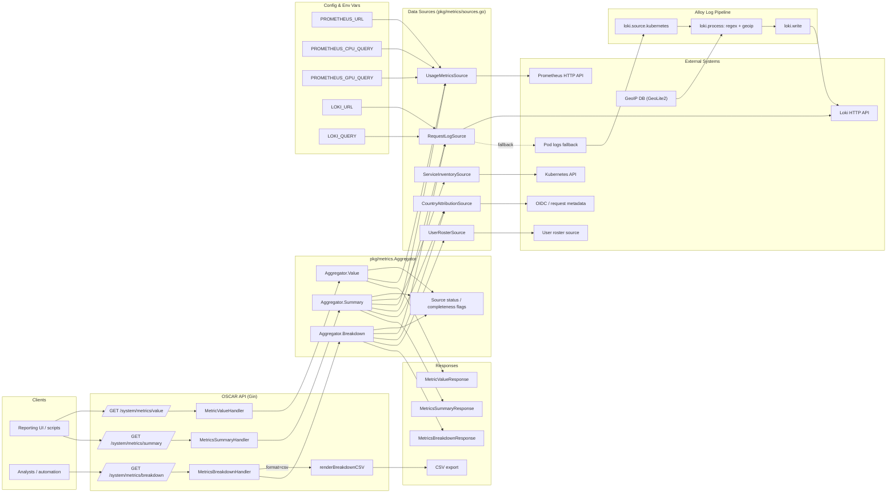

# Metrics Architecture Diagram

```mermaid
flowchart LR
  %% Clients
  subgraph Clients
    U1[Reporting UI / scripts]
    U2[Analysts / automation]
  end

  %% OSCAR API
  subgraph OSCAR["OSCAR API (Gin)"]
    R1[/GET /system/metrics/value/]
    R2[/GET /system/metrics/summary/]
    R3[/GET /system/metrics/breakdown/]
    H1[MetricValueHandler]
    H2[MetricsSummaryHandler]
    H3[MetricsBreakdownHandler]
    CSV[renderBreakdownCSV]
  end

  U1 --> R1 --> H1
  U1 --> R2 --> H2
  U2 --> R3 --> H3
  H3 -->|format=csv| CSV

  %% Aggregation layer
  subgraph Aggregation["pkg/metrics.Aggregator"]
    A1[Aggregator.Value]
    A2[Aggregator.Summary]
    A3[Aggregator.Breakdown]
    A4[Source status / completeness flags]
  end

  H1 --> A1
  H2 --> A2
  H3 --> A3
  A1 --> A4
  A2 --> A4
  A3 --> A4

  %% Sources
  subgraph Sources["Data Sources (pkg/metrics/sources.go)"]
    S1[ServiceInventorySource]
    S2[UsageMetricsSource]
    S3[RequestLogSource]
    S4[CountryAttributionSource]
    S5[UserRosterSource]
  end

  A1 --> S2
  A2 --> S1
  A2 --> S2
  A2 --> S3
  A2 --> S4
  A3 --> S3
  A3 --> S4
  A3 --> S5

  %% External systems
  subgraph External["External Systems"]
    K8s[Kubernetes API]
    Prom[Prometheus HTTP API]
    Loki[Loki HTTP API]
    GeoIPDB["GeoIP DB (GeoLite2)"]
    PodLogs["Pod logs fallback"]
    OIDC[OIDC / request metadata]
    Roster[User roster source]
  end

  S1 --> K8s
  S2 --> Prom
  S3 --> Loki
  S3 -.fallback .-> PodLogs
  S4 --> OIDC
  S5 --> Roster

  %% Log enrichment
  subgraph LogPipeline["Alloy Log Pipeline"]
    LP1[loki.source.kubernetes]
    LP2["loki.process: regex + geoip"]
    LP3[loki.write]
  end

  PodLogs --> LP1 --> LP2 --> LP3 --> Loki
  GeoIPDB --> LP2

  %% Config
  subgraph Config["Config & Env Vars"]
    C1[PROMETHEUS_URL]
    C2[PROMETHEUS_CPU_QUERY]
    C3[PROMETHEUS_GPU_QUERY]
    C4[LOKI_URL]
    C5[LOKI_QUERY]
  end

  C1 --> S2
  C2 --> S2
  C3 --> S2
  C4 --> S3
  C5 --> S3

  %% Outputs
  subgraph Outputs["Responses"]
    O1[MetricValueResponse]
    O2[MetricsSummaryResponse]
    O3[MetricsBreakdownResponse]
    O4[CSV export]
  end

  A1 --> O1
  A2 --> O2
  A3 --> O3
  CSV --> O4
```
